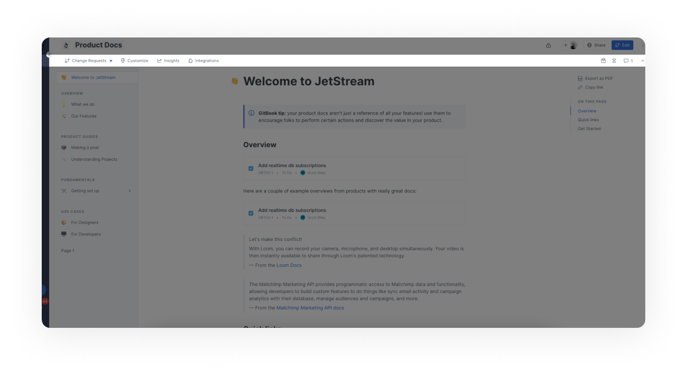
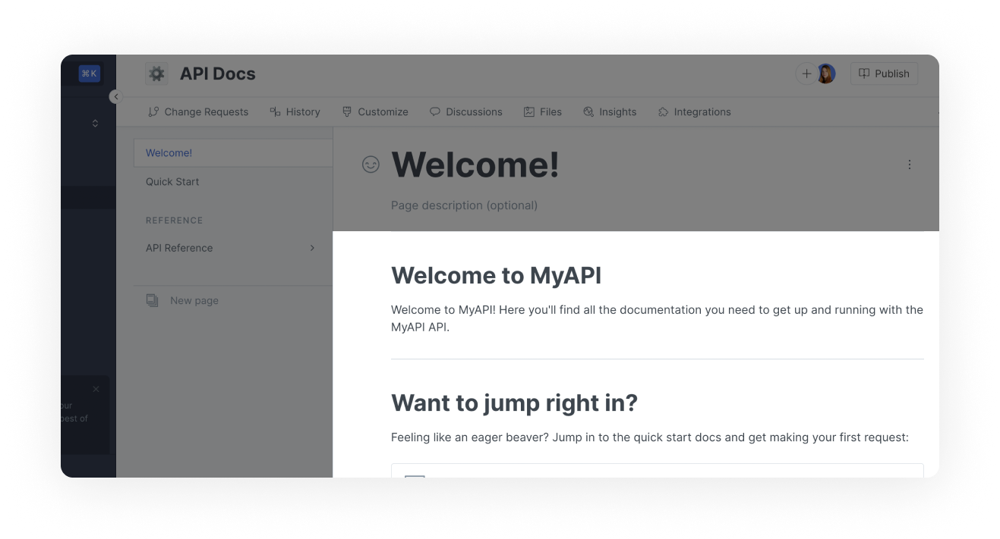
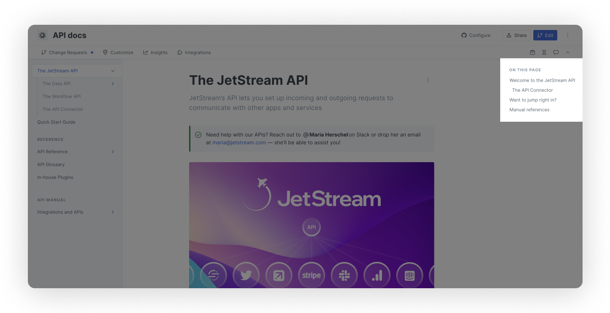

# Navigation

This page walks you through various sections, features, and menus that you'll find within the GitBook app. Start by creating or logging into your account at [app.gitbook.com](https://app.gitbook.com/).


**Permissions**\
\
**The sidebar** can be viewed by everyone, although guests might not see any spaces if they have not been assigned permissions at the content level.

**Space header** and sub-navigation can be seen by everyone, although the number of options available will vary based on your permissions.

The [Table of Contents](navigation.md#table-of-contents), [Page Header](navigation.md#page-header), [Editor](navigation.md#editor), [Page Actions](navigation.md#page-actions), and [On This Page](navigation.md#on-this-page) sections are visible to all.


## Sidebar

<figure><figcaption>
The sidebar in the GitBook app
</figcaption></figure>

The sidebar is the dark blue (in light mode) or black (in dark mode) section on the left-hand side of the app.

You can use the arrow near the top to open and close the sidebar. Closing the sidebar might be helpful when you want more space to focus on the documentation you're writing.

The sidebar contains:

* **The** **quick find** **field**\
  [Quick find](searching-your-content/quick-find.md) helps you quickly navigate between your content, as well as performing common actions.
* **Your documentation library**\
  [Libraries](../content-creation/content-structure/) contain collections and spaces. Use the switch organization toggle, found next to the name of the library, to move between libraries.
* **Notifications** \
  The [notifications](../collaboration/notifications.md) button  displays all the changes requiring your attention.&#x20;
* **The add new button**\
  Located at the bottom of the sidebar, it allows you to create new spaces or collections, as well as import your content.&#x20;
* **The settings menu**\
  You'll find the [settings](broken-reference) menu  at the bottom of the sidebar. Click to access your personal and organization settings, switch between dark and light modes, get help from the support team, offer feedback, and sign out of the GitBook app.

## Space header

<figure><figcaption>
The space header in the GitBook app
</figcaption></figure>

The space header is a narrow area at the very top of the GitBook app. It includes:

* **The **_**internal**_** space emoji**\
  You can choose from a large list of emojis to help you to more easily identify your space. This setting only affects what you see when logged into the GitBook app. (A public setting that allows you to add icons or logos is located in the [space customization](../publishing/customization/space-customization.md) options.)
* **The space name**\
  If you want to change the name of the space, simply click into this field and begin typing.
* **Git Sync configuration**\
  Allows you to set [Git Sync](../integrations/git-sync/) configuration and monitor it's status
* **The share menu**\
  From here you can select a [visibility option](../publishing/share/space-publishing.md) for your space and, once a space is published, access the link and custom domain settings for the space.
* **The edit button**\
  Click this to start a new [change request](https://docs.gitbook.com/getting-started/collaboration/change-requests).
* **The space actions menu**\
  The icon with three vertical dots in the very top-right corner opens up a number of actions for the space.

## Space sub-navigation

<figure><figcaption>
The sub-navigation in the GitBook app
</figcaption></figure>

The space sub-navigation is another narrow area near the top of the GitBook app, immediately underneath the space header.

Similar to the sidebar, it has an up arrow on the right-hand side that you can click to collapse this area. If you want it to be displayed again, you'll find the down arrow to click on at the right-hand side of the space header.

The space sub-navigation includes links to:

* [**Change requests**](../collaboration/collaboration/change-requests.md)\
  From here you can create a new change request and review existing ones. There's a tab for each status: draft, in review, archived and merged.
* [**Customize**](../publishing/customization/space-customization.md)\
  These settings allow you to affect the look and feel of the space, as well as configure features.
* [**Discussions**](../collaboration/comments-discussion.md)\
  You can have space-level conversations with other collaborators of organization-owned spaces here. You can use the feature in spaces that you own personally, too, but you'll have to provide both sides of the conversation!
* [**Insights**](../publishing/insights.md)\
  Insights help you to understand how your public content is being viewed and searched.
* [**Integrations**](../integrations/overview.md)\
  You can connect GitBook to some other collaboration tools.
* [**Files**](../content-creation/blocks/insert-files.md)\
  Upload and manage files from this area.
* [**History**](../content-creation/activity-history.md)\
  Clicking this opens up to provide details about both activity and change history for the space.
* [**Comments**](../collaboration/comments-discussion.md)\
  You can have space-level conversations with other collaborators of organization-owned spaces here. You can use the feature in spaces that you own personally, too, but you'll have to provide both sides of the conversation!

## Table of contents

<figure><figcaption>
The table of contents in the GitBook app
</figcaption></figure>

The table of contents is the list of **document pages, links, and groups** that make up a space.\
It's located to the right of the sidebar and underneath the space sub-navigation.

* A **document page** is for content that lives within the space. You'll write that content within the GitBook app (or in a [Git repository](../integrations/git-sync/) if you prefer). You can click on the name of any page to open it in the editor.
* A **link** looks a lot like any other page in the table of contents, but clicking on it opens whichever link you set. This is a good way to point your documentation readers to other websites, where that's relevant. You'll see a small icon on the right-hand side of the link, which indicates that it will open in a new tab.
* A **group** is a title for one or more pages and/or links. Groups enable you to organize your content into sections.

There are also some options available from the table of contents. Hover over any document page, link, or group for a second and you'll see an icon with three vertical dots appear on the right-hand side of the item. Click on this to reveal the menu.

The option to create a new document page, link, or group can be found at the bottom of the table of contents. If [live edits](../collaboration/collaboration/live-edits.md) are enabled in your space, you'll see it right away. If live edits are disabled, then you will need to be working on a [change request](../collaboration/collaboration/change-requests.md) to be able to see this option.

## Page header

<figure><figcaption>
The page header in the GitBook app
</figcaption></figure>

The page header is made up of:

1. An optional emoji for the page.
2. Page title which will always match the page name in the table of contents.
3. An optional page description (recommended).

## Editor

<figure><figcaption>
The editor in the GitBook app.
</figcaption></figure>

The editor is where you create the content for your documentation. We offer lots of different content blocks — headings, lists, tables, images, code blocks, and more!

In addition, you can [embed content](../content-creation/blocks/embed-a-url.md) from other places, and we support [markdown](../content-creation/editor/markdown.md) to help you create content even more quickly.

## Page actions

<figure><figcaption>
The page actions menu in the GitBook app
</figcaption></figure>

Page actions are located next to the page title. The type of actions available will depend if you are in the live editing mode, change request, or locked edits.&#x20;

## Page options

<figure><figcaption>
Page options menu
</figcaption></figure>

The [page options](../publishing/share/page-layouts.md) menu allows you to customize your documentation layout and navigation. They can only be accessed in the edit mode.&#x20;


Please note that certain changes, such as layout will only be applied to the published documentation and therefore will not be visible in the editor.&#x20;


## On this page

<figure><figcaption>
On this page in the GitBook app
</figcaption></figure>

The on this page section is located on the right-hand side of the editor. When you have more than one on a page, every heading 1 and heading 2 content block title will be listed here, making it easier for you to jump up/down the page to the section you want to work on.


If you can't see the right-hand column of the app, this may be because your browser window is less than 1430 pixels wide. Your browser window will need to be at least 1430 pixels wide to see and use the On This Page section.

