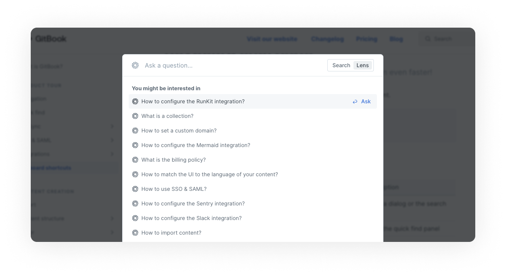
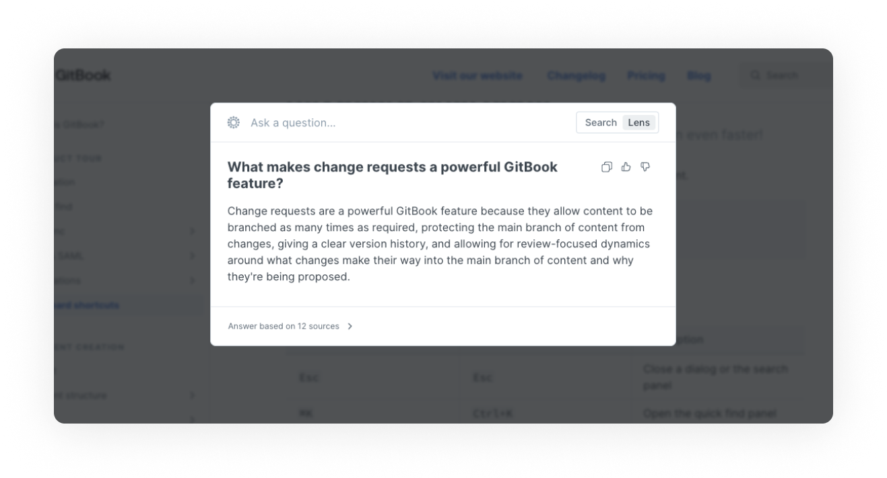

# Lens (AI search)

Simply tell Lens what you want, or ask it a question. It’ll use AI to scan your documentation and give you a simple, semantic answer — with clickable references if you want to dive deeper.


Lens is currently an **alpha** feature.


## Which GitBook plans include Lens?

While Lens is in open alpha, it is available at no additional cost on **all plans**! 🤩

In future, we plan to incorporate Lens into our **Pro and Enterprise plans**, but we'll let you know before that happens.

## How do I enable Lens?

### For published content

You can enable Lens for any published space or collection in that space's or collection's [customization settings](../../publishing/customization/space-customization.md). Click the **customize** button, go to the **configure** tab, and toggle the **enable Lens semantic search** setting on.

### For internal content

You can also enable Lens for your organization's internal content, allowing you to ask questions and get semantic answers about your internal knowledge base. Head to the **organization settings page** and, on the **general** tab, toggle the **enable Lens semantic search** setting on.

## How do I use Lens?

Once Lens is enabled, simply type a question into the search bar. Lens will take a few seconds to scan your documentation and summarize the results.

### Using Lens in published documentation

Let's give it a try right here in GitBook's public documentation! Firstly, open the search command palette. You'll find it in the top-right corner of the page. You can click on it to open it, or press `⌘+K` on a Mac or `Ctrl+K` on a PC.

Then, click on the Lens tab. You'll see a number of suggested questions that you might like to ask.

<figure><figcaption>
Ask a question with Lens.
</figcaption></figure>

For this example, lets try: "What makes change requests a powerful GitBook feature?" After a few seconds, you'll get an answer from Lens!

<figure><figcaption>
Lens gives you a semantic answer to your question.
</figcaption></figure>

### Using Lens in internal documentation

If Lens is enabled for internal content, you'll be able to do the same thing when logged into the GitBook app: open the quick find command palette, click on the Lens tab, type a question and receive a semantic answer.

### Integrating Lens with your product

With our API, you can embed Lens into your product or website! This opens up lots of possibilities, including in-app helpers and website chat bots that can respond to questions based on the content in your documentation.

[Take a look at our developer documentation](https://developer.gitbook.com/gitbook-api/reference/search#get-ai-search-results-from-all-spaces-for-the-currently-authenticated-user).

## How does Lens handle my data?

We pass your content to OpenAI to index and process data. OpenAI **does not** use this content for service improvements (including model training). You can find out more about how OpenAI handles data [here](https://openai.com/blog/introducing-chatgpt-and-whisper-apis#developer-focus).
