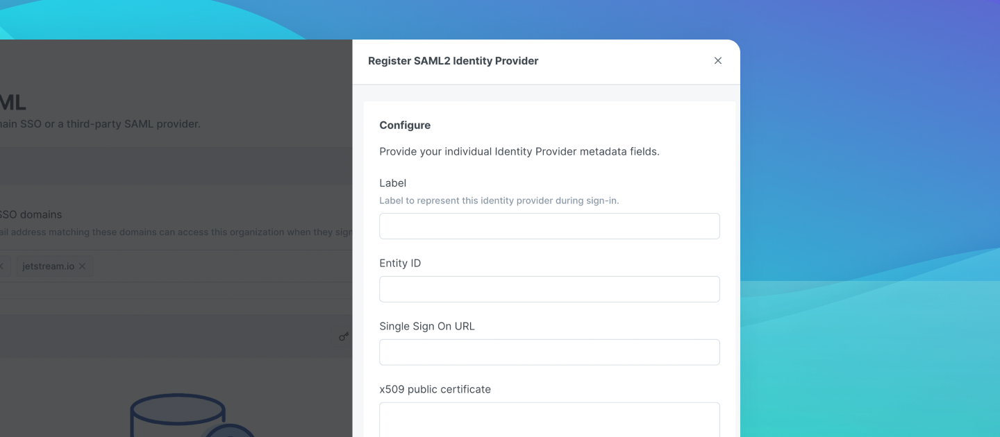

# SAML single sign-on


This feature is included in the Pro and Enterprise plans.


**SAML-based Single Sign-On** (SSO) gives members access to GitBook through an identity provider (IdP) of your choice.‌

GitBook easily integrates with your existing identity provider (IdP) so you can provide your employees with single sign-on to GitBook using the same credentials and login experience as your other service providers.‌

By using SSO, your employees will be able to log into GitBook using the familiar identity provider interface, instead of the GitBook login page. The employee’s browser will then forward them to GitBook. The IdP grants access to GitBook when SSO is enabled and GitBook's own login mechanism is deactivated. In this way, authentication security is shifted to your IdP and coordinated with your other service providers.‌​

## ​Prerequisites for SSO with GitBook 

* Your company’s identity provider (IdP) must support the **SAML 2.0** standard.
* You must have administrative permission on the IdP.
* You must be an administrator of the GitBook organization you want to set SAML up on.

## ​Setup on GitBook 

You must be an [organization admin](../../../collaboration/invite-members-to-your-organization/roles.md#admin) to enable SSO for your GitBook organization.‌

After configuring SSO on your IdP, you will be able to enter metadata. When the setup is successful, administrators will see a confirmation dialog and the URL of the SSO login for end-users will be displayed. **GitBook does not send announcement emails when set up is complete**. It is the responsibility of the administrator to notify company employees (and convey the login URL to them) so they can access GitBook via SSO.‌

You'll need the following from your IdP metadata to register a SAML provider:

* A **label** – this can be anything, it'll be displayed on the login page
* An **entity ID**
* A **Single Sign On URL**
* An **X.509 certificate** – make sure you copy and paste the whole certificate!

## ​Setup on the IdP 

Most SAML 2.0 compliant identity providers require the same information about the service provider (GitBook, in this case) for set up. These values are specific to your GitBook organization and are available in the **Settings -> SSO** tab of the GitBook organization where you want to enable SSO.‌

Most of these values can be copied directly into your IdP to complete configuration of SAML.

GitBook requires that the **NameID** contain the user’s email address. Technically we are looking for: `urn:oasis:names:tc:SAML:1.1:nameid-format:emailAddress` as the Name-ID format – many providers (such as Google) will allow you set a format such as **EMAIL**.

### Custom Attributes

GitBook will pull the following custom attributes from the SAML assert response and use them when creating the user.

| Field        | Description                                                                                              |
| ------------ | -------------------------------------------------------------------------------------------------------- |
| `first_name` | `first_name` and `last_name` fields will be combined to produce the display name for the user in GitBook |
| `last_name`  | `first_name` and `last_name` fields will be combined to produce the display name for the user in GitBook |

## ​Creating end-user accounts 

To add members, create accounts for them in your IdP. The first time a new member logs in to GitBook via the IdP, a GitBook account will be created for them via automatic IdP provisioning. The user will have access to organization resources as an organization member.


Set-up requires lower case email addresses. Do not use mixed case email addresses.‌


## ​Removing accounts 

Removing a member from the IdP will prevent the user from being able to sign in to the corresponding GitBook account, **but will not remove the account from GitBook**. We advise also removing the account from the GitBook organization.

## ​Security notice 

For security reasons, users who signed up to GitBook before the SSO was set up have to continue to log in normally. **SSO will only benefit users who log in to an organization after the setup is complete**. Admins could also ask prior SSO users to delete their account (or change their email) and then they will be able to login with SSO.
