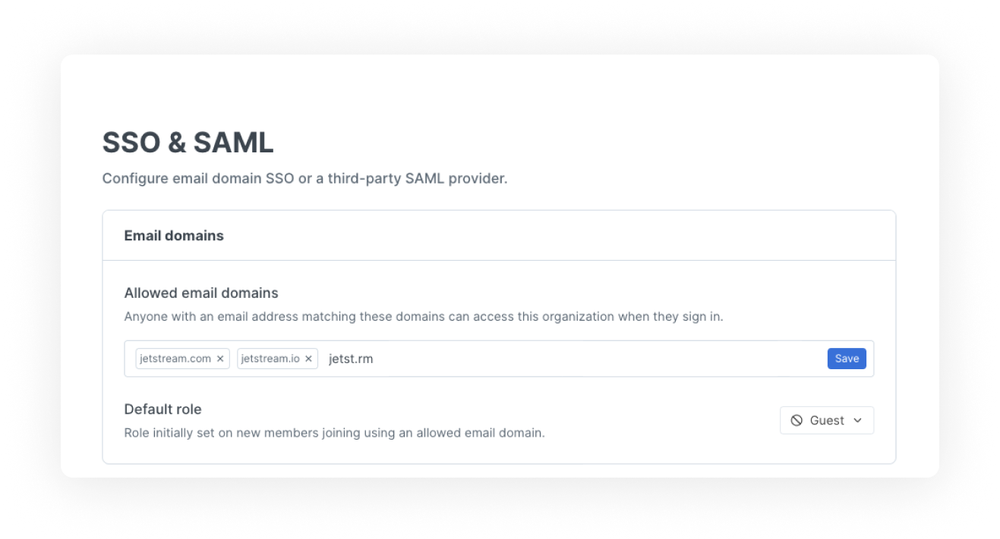

# SSO

While manually managing your organization members is fine for smaller teams or folks who want tonnes of control, sometimes you just need to open things up in a more automated way. GitBook allows you to configure this in a couple of ways, through a basic email domain SOO, and a more complex [SAML integration](saml.md).

## Single sign-on via email domain

When you create or manage your organisation, you can add a list of email domains that you want to allow to access your GitBook organization. This means that anyone with a verified email address that matches your configured SSO domains will be allowed to join your organization.

You can enable email domain SSO in the 'SSO' section of your organization settings; enter a comma-separated list of email domains you'd like to allow SSO access for and you're good to go.

<figure><figcaption></figcaption></figure>


Anyone who joins via an SSO email domain will default to guest access, you can change their role at any time in the members section of your organization settings.

