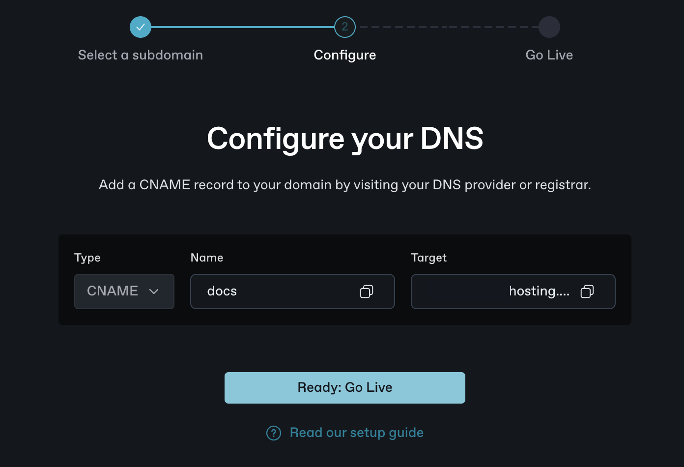
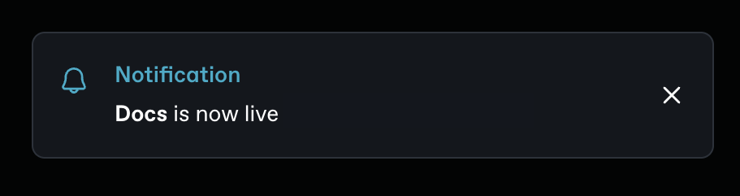

# 4. Finalize the custom domain setup

Once your CNAME record is successfully added within your DNS settings through your DNS provider, you can continue the domain connection process in GitBook.&#x20;

### Finalize the domain setup

After completing the second and third steps, the **Configure your DNS** screen should let you advance by clicking **Ready: Go Live.** This starts GitBook’s validation process.&#x20;

<figure><figcaption></figcaption></figure>

During this phase, GitBook verifies your CNAME record and configures the SSL certificate for your domain, ensuring a secure connection.&#x20;

<figure><figcaption></figcaption></figure>

When this process is finished, a success notification confirms that your site is live. Although this process generally proceeds without issues, occasional errors can occur.&#x20;

<figure><figcaption></figcaption></figure>


Should you encounter any challenges, make a note of the error and refer to our [troubleshooting guide](https://docs.gitbook.com/published-documentation/custom-domain/troubleshooting). If troubleshooting doesn’t work or the issue isn’t addressed in our guide, don't hesitate to [contact our support team](https://www.gitbook.com/contact) for assistance.

