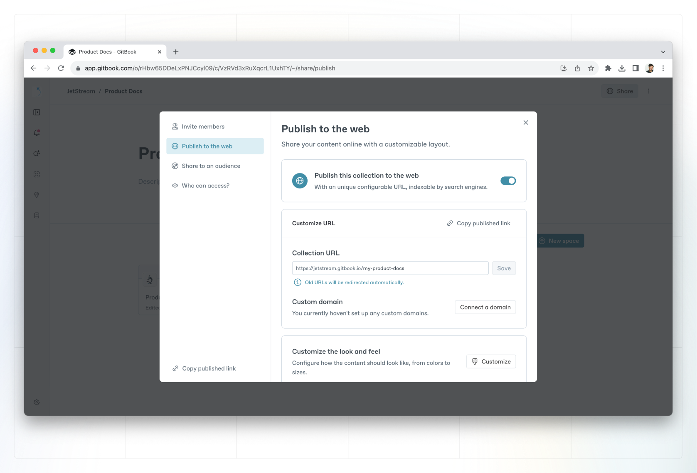
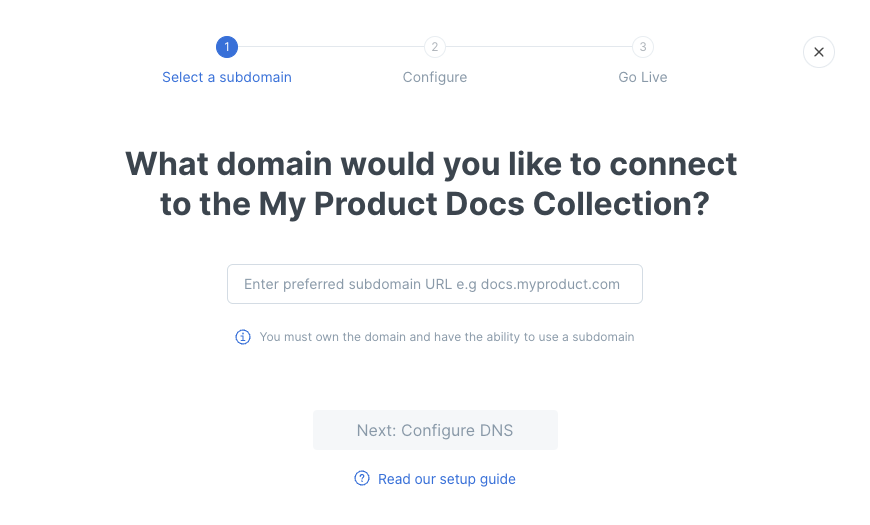

# Collection-level custom domain


Please follow the steps to set a custom domain in this order:

1. [Choosing a subdomain](../choose.md)
2. [Deciding where to set the custom domain](../location.md)
3. [**Initiating the custom domain setup**](./) **(at the** [**organization**](organization-level-custom-domain.md)**,** [**collection**](collection-level-custom-domain.md)**, or** [**space**](space-level-custom-domain.md) **level) (you are here)**
4. [Configuring DNS](../configure-dns.md)
5. [Confirming the custom domain setup](../finalize.md)



The custom domain will be used as-is for the default space in the collection. Other spaces in the collection will have a URL in this format: `[yourcustomdomain]/v/[spaceURL]`.


You'll find the options for setting a custom domain for a collection in the collection's Share modal.&#x20;

Click on the name of the collection in the sidebar, and then click on the **Share** in the top-right corner.

<figure><figcaption>
Collection share modal
</figcaption></figure>

In order to set a custom domain for a collection, your collection needs to be published either publicly, unlisted, with share links, or using visitor authentication.

After publishing, click **Connect a domain** under the Customize URL section. Then, enter the custom domain you'd like to set, and then click **Next: Configure DNS.**

<figure><figcaption>
Connect a custom domain
</figcaption></figure>

We'll then provide the name and value to use in the next step when you create your CNAME DNS record. You can copy the name or value to your clipboard by clicking on the icon on the right-hand side of each field.

<figure><figcaption>
The CNAME value for your custom domain
</figcaption></figure>

The value for the CNAME record will be in the format `[something]-hosting.gitbook.io`, where that `[something]` will be **unique to you**.

Now, you're ready to move onto the next step: [configuring DNS](../configure-dns.md).
