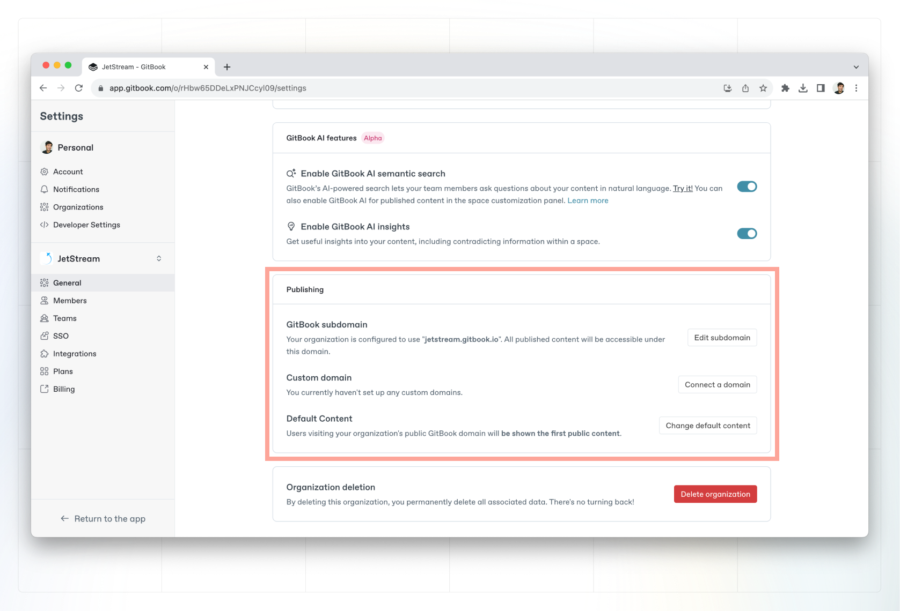
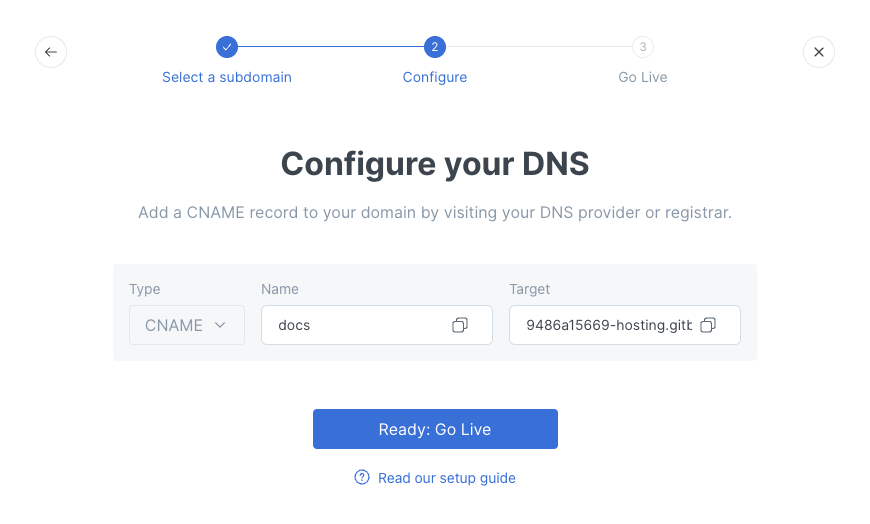

# 2. Initiate the custom domain set-up

Custom domain set-up steps for organizations and sites are similar but will impact your future published URL path. This is why it's important that you decide where to set the domain and follow the correct guide below.&#x20;

## Guide for organization domains

You’ll find the options for setting a custom domain for an organization within the organization settings page. Open the **Settings** menu in the lower left corner, and click on **Organization** **Settings**.

1.  In the **General** section, scroll to the **Publishing** section and under **Custom Domain**, click **Connect a domain**

    <figure><figcaption>
Set a domain for your entire organization in settings.
</figcaption></figure>
2.  This will open a window where you can enter the custom domain, then click **Next: Configure DNS**

    

    <figure><figcaption>
Connect a custom domain
</figcaption></figure>

    

3.  The final step requires you to copy the name and value to your clipboard so that you can create a CNAME DNS record. To copy the information click on the icon on the right-hand side of each field. Once copied, you can move on to [configuring the DNS](configure-dns.md).&#x20;

    

    <figure><figcaption>
The name and value for the CNAME record
</figcaption></figure>

    


The value for the CNAME record will be in the format:\
`[example]-hosting.gitbook.io`\
\
Please use the value displayed in the GitBook app and _not_ the value in the screenshot above.


Now you’re ready to move on to the next step: [configuring the DNS](configure-dns.md).

## Guide for site domains

The method for configuring a site domain typically mirrors the approach for setting up an organization domain. The primary distinction lies in step 1 which is the initial location for initiating the custom domain configuration.

1. Navigate to the site for which you want to set the custom domain. Click **Settings** then choose **Set up custom domain**\
   _**IMAGE**_
2.  This will open a window where you can enter the custom domain, then click **Next: Configure DNS**

    <figure><figcaption></figcaption></figure>
3. The final step requires you to copy the name and value to your clipboard so that you can create a CNAME DNS record. To copy the information click on the icon on the right-hand side of each field. Once copied, you can move on to [configuring the DNS](configure-dns.md).&#x20;


The value for the CNAME record will be in the format:\
`[example]-hosting.gitbook.io`\
\
Please use the value displayed in the GitBook app and _not_ the value in the screenshot above.


Now, you’re ready to move on to the next step: [configuring the DNS](configure-dns.md).
