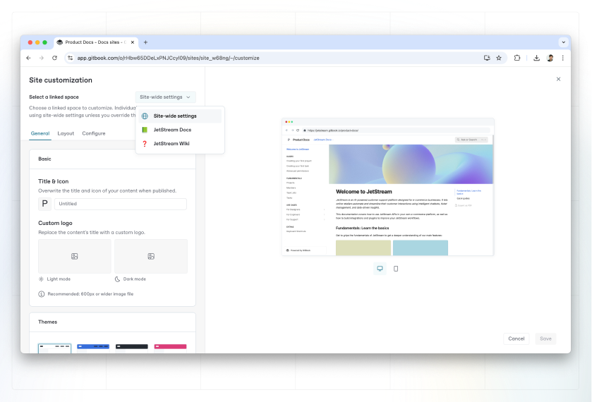

# Customizing sites with multiple spaces

If you have [a docs site with more than one linked space](../site-structure-and-navigation/publish-multiple-spaces-on-one-site.md), you can control the customization of each variation individually.

### How is customizing a linked space different from customizing a docs site?

Customizing an individual linked spaces lets you control the appearance of different parts of your published documentation. This is useful if you want to have different styles for different products or experiences that live on the same docs site.

<figure><figcaption>
Customize published docs with multiple linked spaces
</figcaption></figure>

### Overriding site-wide settings

Changes you make at a site-wide level will automatically apply to all linked spaces.

However, you can also choose specific linked spaces from the drop-down menu in the **Customization** panel, and apply overrides to those linked spaces.

Changes you make here will override the site-wide customization settings, even if you change the site-wide setting again later.


Most customization settings apply to your **published content**. This keeps your writing experience and in-app GitBook content consistent while allowing you to control the output to a degree.


### Customization options

To learn more about each of the customization options read the guidance on [site customization](space-customization.md).
