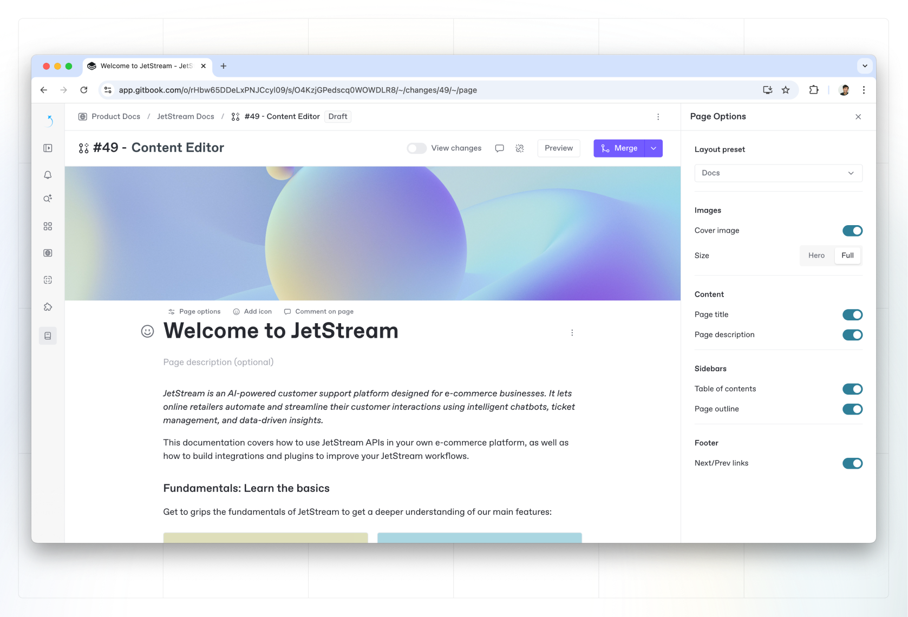

# Page options & covers

You can customize the look and feel of individual pages within a space. You can open the **Page options** <picture><source srcset="../../.gitbook/assets/Sort dark.png" media="(prefers-color-scheme: dark)"></picture> menu or change a page’s cover by hovering over the page title. You’ll see the buttons appear just above the page title.

<figure><figcaption>
Page options
</figcaption></figure>

### Page options

In the Page Options side panel, you can select how each page is displayed to those who visit your **published** content. There are three layout presets to choose from, or you can create a custom layout.

Each layout preset will toggle on or off each of the following parts of the page:

* Page title
* Page description
* Table of contents
* Page outline
* Next/previous links

Take a look at how each preset will set each of these parts of the page:

<table data-full-width="true"><thead><tr><th>Part of the page</th><th data-type="checkbox">Docs layout</th><th data-type="checkbox">Editorial layout</th><th data-type="checkbox">Landing page layout</th></tr></thead><tbody><tr><td>Page title</td><td>true</td><td>true</td><td>true</td></tr><tr><td>Page description</td><td>true</td><td>true</td><td>true</td></tr><tr><td>Table of contents</td><td>true</td><td>false</td><td>false</td></tr><tr><td>Page outline</td><td>true</td><td>true</td><td>false</td></tr><tr><td>Next/previous links</td><td>true</td><td>true</td><td>true</td></tr></tbody></table>

If you want to use a custom layout, you can choose simply toggle a setting in any preset to switch the setting to **Custom** — or manually select the **Custom** option from the drop-down and start making changes.&#x20;


Remember that the settings you choose here will affect **published content only**.


### Page covers

You can also set a page cover for each page of your documentation. When you click the **Page cover** <picture><source srcset="../../.gitbook/assets/Files dark.png" media="(prefers-color-scheme: dark)"></picture> option, a default cover will be added immediately. From there, you can:

*   **Change the cover image**

    Hover over the page cover and click **Change cover**, then select or upload an image. Based on how we currently display page covers, 1990x480 pixels is the ideal size.
*   **Reposition the cover image**

    Hover over the page cover and open the **Actions menu** . Click **Reposition**, then drag the image as you wish and click **Save**.
* **Remove the cover image**\
  Hover over the page cover and open the **Actions menu** , then click **Remove**.
* **Full width and hero width**\
  You can change the style of your page cover to span the full width of your screen or just the width of your content. Hover over the page cover and open the **Actions menu** , then choose your preferred option from the menu.
