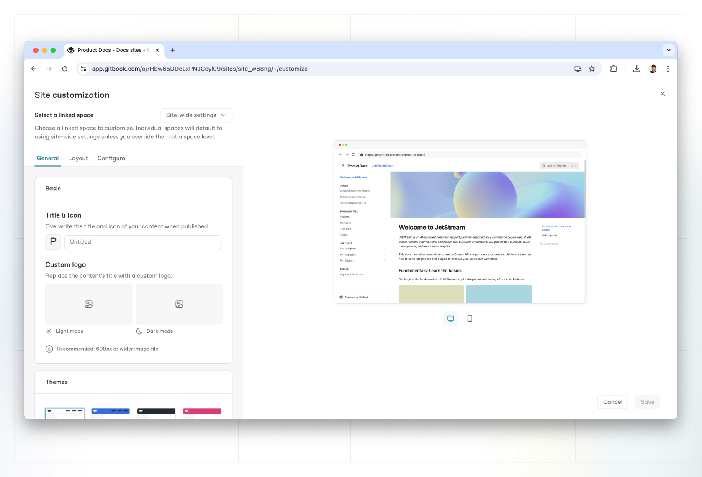

# Site customization

Customizing your site lets you control the branding, presentation and extra features of your site's public content. You can access your site's customization settings from the settings tab from your docs site's overview page.


Most customization settings apply to your **published content**. This keeps your writing experience and in-app GitBook content consistent while allowing you to control the appearance of your published content.


<figure><figcaption>
Customize options
</figcaption></figure>


[Advanced customization](space-customization.md#what-counts-as-advanced-customization) settings are only available as part of the Pro plan and Enterprise plan. To find out more, [visit our pricing page](https://www.gitbook.com/pricing) or scroll down to find out what’s included in Advanced customization.


### General

Control how your content looks in the General tab. The available options are:

Title, icon and logo

**Title**\
You can set any title you choose for your space. Note: this setting will only affect the title that displays _in the published documentation_. If you want to edit the title in the GitBook app, close the customize menu and edit it at the top of the space.

**Icon**\
You can set an emoji, or upload an icon of your own. Note: this setting will only affect the icon that displays _in the published documentation_ and it’ll also be used as the favicon for the page. If you want to edit the icon used within the GitBook app, close the customize section and click on the icon at the top of the space.

**Custom logo** <mark style="background-color:purple;">Premium & Enterprise</mark>\
You can replace _both_ the published space’s title and icon with a custom logo so that your documentation better reflects your own branding — and, you can upload two versions: one for light mode, and one for dark mode.&#x20;

#### What’s the difference between the icon and logo options?

The icon setting lets you upload a small, 132x132px image, which will appear _alongside_ your space title. The custom logo option lets you upload a larger image (we recommend at least 600px wide), which will completely replace any icon and title you’ve set.

Themes (for light &#x26; dark modes)

Themes let you customize the color scheme of your published content for both light and dark mode. While you can use any colors you like, it’s important to keep accessibility in mind and choose something with good contrast so your content is easy to read.

**Default theme**\
All spaces have access to this theme, where the header background color will be aligned with the background color for the rest of the space.

**Bold theme** <mark style="background-color:purple;">Premium & Enterprise</mark>\
The bold theme uses the primary color as the header background color.

**Contrast theme** <mark style="background-color:purple;">Premium & Enterprise</mark>\
The contrast theme has a dark header background color in light mode, and a light header background color in dark mode.

**Custom theme** <mark style="background-color:purple;">Premium & Enterprise</mark>\
The custom theme option lets you to set your own color preferences for the background color and link color in the header, in addition to choosing the primary color for light and dark mode.

Modes

**Show mode toggle**\
Enable this if you would like visitors to your published content to be able to manually toggle between light and dark mode. Readers can find the toggle at the bottom of any published page, both on larger screens and mobile devices.

**Default mode**\
Choose whether visitors to your published content will see it in light or dark mode initially. If **Show mode toggle** is enabled, they’ll be able to switch to the other option if they prefer. If **Show mode toggle** is disabled, they’ll only be able to see your content in the mode you choose here.

_Note: if you just want to change the theme within the GitBook app, you can do that from your **Settings**_ <picture><source srcset="../../.gitbook/assets/settings-dark.png" media="(prefers-color-scheme: dark)"></picture> _menu, which can be found at the bottom of the_ [_sidebar_](../../content-editor/editor/navigation.md#sidebar)_._

Styling

**Font family** <mark style="background-color:purple;">Premium & Enterprise</mark>\
You can choose a font family for your published content from a list of popular options.

GitBook doesn’t support uploading or linking custom fonts. If you think we’re missing a typeface that works wonderfully for headers, body copy, and captions, [let us know](../../help-and-faq/faq/support.md)!

**Corner style**\
Choose either a rounded or straight corner style, to help align your published GitBook content with your own brand’s styling preferences.

**Background**\
Switch between a plain background and a subtly tinted background that complements your [theme](space-customization.md#themes-for-light-and-dark-modes).

### Layout: manage navigation options for your content

Header

**Navigation**\
Add header links to your site. You could use header links to point to important parts of your documentation, or perhaps to link back to your main website.

You can choose what type of appearance you would like your link to have, and can choose between a normal link, primary button, and secondary button

When enabled, simply add a title and a URL for each link. We support two levels of header navigation, meaning that you can have sub-links that appear in a dropdown menu.

.png>)

Page

**Pagination**\
Keep this setting on to have previous and next buttons appear at the bottom of each page in your space, or toggle it off to remove them.

<strong>Footer</strong> <mark style="background-color:purple;">Premium &#x26; Enterprise</mark>

Enable or disable a footer section for your space.

**Logo** <mark style="background-color:purple;">Premium & Enterprise</mark>\
Add your logo or another image in the footer.

**Copyright text** <mark style="background-color:purple;">Premium & Enterprise</mark>\
Add some brief copyright information to your footer.

**Navigation** <mark style="background-color:purple;">Premium & Enterprise</mark>\
Add links in your footer, in multiple sections. Just like with the header, you can add a title and URL for each link. Make sure to also include a section title for each section you create.

### Configure: manage the interface

Localize user interface

You can select from a list of languages to localize the user interface of your published content. This will apply translations to the **non-custom** areas of the interface.

This setting will _not_ auto-translate your actual content, but can help with matching the user interface to the language that you are writing in.

Is there a language we don’t yet offer that you would like to see included in this list? [Let us know](https://github.com/GitbookIO/gitbook/issues), or [contribute your own translation](https://www.gitbook.com/solutions/open-source)!

Privacy Policy

You can link to your own privacy policy to help visitors understand how your GitBook content uses cookies, and how you protect their privacy. If you choose not to set one, your site will default to [GitBook’s own privacy policy](https://policies.gitbook.com/privacy-and-security/statement/cookies).

Edit on GitHub/GitLab

If your space is connected to a Git repository, you can optionally show a link for your users to contribute to your documentation from your linked repository.

### What counts as ‘Advanced customization’?

Every GitBook user can take advantage of basic customization options on their docs site. Pro or Enterprise plan users can also use advanced customization features to further tweak their docs to match their brand.

Advanced customization options include:

* **Custom logo** – Add a logo that replaces the emoji and title at the top of your docs site.
* **Custom font** – Change the font of your docs to one of the built-in options.
* **Footer** – Add a custom logo, copyright text and navigation to a footer at the bottom of your documentation.
* **Bold, Contrast and Custom themes** – Customize the primary color of your docs, as well as setting the background color for your header and the links within it.
* **Ask GitBook AI** – Let your users ask anything about your product from the Search menu. GitBook AI will scan your documentation and provide a plain English answer in seconds.

### What _cannot_ be customized?

The options above provide lots of ways for you to customize your space, but there are a few things that you won’t be able to customize, regardless of [your chosen plan](../../account-management/plans/).

1. It’s not possible to customize the layout of the elements on the page. (However, it _is_ possible to [hide certain elements](page-layouts.md) on a page-by-page basis)
2. There’s no way to insert custom code, such as CSS, HTML, JS, etc., directly into one or more documentation pages. If you’re looking to integrate a third party service, take a look at [the docs for our integrations platform](https://developer.gitbook.com/). We already integrate with a number of popular tools, and offer [rich embeds](../../content-editor/blocks/embed-a-url.md) for many more.&#x20;
3. It’s not possible to remove the small "Powered by GitBook" link that appears in published documentation.
