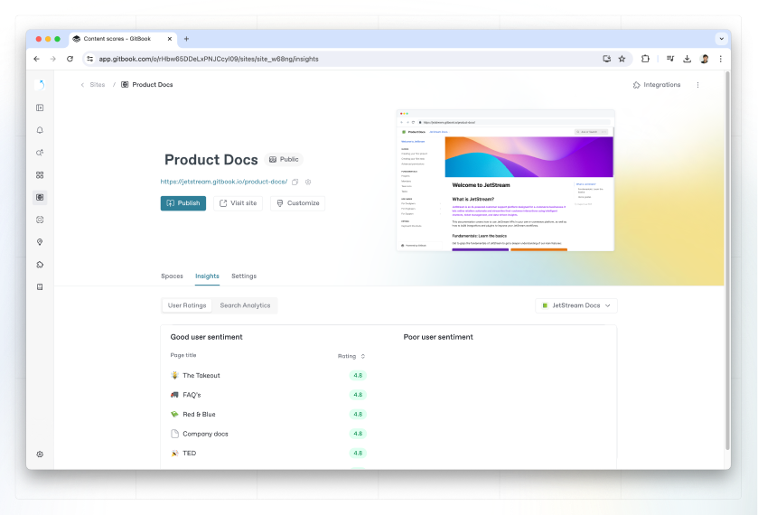
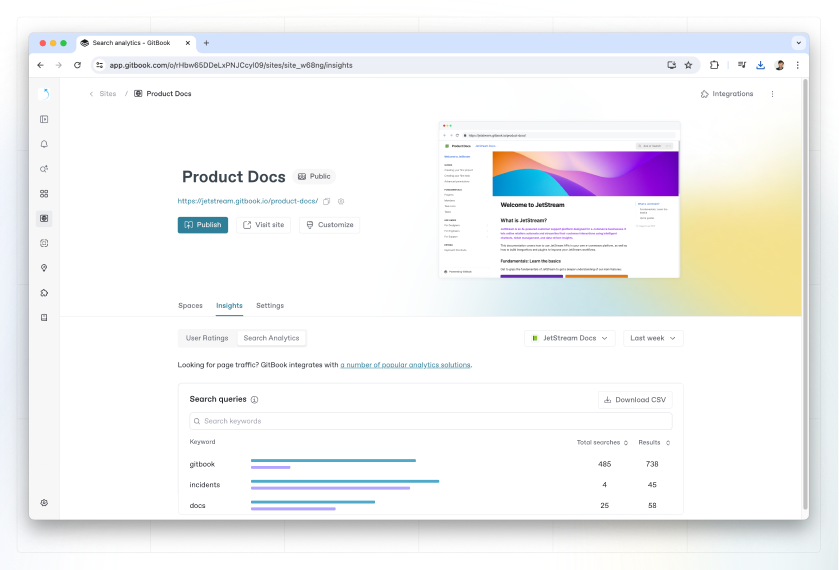

# Site insights


This feature is available as part of the Pro plan and Enterprise plan. To find out more, [visit our pricing page](https://www.gitbook.com/pricing).


Insights give you information on the content you've published and how it performs. It's split up between two sections — **user scores** and **search analytics**.

You can find insights for individual docs sites in the docs site dashboard. Click on the **Insights** tab to view them.

### Content scores

Content scores give you a high-level representation of how your users rate your content. After enabling [page rating](customization/space-customization.md#page-rating) in the **Customize** menu for a site, you can see each page’s average feedback rating here.

You’ll initially see the ratings for your site’s default content, and you can use the dropdown menu on the right to select any other linked spaces in that site. You can then hover over the average rating to see how many positive, neutral and negative ratings a specific page has.

If you want to use or analyze this data further outside of GitBook, click **Download CSV** to download a `.csv` file to your device.

#### How does GitBook calculate user scores?

GitBook uses a simple formula to calculate the page’s overall score:

`no. of ratings * (no. of positives - [0.5 * no. of neutrals] - [2 * no. of negatives])`

The goal of the content score is to surface the pages with the most feedback, with a bias towards negative ratings so you can see pages that need improvements. The more ratings a page has, the more the formula amplifies the sentiments of those ratings. This helps you spot pages that need attention, as well as pages that are highly-rated — to help you identify, iterate on and replicate your best content.

We cap the score at 500 (and -500) to avoid scores for commonly-rated pages reaching 10,000+.


**Why can’t I see any data for my site?**\
We only display data for published sites with page ratings enabled. If your site is not published or does not have page ratings enabled, you won’t see any insights.


<figure><figcaption>
User ratings
</figcaption></figure>

### Search analytics

You can measure and improve your documentation by checking which keywords are used the most by users searching your documentation.

Switch to the **Search analytics** tab to see what keywords are performing the best, and which ones you could improve on. You can view these search terms for the past week, month, or year.

The information here can be helpful for informing your content architecture, making certain parts of your documentation easier to find without search, or adding additional content to existing pages based on what your visitors are searching for.

<figure><figcaption>
Search analytics
</figcaption></figure>

If you want to use or analyze this data further outside of GitBook, click **Download CSV** to download a `.csv` file to your device.

You’ll get information on:

`pageHits`: Total number of pages (title and description) matching the search term/query .

`sectionHits`: Total number of sections (contents of the pages) matching the search term/query.


**Why can’t I see any data for my space?**\
We only display data for published sites. If your site is not published, you won’t see any search insights.

