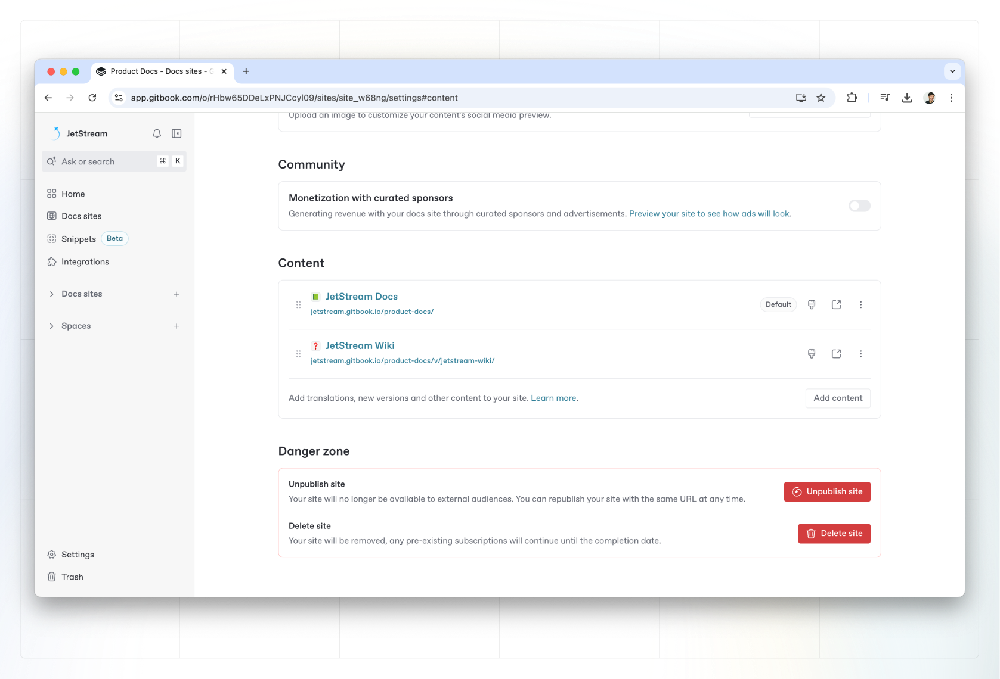

# Publish multiple spaces on one site

You can publish multiple versions of the same documentation as part of a single docs site. These variations will be available to the end users via the space switcher in the top-left corner of the published site.



### Why publish multiple spaces on one site?

A site with multiple spaces is useful if you need to group together the content of your spaces — such as if you’re documenting multiple versions of an API (v1, v2, v3, etc.), or documenting your content in different languages.

<figure><figcaption>
Multiple spaces published through a single GitBook docs site.
</figcaption></figure>

### Link multiple spaces to a site

From your docs site’s dashboard, click the **Settings** <picture><source srcset="../.gitbook/assets/settings-dark.png" media="(prefers-color-scheme: dark)"></picture> button, then scroll down to the **Content** section. Here you can see all the content of your site, and can add more by linking more spaces.

The spaces you link can contain similar or completely different content to the other linked spaces.&#x20;

<figure><figcaption></figcaption></figure>

### Remove content from a site

To remove the content of a space from a site, click the **Settings** <picture><source srcset="../.gitbook/assets/settings-dark.png" media="(prefers-color-scheme: dark)"></picture> button from your docs site dashboard, then scroll down to the **Content** section to find the content you want to remove. Open the **Actions menu**  next to the linked space you want to remove and select **Delete from site**. This will remove it from the published site, but will not delete the space or the content within.
