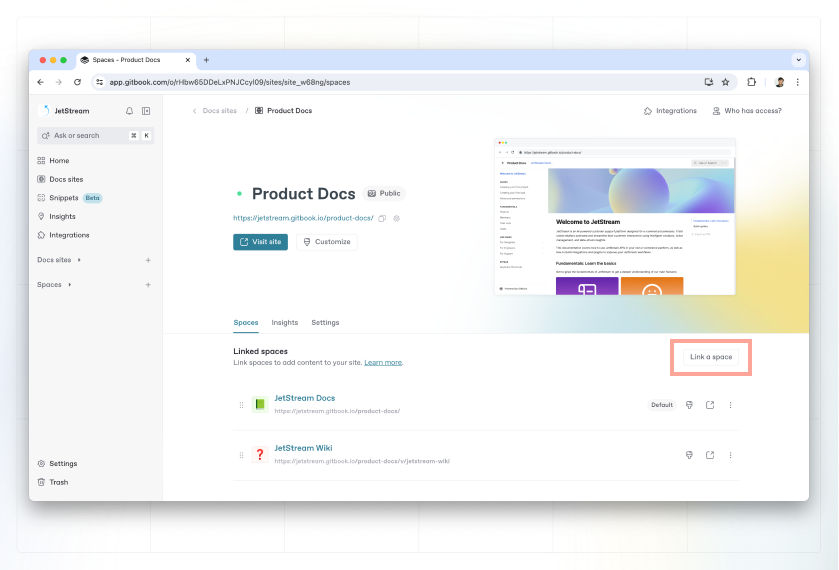

# Publish multiple spaces on one site

You can publish multiple versions of the same documentation as part of a single docs site. These variations will be available to the end users via the space switcher in the top-left corner of the published site.

<figure><figcaption>
Multiple spaces published through a single GitBook docs site.
</figcaption></figure>

### Why publish multiple spaces on one site?

A site with multiple spaces is useful if you need to group together the content of your spaces — such as if you’re documenting multiple versions of an API (v1, v2, v3, etc.), or documenting your content in different languages.

### Link multiple spaces to a site

From your docs site’s dashboard, under the **Spaces** tab, you can link more spaces to create site variations. Click the **Link a space** button on the right to link another space.&#x20;

In terms of content, each variation is just another space that you link to your site. It can contain similar or completely different content to the other linked spaces.&#x20;

<figure><figcaption></figcaption></figure>

### Remove a linked space

To remove a linked space, select the **Spaces** tab in your docs site dashboard, then open the **Actions menu**  next to the linked space you want to remove and select **Delete from site**. This will remove it from the published site, but will not delete the space or the content within.
