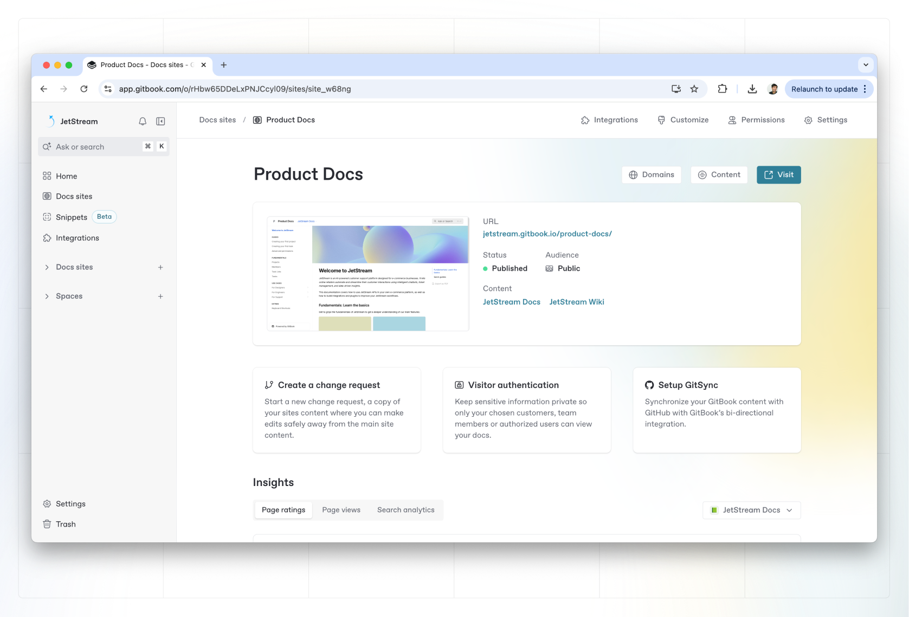

# Publish your content as a docs site

Once you’ve finished writing, editing, or importing your content, you can publish your work to the web as a docs site. Your docs will be published on the web and available to your selected audience.&#x20;

To get started, create a new docs site for your content to live on, or publish a space as a docs site.

### Create a docs site

To create a docs site, click the plus **+** icon next to Docs site in the sidebar on the left.

The content on your site comes from [spaces](../../content-editor/editor/content-structure/what-is-a-space.md) in your organization. When you create a new docs site, you can create a new space, or link an existing one.&#x20;

After linking a space, you'll be able to choose who can access your content once it’s published.

<figure><figcaption>
Docs site home
</figcaption></figure>

Alternatively, you can create a docs site from the space you want to publish by opening the space and clicking **Share** in the top-right corner of the window. Then choose **Publish as a docs site** in the share modal’s sidebar.&#x20;

From this menu, you can link your space to an existing docs site, or create a new one to publish your space on its own. It also shows any other docs site your space is already linked to.

### Delete or unpublish a docs site

To delete a docs site, you'll need to go into your site's settings. See [site-settings.md](../site-settings.md "mention") for more information.

### Publish your content

<table data-view="cards"><thead><tr><th></th><th></th><th data-hidden data-card-cover data-type="files"></th><th data-hidden data-card-target data-type="content-ref"></th></tr></thead><tbody><tr><td><strong>Public</strong></td><td>Publish your docs publicly to the web.</td><td><a href="../../.gitbook/assets/2 (1).png">2 (1).png</a></td><td><a href="public-publishing.md">public-publishing.md</a></td></tr><tr><td><strong>Privately with share links</strong></td><td>Publish your docs using private links.</td><td><a href="../../.gitbook/assets/6 (1).png">6 (1).png</a></td><td><a href="share-links.md">share-links.md</a></td></tr><tr><td><strong>Visitor Authentication</strong></td><td>Protect your published docs with OAuth sign in.</td><td><a href="../../.gitbook/assets/9 (1).png">9 (1).png</a></td><td><a href="visitor-authentication/">visitor-authentication</a></td></tr></tbody></table>

### Customize your docs

After you've published a site, you can customize your docs in multiple ways.

<table data-view="cards"><thead><tr><th></th><th></th><th data-hidden data-card-cover data-type="files"></th><th data-hidden data-card-target data-type="content-ref"></th></tr></thead><tbody><tr><td><strong>Set a theme</strong></td><td>Customize and add a theme.</td><td><a href="../../.gitbook/assets/5 (1).png">5 (1).png</a></td><td><a href="../customization/space-customization.md">space-customization.md</a></td></tr><tr><td><strong>Set a custom domain</strong></td><td>Set up a custom domain for your docs.</td><td><a href="../../.gitbook/assets/8.png">8.png</a></td><td><a href="../custom-domain/">custom-domain</a></td></tr><tr><td><strong>Publish a variation</strong></td><td>Add multiple variations for your docs.</td><td><a href="../../.gitbook/assets/1 (1).png">1 (1).png</a></td><td><a href="../publish-multiple-spaces-on-one-site.md">publish-multiple-spaces-on-one-site.md</a></td></tr></tbody></table>

### Learn more

<table data-card-size="large" data-view="cards"><thead><tr><th></th><th></th><th data-hidden></th><th data-hidden data-card-cover data-type="files"></th><th data-hidden data-card-target data-type="content-ref"></th></tr></thead><tbody><tr><td><strong>Pricing</strong></td><td>Learn more about how pricing works for docs sites in GitBook.</td><td></td><td><a href="../../.gitbook/assets/12 (1).png">12 (1).png</a></td><td><a href="../../account-management/plans/">plans</a></td></tr><tr><td><strong>SEO</strong></td><td>Learn more about how SEO works for your published docs.</td><td></td><td><a href="../../.gitbook/assets/4 (1).png">4 (1).png</a></td><td><a href="../seo.md">seo.md</a></td></tr></tbody></table>
