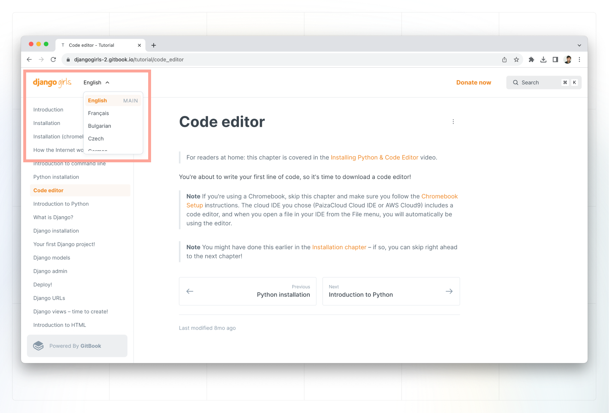
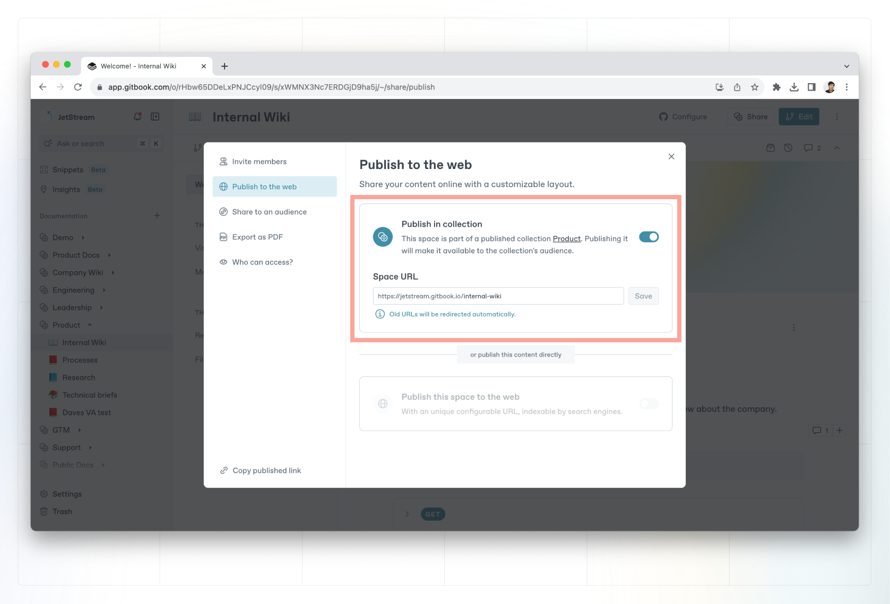
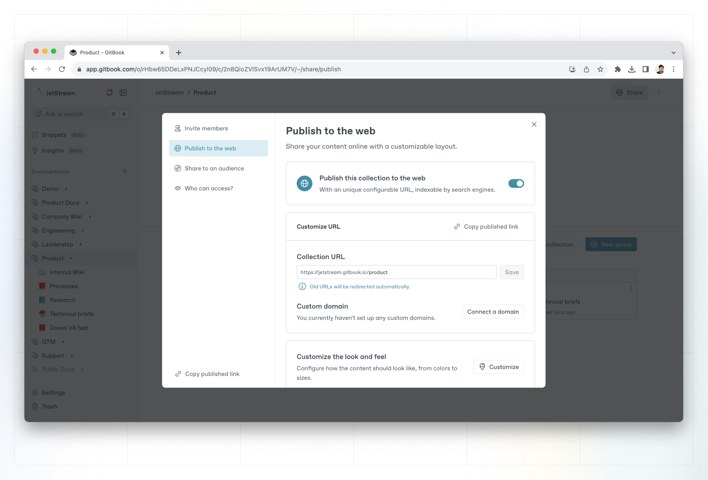

# Share a collection

Collection publishing allows you to publish multiple versions of your content in one place.&#x20;


**Permissions**

Only creators and administrators can publish content.


### Why publish spaces in a collection?

When you set the [space visibility](space-publishing.md) of a space to **in collection** and publish the collection, you can wrap a number of spaces in a single published interface. This is called **publishing variants**.

When you publish a collection of variants, any space that is published inside the collection will be quickly accessible through a dropdown in the sidebar of the published content, allowing readers to switch between variants at any time.

Variants are useful if you need to offer a grouped experience for spaces, such as documenting multiple versions of an API (v1, v2, v3, etc.) or documenting your content in multiple languages.

<figure><figcaption>
Variants of a published GitBook Collection.
</figcaption></figure>

### Unpublished spaces inside a published collection

When you publish a collection, you still need to decide which spaces nested within the collection should be published as part of that collection. This allows you to choose which spaces in a collection are visible.

As an example, say you have a collection full of useful spaces, but you're working on a completely new space to live alongside them. Rather than creating and editing that space somewhere else, you can keep it where it's supposed to live, and only publish it as part of the collection when it's ready.

### Publish a collection with variants

<figure><figcaption>
Publish a space in a collection.
</figcaption></figure>

### Publish the collection

First we will publish the collection. Note that this **does not publish the spaces inside the collection**. You need to publish each space individually.

Collection publishing works almost exactly the same as [space publishing](space-publishing.md#publish-to-the-web). Navigate to the the **share** button near the top-right corner, which will open the share modal.

Inside the share modal, you'll see some or all of the following tabs on the left-hand side to choose from. (The tabs available to you will depend on your permissions.)

<figure><figcaption>
Publish a collection in GitBook
</figcaption></figure>

### Publish individual spaces

For each space that you want to publish in the collection, click on the **share** button near the top-right corner to open the share modal.

This action will create variants that will be displayed inside your collection.&#x20;

Ensure you're on the publish to the web tab, and then toggle the publish in collection setting to the **on** position.

See [sharing options](space-publishing.md) for more info.

### Set the default space in a collection

The default space in a collection is the space that readers will land on when they visit your published collection.&#x20;

To change the default space in a collection, navigate to the collection customization page by clicking the menu icon in the top-right corner of the collection in the editor. Under General > Collection, choose the default space from the dropdown.
