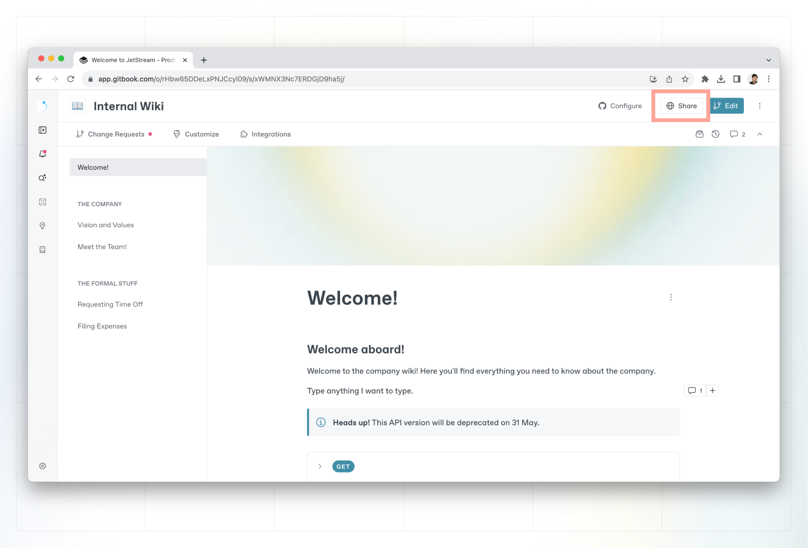
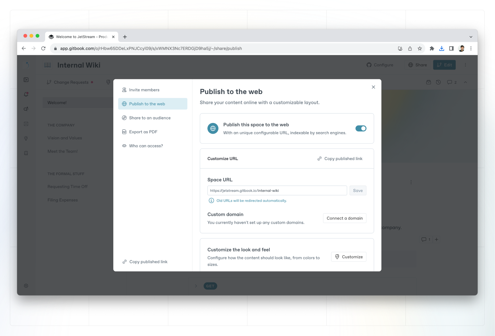

# Sharing options

### Sharing a space

To share a space, click the **share** button in the top-right corner of a space. This will open the share modal.

<figure><figcaption>
Share your GitBook space with an audience.
</figcaption></figure>

Inside the share modal, you’ll see different sharing options on the left-hand side.


The options available to you will depend on your permissions in the space, as well as your pricing plan.


### What sharing options are available?

#### Invite members

<figure><figcaption>
Invite members to a GitBook space.
</figcaption></figure>

By default, users within your organization will inherit the permissions assigned to them within the organization settings area.&#x20;

If you want your content to remain private, and shared only with a specific person or group, inviting that person or people to be a member of your organization could be a great choice. They will be able to access the content when they are logged into their GitBook account.


Inviting a member will make them a member of the organization that owns the space, which **will increase your overall subscription charge.**&#x20;

The cost for this will depend on the [plan](../../account-management/plans/) that the organization is subscribed to.


It is also possible to [invite members to the organization ](../../account-management/member-management/invite-members-to-your-organization.md)from within the organization settings area.

#### Publish to the web

<figure><figcaption>
Publish to web
</figcaption></figure>

If your content is suited for a much wider audience, you can publish it on the web. Spaces that are published on the web can be [indexed by search engines](../seo.md) and will be available to anyone on the Internet.

You’ll still retain control over who can _edit_ your content, and only your primary content branch will be published, so any [change requests](../../content-editor/editor/change-requests.md) will remain private until merged.

#### Share to an audience

<figure><figcaption>
Share your GitBook space with an audience.
</figcaption></figure>

In some cases, you might want to publish and share your content with a more specific audience.

#### **Publish in collection**

If the space is nested inside of a published collection, you'll see this option. A space nested inside of a collection does not _have_ to be published as part of the collection so you can do things like work on a new version and only publish it when it's ready. Toggle this option to publish the space as part of the collection. You can find out more about collection publishing. See [collection publishing](collection-publishing.md) for more info.


This option will only be visible if your collection has been published first.&#x20;


#### **Publish with** **visitor authentication**

With visitor authentication, GitBook lets _your_ server-side code handle who has access to the content. See [visitor authentication](visitor-authentication.md) for more info.

#### **Publish with** **share links**

Share links include a private token, making it extremely difficult for anyone outside of those you share the link with to find the content. This can be a great way to share private content with those who are not members of your organization. See [share links](share-links.md) for more info.

#### **Publish as unlisted**

Unlisted spaces are publicly available, but they _won’t_ be indexed by search engines such as Google. They will still be accessible to anyone with a the link to your documentation. Unlisted spaces can be particularly helpful if you want to publish a beta of your docs, or do large-scale user testing, without impacting your SEO with potentially duplicate content.

### Export as PDF

This option allows you to generate a PDF copy of your content and share this with others in any way you choose. You can export one or more single pages or the entire space in one PDF file. See [PDF export](pdf-export.md) for more info.

### Who can access?

This tab confirms the current visibility of the space, along with who has access to it within the GitBook app. No settings can be changed here; all changes are made from within the other tabs.
