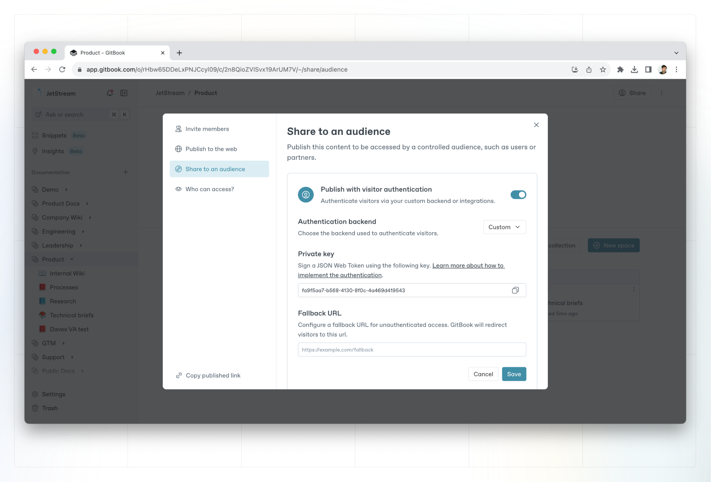

# Visitor Authentication


This feature is currently accessible to all **Pro and Enterprise** customers. If you are interested in the [Enterprise plan](../../../account-management/plans/#enterprise-plan), please contact [sales@gitbook.com](mailto:sales@gitbook.com) for a quote.


Visitor Authentication allows you to publish your content while requiring authentication from any visitors. When enabled, GitBook lets your authentication provider handle who has access to the content.

<figure><figcaption></figcaption></figure>

### Use cases

Common use cases for Visitor Authentication include:

* Publishing sensitive product documentation that should only be accessible to paying customers, sales prospects or partners.
* Publishing internal knowledge base content that should only be accessible to employees of your company.

### Setup

There are two methods you can choose from when setting up Visitor Authentication:

1. Installing one of our authentication integrations — we currently support Okta, Azure, and Auth0. We **highly recommend** this option if you’re using an authentication provider we support.
2. Create and host your own server to handle the authentication. Many different technologies can be used, but it’s up to you to code and maintain the solution you go with. See the [Guides section](https://developer.gitbook.com/visitor-authentication/guides/custom-backend) of our developer documentation for more information.

Want to use one of our integrations? Use these guides to get up and running:






