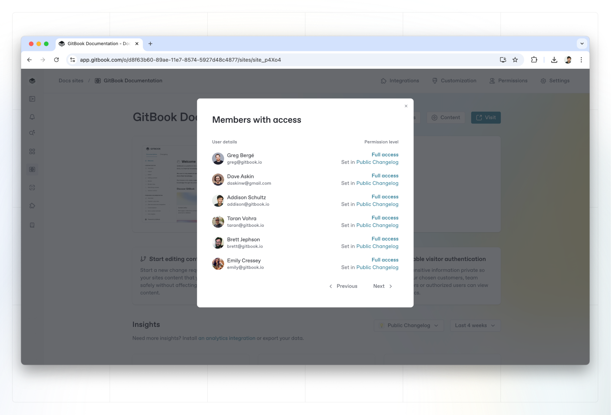

# Site permissions

Docs sites inherit the permissions from the **spaces** linked to them.

You can view all the permissions set for users with access to the docs site from the permissions modal from the docs site’s overview page. You’ll also see which space the user’s permission was inherited from. If you’d like to change the permission, click on the space and edit the permissions on the space in the permissions modal.

<figure><figcaption></figcaption></figure>

Users with **Administrator** or **Creator** permissions on _any_ linked space will have full access permissions on the docs site. This means that they’ll be able to control any of the publishing and customization settings.

Users with **Reviewer**, **Editor**, **Commenter**, or **Reader** permissions on a linked space will be given Read-only permissions. This means they will see the docs site in the account but won't be able to access any of the settings.&#x20;
