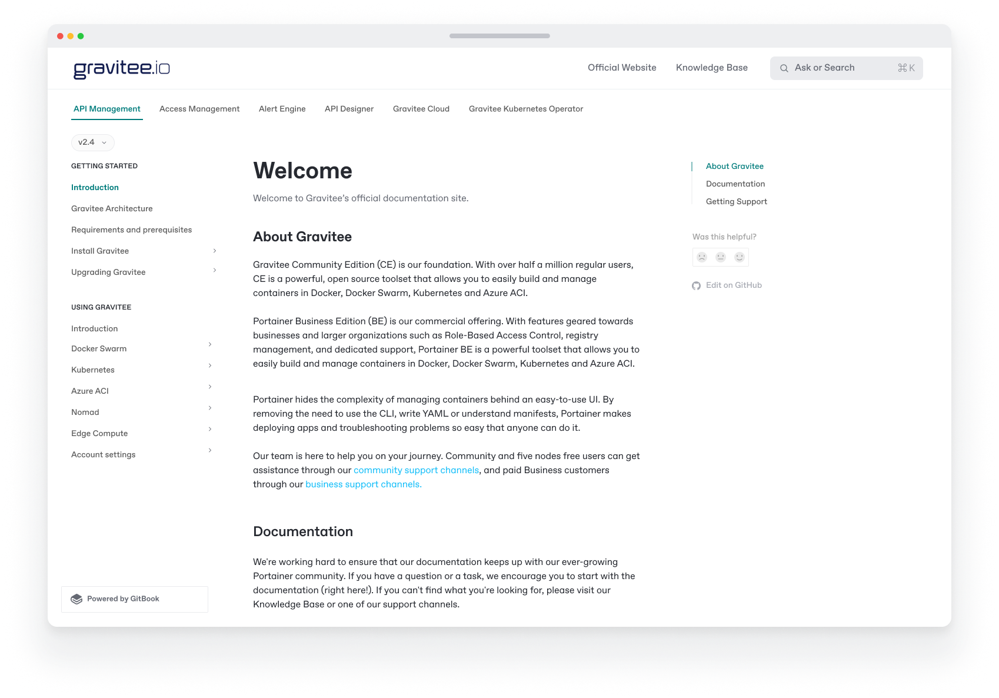

# Site sections

### Why split a site into multiple sections?

A site with multiple sections is useful if you need to separate distinct parts of your documentation, each with its own navigation tree — such as if you're documenting different products with separate versions, or if you want to offer end-user and developer documentation separate from each other.

The spaces you link as sections can contain any content, but it is recommended to use sections as _semantically different_ parts of your docs. If the spaces you'd like to link are variations of the same content, consider adding them as [content variants](publish-multiple-spaces-on-one-site.md) instead.

<figure><figcaption>
Multiple sections published on a single GitBook docs site.
</figcaption></figure>

### Adding a section to your docs site

From your docs site’s dashboard, click the **Settings** <picture><source srcset="../../.gitbook/assets/settings-dark.png" media="(prefers-color-scheme: dark)"></picture> button, then scroll down to the **Site structure** section. Here you can see all the content of your site.

To add a section, click the **Add section** button underneath the table and choose a space to link as a section. This space will serve as the first (or only) variant within your new section. The new section is then added to the table and will be available to visitors as a tab at the top of your site.

<figure><figcaption></figcaption></figure>

### Changing a section

You can change the name and slug of each of your sections by tapping the  **Edit** button in the table row of the section you'd like to edit. Edit the field(s) you'd like to change, then click the  **Save** button to save.

### Reordering sections

Your site displays sections in the order that they appear in your Site structure table. Sections can be reordered by pressing the **More menu**   in the table row of the space you'd like to edit and choosing **Move up** or **Move down**.&#x20;

All the spaces within that section will be moved with it. The changed order will be reflected on your site immediately.

### Setting a default section

If you have multiple sections in your site, one section will be marked as the default. This section is shown when visitors arrive on your site, and is served from your site's root URL. Other sections each have a slug that is appended to the root URL.

To set a section as default, click on the **More menu**  in the section's table row and then click **Set as default**.

### Remove a section from a site

To remove a section from a site, click the **Settings** <picture><source srcset="../../.gitbook/assets/settings-dark.png" media="(prefers-color-scheme: dark)"></picture> button from your docs site dashboard, then scroll down to the **Site structure** table to find the content you want to remove. Open the **More menu**  next to the section you want to remove and select **Delete from site**. This will remove the section, along with all the variants within it, from the published site. It will not delete the space or the content within.
