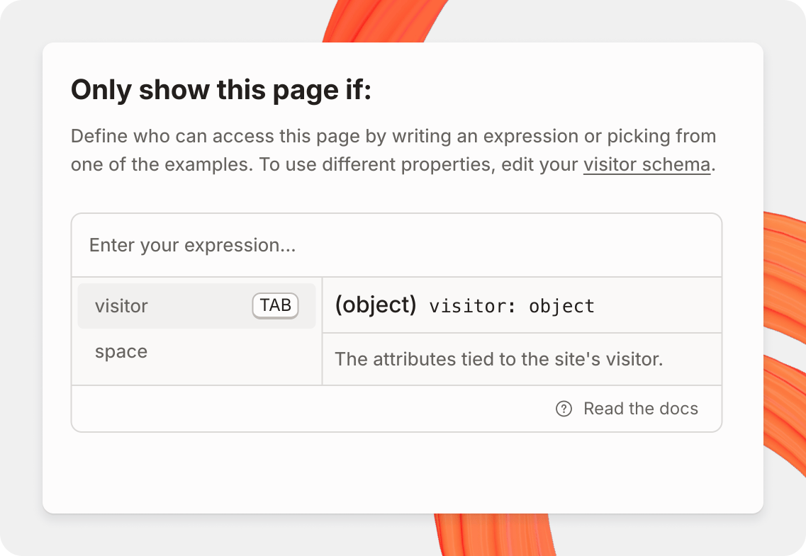

# Adapting your content

After setting up your authentication method, you’ll be able to use the data to adapt the content in your site for different users.

You can adapt and personalize many parts of your docs, including:

* Hiding or showing [pages](../../creating-content/content-structure/page.md)
* Hiding or showing site [variants](../site-structure/variants.md)
* Hiding or showing site [sections](../site-structure/site-sections.md)
* Hiding or showing [header links](../customization/layout-and-structure.md#header)
* Adding personalized content to [inline expressions](../../creating-content/variables-and-expressions.md)

### Working with the condition editor

The condition editor is where you’ll set the conditions for showing or hiding a page, variant, or section. After opening the condition editor, you’ll be able to write your condition as an [expression](../../creating-content/variables-and-expressions.md) that will run against data coming from visitors to your site.

<figure><figcaption></figcaption></figure>

#### Example

The data you pass through your users to GitBook is attached to an object called `visitor.claims`.

Let’s take a look at an example if we want to write a conditional statement to **only show a page for users who are part of a beta program** you might define.

```javascript
visitor.claims.isBetaUser == true
```

The expression above means that any user who matches this claim (i.e. `isBetaUser` is `true` in the user’s claim), will be able to see and access the page. Any user who does not match this claim (including visitors without any claims set), will not be able to see or access the page.

The condition editor also comes built in with autocomplete, which suggests claims or attributes that have been found on previous visitors to your site, helping you craft the conditional statement for your pages, variants, or sections.

As you use the autocomplete, you'll notice that [variables](../../creating-content/variables-and-expressions.md#use-variables-in-your-content) are also available to use. You can combine variables that you have defined together with claims that come from user data to write conditional expressions. For example, you could:

1. Set a variable for the latest version of your product
2. Then, configure a claim that shows which version of your product is being used by a visitor to your docs
3. Finally, write an expression to only show certain pages when a user is on the latest version of your docs

You can write many different kinds of expressions , as long as they are written in valid Javascript. For instance, you can combine multiple claims into the condition editor to match specific users by using the `&&` or `||` operator. You can read more about operators [here](https://developer.mozilla.org/en-US/docs/Web/JavaScript/Reference/Operators#binary_logical_operators).

### Testing with segments

Segments represent mock user data that you can configure to test your conditions.

For example, you could set up a segment that represents a developer on your enterprise plan, or a sign-in user on a free plan, and then see which pages would be visible to them.

[You can read more about setting up and using segments here.](testing-with-segments.md)

### Conditional pages

To launch the condition editor for a page, head to the actions menu <picture><source srcset="../../.gitbook/assets/25_01_10_actions_icon_dark.svg" media="(prefers-color-scheme: dark)"></picture> next to a page, and click **Add condition.** You can also launch the condition editor from a [page’s options](../../resources/gitbook-ui/#page-options).

You can see which pages in your space have conditions set if the page has a page condition icon <picture><source srcset="../../.gitbook/assets/25_04_10_page_condition.svg" media="(prefers-color-scheme: dark)"></picture> next to it.


#### Conditional blocks

To add a conditional block, begin a new line in the editor, type <kbd>/</kbd>, then select <picture><source srcset="../../.gitbook/assets/25_04_10_page_condition.svg" media="(prefers-color-scheme: dark)"></picture> **Conditional content**.

In the top right of the block, click on the <picture><source srcset="../../.gitbook/assets/25_04_10_page_condition.svg" media="(prefers-color-scheme: dark)"></picture> **Condition** button to edit the condition and control the visibility of the block. Not all block types are supported within conditional blocks.


### Conditional variants

To launch the condition editor for a variant, head to the actions menu <picture><source srcset="../../.gitbook/assets/25_01_10_actions_icon_dark.svg" media="(prefers-color-scheme: dark)"></picture> next to a variant, and click **Add condition**.

You can see which variants in your docs have conditions set if the variant has a page condition icon <picture><source srcset="../../.gitbook/assets/25_04_10_page_condition.svg" media="(prefers-color-scheme: dark)"></picture> next to it.

### Conditional sections

To launch the condition editor for a section, head to the actions menu <picture><source srcset="../../.gitbook/assets/25_01_10_actions_icon_dark.svg" media="(prefers-color-scheme: dark)"></picture> next to a section, and click **Add condition**.

You can see which sections in your docs have conditions set if the section has a page condition icon <picture><source srcset="../../.gitbook/assets/25_04_10_page_condition.svg" media="(prefers-color-scheme: dark)"></picture> next to it.

### Conditional page header links

To launch the condition editor for a page header link, head to the actions menu <picture><source srcset="../../.gitbook/assets/25_01_10_actions_icon_dark.svg" media="(prefers-color-scheme: dark)"></picture> next to a header link, and click **Add condition**.

You can see which links in your docs have conditions set if the section has a page condition icon <picture><source srcset="../../.gitbook/assets/25_04_10_page_condition.svg" media="(prefers-color-scheme: dark)"></picture> next to it.

### Inline expressions

In addition to controlling the visibility of content, you can also use claims inline using [expressions](../../creating-content/variables-and-expressions.md), just like page and space variables.

To reference a claim inline using an expression, type <kbd>/</kbd> in the editor, then select <picture><source srcset="../../.gitbook/assets/25_07_23_expression_dark_mode.svg" media="(prefers-color-scheme: dark)"></picture> **Expression**. Claims will be accessible in the expression editor as properties on `visitor` .

### Working with Git Sync

Conditions set in GitBook are synced through Git Sync and appear in the synced Markdown pages. This means blocks and pages with conditions set on their visibility are still visible in your synced repo.

Data passed through claims is never visible in Markdown, and is securely passed to GitBook.
