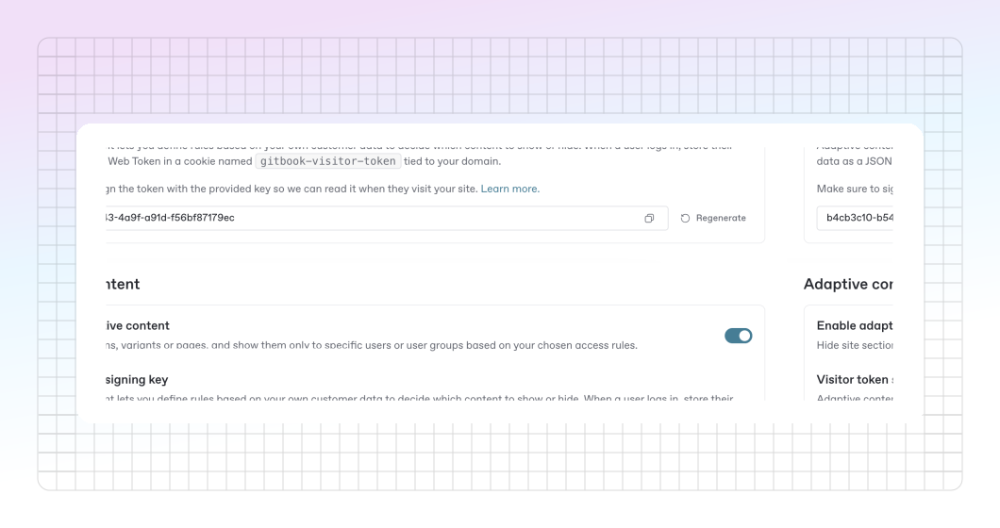

# Enabling adaptive content

To start customizing your documentation experience for your readers, you'll need to enable adaptive content and decide how your visitor data is passed to GitBook. This lets your site's content dynamically adapt based on who's viewing it.

### Enable adaptive content

Before you’re able to pass user data to GitBook, you’ll need to configure your site to use adaptive content.

Head to your [site’s settings](../site-settings.md), and enable “Adaptive content” from your site’s audience settings. Once enabled, you’ll get a generated “Visitor token signing key”, which you’ll need in order to continue the adaptive content setup.&#x20;

<figure><figcaption><p>Enable adaptive content</p></figcaption></figure>

### Set your adaptive schema

After enabling adaptive content, you’ll need to define a schema for the types of claims you expect GitBook to receive when a user visits your site.

The adaptive content schema should reflect how these claims are structured when sent to GitBook.

For example, if you expect a visitor to potentially be a beta user in your product, you would set an adaptive schema similar to:

```json
{
  "type": "object",
  "properties": {
    "isBetaUser": {
      "type": "boolean",
      "description": "Whether the visitor is a Beta user.”
    },
  },
  "additionalProperties": false
}
```

This will also help you use autocomplete when configuring your claims in the [condition editor](adapting-your-content.md#working-with-the-condition-editor).

If you intend to work with unsigned claims, you will need to declare the claims you are expecting in the schema under an “unsigned” prop alongside your signed claims.

```json
{
  "type": "object",
  "properties": {
    "isBetaUser": {
      "type": "boolean",
      "description": "Whether the visitor is a Beta user.”
    },
  },
  // Add unsigned claims
  "unsigned": {
    "type": "object",
    "description": "Unsigned claims of the site visitor.",
    "properties": {
      "language": {
        "type": "string",
        "description": "The language of the visitor",
        "enum": [
          "en",
          "fr",
          "it"
        ]
      }
    },
    "additionalProperties": false
  }
  "additionalProperties": false
}
```

Next, you’ll need to decide how you want to pass your visitor data to GitBook.

### Ways to pass visitors's data to GitBook

GitBook provides different ways to pass visitor data to adapt your site's content. Choose the option that best suits your needs:

* [**Cookie method**](enabling-adaptive-content.md#cookie-method)**:** When you don’t require full authentication for your docs but still want to use your user’s data to adapt your public site’s content based on their information.
* [**Authenticated access method**](enabling-adaptive-content.md#authenticated-access-method)**:** When you need your site to be behind [authentication](../authenticated-access/) and want to customize the site’s content based on your authenticated user’s information.

#### Methods

<table data-full-width="false"><thead><tr><th width="323.2421875">Method</th><th width="266.6015625">Use-cases</th><th width="206.58984375">Ease of setup</th><th width="202">Security</th><th>Format</th><th>Transport</th></tr></thead><tbody><tr><td>Signed cookie <code>gitbook-visitor-token</code></td><td>API test credentials, customer identification, etc</td><td>Require signing and a custom domain</td><td><span data-gb-custom-inline data-tag="emoji" data-code="2705">✅</span> Properties can only be defined by the backend</td><td>JWT</td><td>Cookies</td></tr><tr><td>Public cookie <code>gitbook-visitor</code></td><td>Feature flags</td><td>Easy to use</td><td><span data-gb-custom-inline data-tag="emoji" data-code="274c">❌</span> Visitor can override the properties</td><td>JSON</td><td>Cookies</td></tr><tr><td>Signed query parameter <code>token</code></td><td></td><td>Require signing and a custom domain</td><td><span data-gb-custom-inline data-tag="emoji" data-code="2705">✅</span> Properties can only be defined by the backend</td><td>JWT</td><td>URL</td></tr><tr><td>Query parameters <code>gitbook_&#x3C;prop>=</code></td><td></td><td>Easy to use</td><td><span data-gb-custom-inline data-tag="emoji" data-code="274c">❌</span> Visitor can override the properties</td><td>JSON</td><td>URL</td></tr></tbody></table>

### Signed cookie method


This approach only works if your site is served under a subdomain of your application domain. To set up a custom domain on your site follow the steps outlined [in this section](../custom-domain.md).


When you don’t need your documentation to be fully behind authentication but still want to tailor its content for users logged into your application, you can store their user attributes as a [JSON Web Token](https://jwt.io/introduction) in a cookie named `gitbook-visitor-token` tied to your product domain.

To set this up, you'll need to adjust your application’s login flow to include the following steps:



### **Generate a JWT when users logs in to your application**

Whenever a user logs in to your product, generate a JWT that contains selected attributes of your authenticated user's info.&#x20;



### Sign the JWT using the site's visitor signing key

Then, make sure to sign the JWT using the site's **visitor signing key**, which you can find in your site’s audience settings after enabling Adaptive Content.



### Store the JWT in a wildcard session cookie&#x20;

Finally you need to store the signed JWT containing your user's info into a wildcard session cookie **under your product domain**.

For example, if your application is served behind the `app.acme.org` domain, the cookie will need to be created under the `.acme.org` wildcard domain.



Here's what the code of your application login handler might look like after incorporating these steps:

```typescript
import * as jose from 'jose';

import { Request, Response } from 'express';

import { getUserInfo } from '../services/user-info-service';
import { getFeatureFlags } from '../services/feature-flags-service';

const GITBOOK_VISITOR_SIGNING_KEY = process.env.GITBOOK_VISITOR_SIGNING_KEY;
const GITBOOK_VISITOR_COOKIE_NAME = 'gitbook-visitor-token';


export async function handleAppLoginRequest(req: Request, res: Response) {
   // Your business logic for handling the login request
   // For example, checking credentials and authenticating the user
   //
   // e,g:
   // const loggedInUser = await authenticateUser(req.body.username, req.body.password);

   // After authenticating the user, retrieve user information that you wish
   // to pass to GitBook from your database or user service.
   const userInfo = await getUserInfo(loggedInUser.id);
      
   // Build the JWT payload with the user's information
   const gitbookVisitorClaims = {
       firstName: userInfo.firstName,
       lastName: userInfo.lastName,
       isBetaUser: userInfo.isBetaUser
       products: userInfo.products.map((product) => product.name),
       featureFlags: await getFeatureFlags({userId: loggedInUser.id})
   }
   
   // Generate a signed JWT using the claims
   const gitbookVisitorJWT = await new jose.SignJWT(gitbookVisitorClaims)
     .setProtectedHeader({ alg: 'HS256' })
     .setIssuedAt()
     .setExpirationTime('2h') // abritary 2 hours expiration
     .sign(GITBOOK_VISITOR_SIGNING_KEY);
     
  // Include a `gitbook-visitor-token` cookie including the encoded JWT in your
  // login handler response
  res.cookie(GITBOOK_VISITOR_COOKIE_NAME, gitbookVisitorJWT, {
     httpOnly: true,
     secure: process.env.NODE_ENV === 'production',
     maxAge: 2 * 60 * 60 * 1000, // abritary 2 hours expiration
     domain: '.acme.org' //
  });
  
  // Rest of your login handler logic including redirecting the user to your app
  res.redirect('/'); // Example redirect
}
```

After successfully signing the cookie for a user when they log into your app, they will have associated data with them upon visiting your published GitBook site.&#x20;

Following the example above, the data available for this user could look like:

```json
{
   "visitor":{
      "claims":{
         "firstName": "John",
         "lastName": "Doe",
         "isBetaUser": true,
         "products":[
            "PRODUCT_A",
            "PRODUCT_C"
         ],
         "featureFlags":{
            "PRODUCT_V2_FEATURE": true
         }
      }
   }
}
```

### Pass unsigned claims via query parameters

After setting up your schema to accept unsigned claims, you’ll be able to pass them through the URL of your published site.&#x20;

For instance, in the [example above](enabling-adaptive-content.md#set-your-adaptive-schema), we can pass the language claim to our published site when visiting this url:

```url
https://docs.acme.org/?visitor.language=fr
```

### Authenticated access method

GitBook offers out-of-the box solutions to protect your docs. Integrations for Auth0, Okta, Azure AD, and AWS Cognito allow you install an integration to enforce a log-in screen before being able to access your published site.&#x20;

Depending on which authenticated access method you’re using, you’ll still need to configure a few more things depending on which integration you’re using in order to send the right data to GitBook.

Head to the relevant guide for full instructions on setting up adaptive content with authenticated access.

<table data-view="cards"><thead><tr><th></th><th></th><th data-hidden data-card-target data-type="content-ref"></th><th data-hidden data-card-cover data-type="files"></th></tr></thead><tbody><tr><td><strong>Setting up Auth0</strong></td><td>Configure Auth0 with authenticated access and adaptive content.</td><td><a href="../authenticated-access/setting-up-auth0.md">setting-up-auth0.md</a></td><td><a href="../../.gitbook/assets/card_auth0.svg">card_auth0.svg</a></td></tr><tr><td><strong>Setting up Azure AD</strong></td><td>Configure Azure AD with authenticated access and adaptive content.</td><td><a href="../authenticated-access/setting-up-azure-ad.md">setting-up-azure-ad.md</a></td><td><a href="../../.gitbook/assets/card_azure_ad.svg">card_azure_ad.svg</a></td></tr><tr><td><strong>Setting up AWS Cognito</strong></td><td>Configure AWS Cognito with authenticated access and adaptive content.</td><td><a href="../authenticated-access/setting-up-aws-cognito.md">setting-up-aws-cognito.md</a></td><td><a href="../../.gitbook/assets/card_aws_cognito.svg">card_aws_cognito.svg</a></td></tr><tr><td><strong>Setting up Okta</strong></td><td>Configure Okta with authenticated access and adaptive content.</td><td><a href="../authenticated-access/setting-up-okta.md">setting-up-okta.md</a></td><td><a href="../../.gitbook/assets/card_okta.svg">card_okta.svg</a></td></tr><tr><td><strong>Setting up a custom backend</strong></td><td>Configure a custom backend with authenticated access and adaptive content.</td><td><a href="../authenticated-access/setting-up-a-custom-backend.md">setting-up-a-custom-backend.md</a></td><td><a href="../../.gitbook/assets/card_custom_backend.svg">card_custom_backend.svg</a></td></tr></tbody></table>
