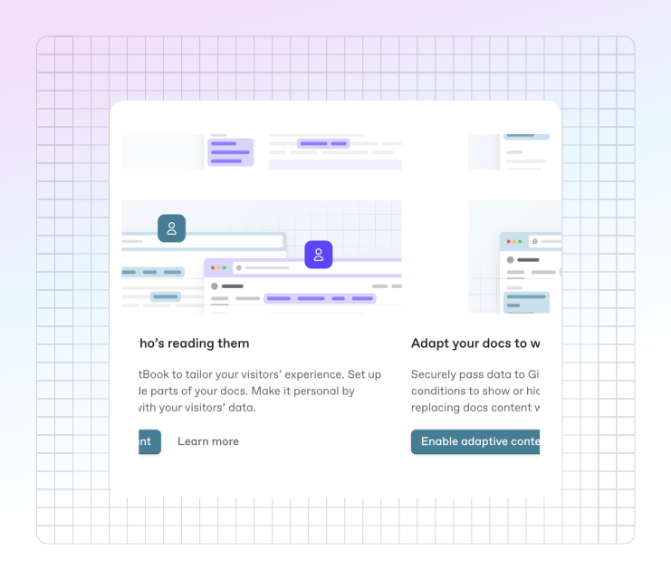

# Enabling adaptive content

To start customizing your documentation experience for your readers, you'll need to enable adaptive content and decide how your visitor data is passed to GitBook. This lets your site's content dynamically adapt based on who's viewing it.

### Enable adaptive content

Before you’re able to pass user data to GitBook, you’ll need to configure your site to use adaptive content.

Head to your [site’s settings](../../site-settings.md), and enable “Adaptive content” from your site’s audience settings. Once enabled, you’ll get a generated “Visitor token signing key”, which you’ll need in order to continue the adaptive content setup.

<figure><figcaption><p>Enable adaptive content</p></figcaption></figure>

### Set your visitor schema

After enabling adaptive content, you’ll need to define a schema for the types of claims you expect GitBook to receive when a user visits your site.

The visitor schema should reflect how these claims are structured when sent to GitBook.

For example, if you expect a visitor to potentially be a beta user in your product, you would set a visitor schema similar to:

```json
{
  "type": "object",
  "properties": {
    "isBetaUser": {
      "type": "boolean",
      "description": "Whether the visitor is a Beta user."
    }
  },
  "additionalProperties": false
}
```

This will also help you use autocomplete when configuring your claims in the [condition editor](../adapting-your-content.md#working-with-the-condition-editor). Visitor schemas only support the following types:



Read claims being passed in as strings.

Strings **must contain an enum** key, which needs to contain any expected values that would be found on the key being read.

```json
{
  "type": "object",
  "properties": {
    "language": {
          "type": "string",
          "description": "The language of the visitor",
          "enum": [
            "en",
            "fr",
            "it"
          ]
  },
  "additionalProperties": false
}
```



Read claims being passed in as booleans.

```json
{
  "type": "object",
  "properties": {
    "isBetaUser": {
      "type": "boolean",
      "description": "Whether the visitor is a Beta user."
    },
  },
  "additionalProperties": false
}
```



Nest claims in an object to group similar values.

```json
{
  // Top level claims
  "type": "object",
  "properties": {
    // Nested claims
    "access": {
      "type": "object",
      "description": "User’s access to product feature",
      "properties": {
        "isAlphaUser": {
          "type": "boolean",
          "description": "Whether the visitor is a Alpha user."
        },
        "isBetaUser": {
          "type": "boolean",
          "description": "Whether the visitor is a Beta user."
        },
      },
      "additionalProperties": false
    }
  },
  "additionalProperties": false
}
```



### Set an unsigned claim

Unsigned claims are a specific type of claim that identifies claims coming through that might not be signed by a client application. It is required to set claims in your visitor schema as `unsigned` if you are passing claims through URL parameters, unsigned cookies, and feature flags.

If you intend to work with unsigned claims, you will need to declare the claims you are expecting in the schema under an “unsigned” prop alongside your signed claims.

```json
{
  "type": "object",
  "properties": {
    "isBetaUser": {
      "type": "boolean",
      "description": "Whether the visitor is a Beta user."
    },
    // Add unsigned claims
    "unsigned": {
      "type": "object",
      "description": "Unsigned claims of the site visitor.",
      "properties": {
        "language": {
          "type": "string",
          "description": "The language of the visitor",
          "enum": [
            "en",
            "fr",
            "it"
          ]
        }
      },
      "additionalProperties": false
    }
  },
  "additionalProperties": false
}
```

### Pass visitor data to GitBook

GitBook provides different ways to pass visitor data to adapt your site's content. After defining your schema, you’ll need to decide how you want to pass your visitor data to GitBook.

<table data-card-size="large" data-view="cards"><thead><tr><th></th><th></th><th></th><th data-hidden data-card-target data-type="content-ref"></th></tr></thead><tbody><tr><td><i class="fa-cookie">:cookie:</i></td><td><strong>Cookies</strong></td><td>Pass visitor data into your docs through a public or signed cookie.</td><td><a href="cookies.md">cookies.md</a></td></tr><tr><td><i class="fa-link">:link:</i></td><td><strong>URL</strong></td><td>Pass visitor data into your docs through URL query parameters.</td><td><a href="url.md">url.md</a></td></tr><tr><td><i class="fa-flag">:flag:</i></td><td><strong>Feature flags</strong></td><td>Pass visitor data into your docs through a feature flag provider.</td><td><a href="feature-flags.md">feature-flags.md</a></td></tr><tr><td><i class="fa-lock">:lock:</i></td><td><strong>Authenticated access</strong></td><td>Pass visitor data into your docs through an authentication provider.</td><td><a href="authenticated-access.md">authenticated-access.md</a></td></tr></tbody></table>
