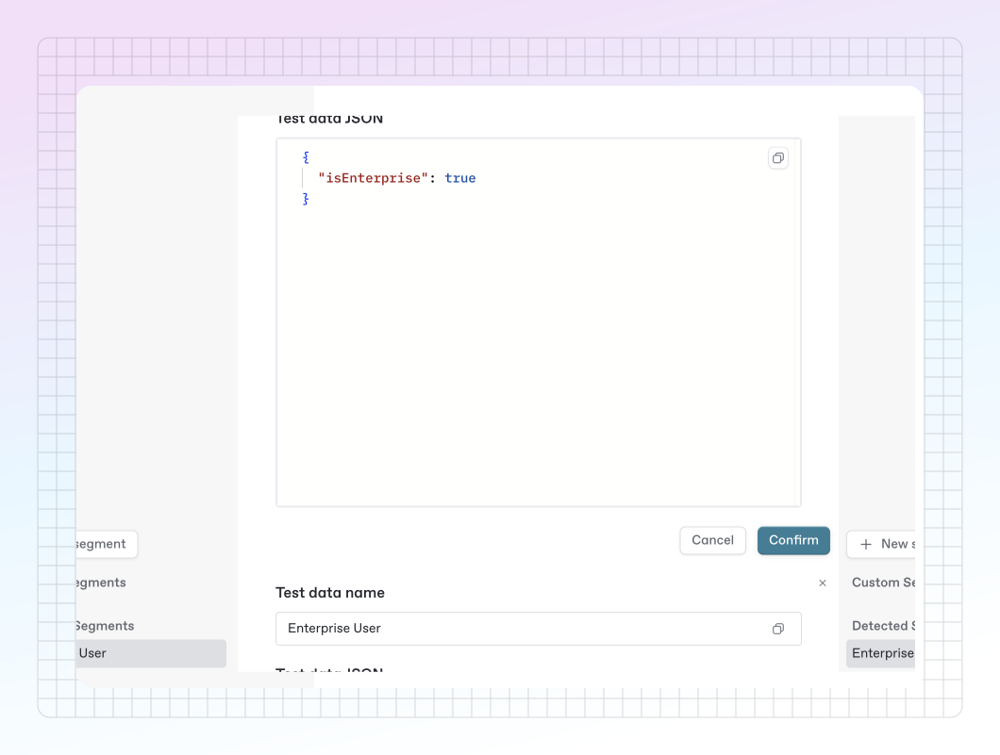

# Testing with segments

Segments allow you to test the conditions you set by defining claims on a mock user.

For example, you might want to only show a page or section to beta users. By creating a segment and defining the properties associated with this group of mock users, you can mimic a segment that is specific to the users you’re targeting.

<figure><figcaption><p>The segment editor in GitBook.</p></figcaption></figure>

### Create a segment

To create a new segment, head to the condition editor, and click the settings icon <picture><source srcset="../../.gitbook/assets/25_01_10_settings_icon_dark.svg" media="(prefers-color-scheme: dark)"></picture> next to an existing segment in the segment dropdown.

Here you’ll be able to define the data that will appear on a mock user. Because this is the data that’s being represented, the `visitor.claims` key is omitted.

#### Example

To create a segment for beta users following the examples in our docs, you would create a new segment, and add the following data.

```json
{
  "isBetaUser": true
}
```

When heading back to the condition editor, selecting the beta segment we created should show that the page we’re viewing **would** be accessible to our test user.

<figure><figcaption><p>Testing a segment in GitBook.</p></figcaption></figure>

### Detected segments

Detected segments allow you to get a sense of the type of claims you are receiving from visitors to your site.

These segments are not editable, but allow you to copy/paste claims from the segment editor to create your own user segments.

### Testing segments in the preview

In addition to testing segments in the segment editor, you’ll be able to use your segments in real time in the preview when viewing changes for your site.

Use the dropdown in the upper left corner when in preview mode for your site to choose a segment to see how your site will look for your chosen segment.
