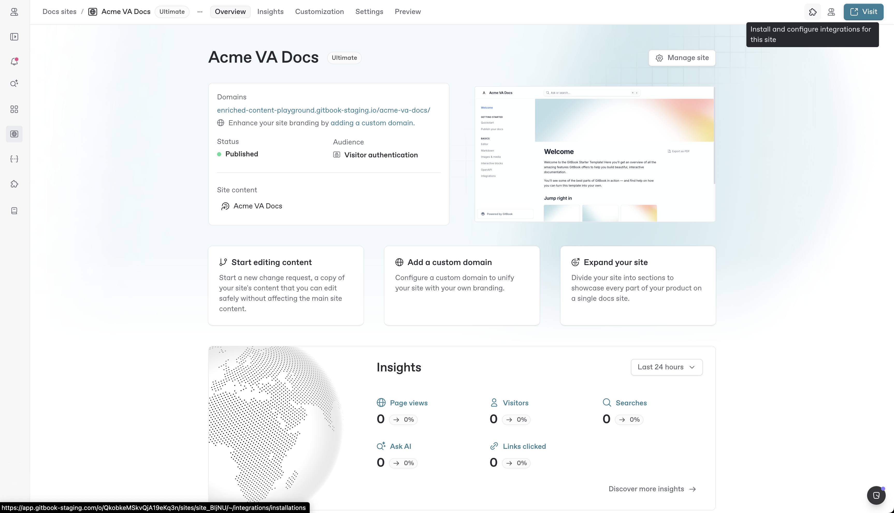
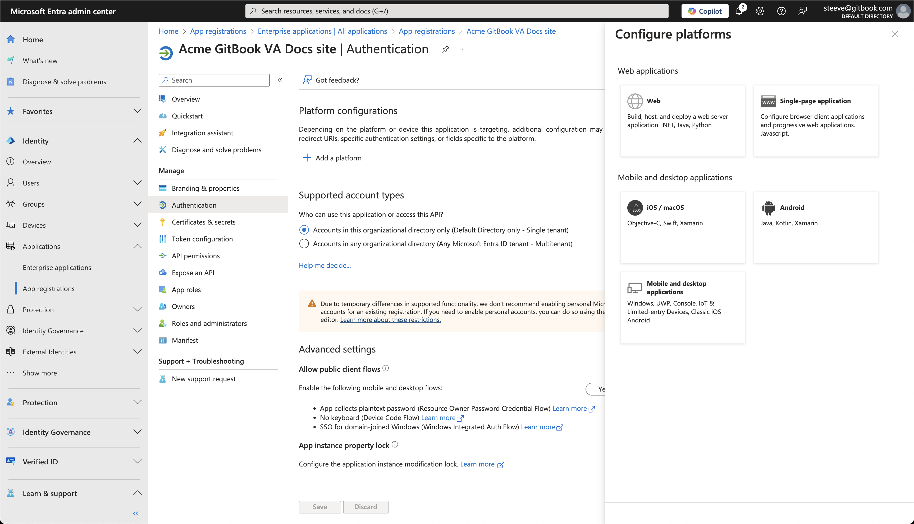
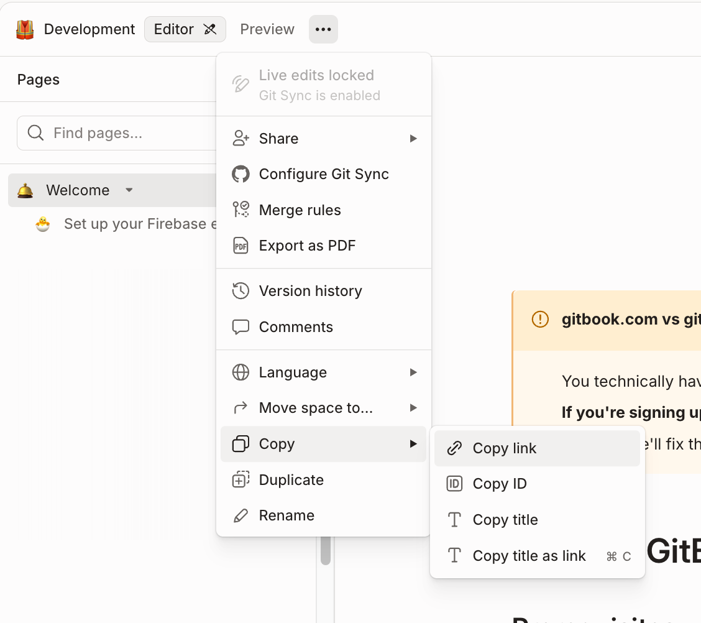

# Setting up Azure AD


This guide takes you through setting up a protected sign-in screen for your docs. Before going through this guide, make sure you’ve first gone through "[Enabling authenticated access](enabling-authenticated-access.md)".



There is a known limitation with the Azure integration where heading URL fragments will be removed upon authentication. The user will still land on the correct page, but will be taken to the top of the page instead of the heading in the URL. Once a user is authenticated this behavior will no longer occur during a session and the user would be directed to the correct heading.

This is due to a security measure put in place by Microsoft.


### Overview

To setup your GitBook site with authenticated access using Azure AD, the process looks as follows:



### [Create an app registration in Azure AD](setting-up-azure-ad.md#id-1.-create-an-app-registration-in-azure-a-d)

Create an Azure AD application registration in your Microsoft Entra ID admin dashboard.



### [Install and configure the Azure AD integration on your site](setting-up-azure-ad.md#id-2.-install-and-configure-the-azure-a-d-integration)

Install the Azure AD integration and add the required configuration to your GitBook site.



### [Configure Azure AD for adaptive content (optional)](setting-up-azure-ad.md#id-3.-configure-azure-a-d-for-adaptive-content-optional)

Configure your Azure AD to work with Adaptive content in GitBook.



### 1. Create an app registration in Azure AD

Start by creating an app registration in your Microsoft Entra ID dashboard. This application registration will allow the GitBook Azure AD integration to request tokens to validate user identity before granting them access to your site.

1. Sign in to your Microsoft Entra ID admin [dashboard](https://entra.microsoft.com/).
2. Head to **Identity** > **Applications** > **App registrations** from the left sidebar.
3. Click on **+ New registration,** and give your registration a name.
4. Under **Supported account types,** select “**Accounts in this organizational directory only (Default Directory only - Single tenant)”**.
5. Leave the Redirect URI field empty for now—you will need to fill this in later.
6.  Click **Register** to complete the app registration.\

    <figure><figcaption>
Register an app for the GitBook VA integration.
</figcaption></figure>

7.  You should then see your new app registration **Overview** screen. Copy and make note of the **Application (client) ID** and **Directory (tenant) ID**.\

    <figure><figcaption>
Overview of the newly created app registration.
</figcaption></figure>

8.  Click on **Add a certificate or secret**. You should see the following **Certificates & Secrets** screen:\

    <figure><figcaption>
Add a certificate or secret.
</figcaption></figure>

9. Click on **+ New client secret**.
10. Enter suitable description for the secret and click **Add**.
11. Copy and make note of the **Value** field (_**not** the Secret ID_) of the secret you just created.

### 2. Install and configure the Azure AD integration

Once you've created the Azure AD app registration, the next step is to install the Azure AD integration in GitBook and link it with your Azure application using the credentials you generated earlier:

1. Navigate to the site where you’ve [enabled Authenticated Access](enabling-authenticated-access.md#enable-authenticated-access) and want to use Azure AD as the identity provider.
2.  Click on the **Integrations** button in the top right from your site’s settings.\

    <figure><figcaption></figcaption></figure>

3. Click on **Authenticated Access** from the categories in the sidebar.
4. Select the **Azure** integration.
5.  Click **Install on this site**.\

    <figure><figcaption></figcaption></figure>
6.  After installing the integration on your site, you should see the integration's configuration screen:\

    <figure><figcaption></figcaption></figure>
7. Enter the **Client ID**, **Tenant ID**, and **Client Secret** values you copied after [creating the Azure AD app registration](setting-up-azure-ad.md#id-1.-create-an-app-registration-in-azure-a-d) earlier, and click “Save”.
8. Copy the **URL** displayed **at the bottom of the dialog**.
9. Head back to the Azure AD app registration you created earlier in the Microsoft Entra ID dashboard.
10. Browse to **Manage** > **Authentication** in the sidebar.
11. Click **+ Add a platform** and select **Web** card in the panel that opens.\

    <figure><figcaption></figcaption></figure>
12. Paste the GitBook integration **URL** you copied earlier in the **Redirect URI** field, and click “Configure”\

    <figure><figcaption></figcaption></figure>

13. Head back to **Azure integration** installation screen **in GitBook**.
14. Close the integration dialogs and click on the **Settings** tab in the site screen.
15. Browse to **Audience** and select **Authenticated access** (if not already selected).
16. Select **Azure** from the dropdown in the **Authentication backend** section.
17. Click **Update audience**.\

    <figure><figcaption></figcaption></figure>
18. Head to the site's overview screen and click **Publish** if the site is not already published. &#x20;

\
Your site is now published behind Authenticated Access using your Azure AD as identity provider.&#x20;

To test it out, click on Visit. You will be asked to sign in with Azure, which confirms that your site is published behind Authenticated Access using Azure.


Upon accessing the published content URL and after logging in with your Azure credentials, you may see a screen telling you that you need to "Request approval" from your admin. Your admin can grant this request by accessing the published content URL, logging in, and granting approval on behalf of the organization.


### 3. Configure Azure AD for Adaptive content (optional)



To leverage the Adaptive Content capability in your authenticated access site, configure the Azure AD app registration to include additional user information in the authentication token as claims.&#x20;

These claims, represented as key-value pairs, are passed to GitBook and can be used to [adapt content](../adaptive-content/adapting-your-content.md) dynamically for your site visitors.

Azure AD supports different types and levels of claims, each with its own method of setup:

*   **Standard Claims**: Common claims that may be included in tokens but are not always present by default.\

    
    Azure AD keeps token sizes optimized for performance. As a result, many claims are **not** included in the token by default and must be explicitly requested by the application. To ensure claims like `email` , `groups` or `roles` are included, they must be explicitly requested as **optional claims**.
    

* **Optional Claims**: Additional predefined claims that can be enabled for an application.
* **Custom Claims**: Claims sourced from custom user attributes in Azure AD or external systems via a custom claims provider.

For more details on how to include these different types of claims in the tokens generated by your Azure AD app, refer to the following Microsoft Entra documentation guides:

* [User Attributes](https://learn.microsoft.com/en-us/entra/external-id/customers/how-to-add-attributes-to-token)
* [Optional Claims](https://learn.microsoft.com/en-us/entra/identity-platform/optional-claims?toc=%2Fentra%2Fexternal-id%2Ftoc.json\&bc=%2Fentra%2Fexternal-id%2Fbreadcrumb%2Ftoc.json\&tabs=appui)
* [Custom Claims](https://learn.microsoft.com/en-us/entra/identity-platform/custom-claims-provider-overview)

After setting up and configuring the right claims to send to GitBook, head to “[Adapting your content](../adaptive-content/adapting-your-content.md)” to continue configuring your site.
