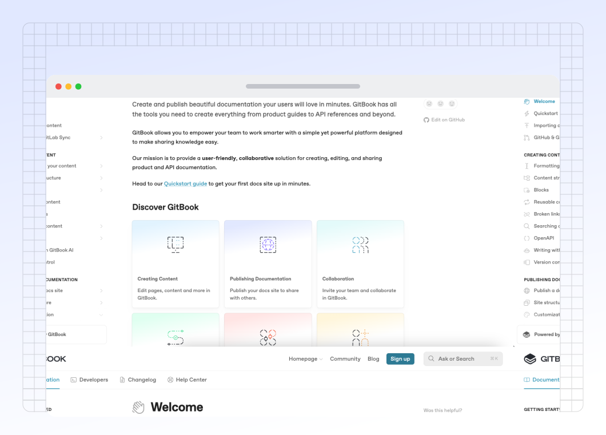
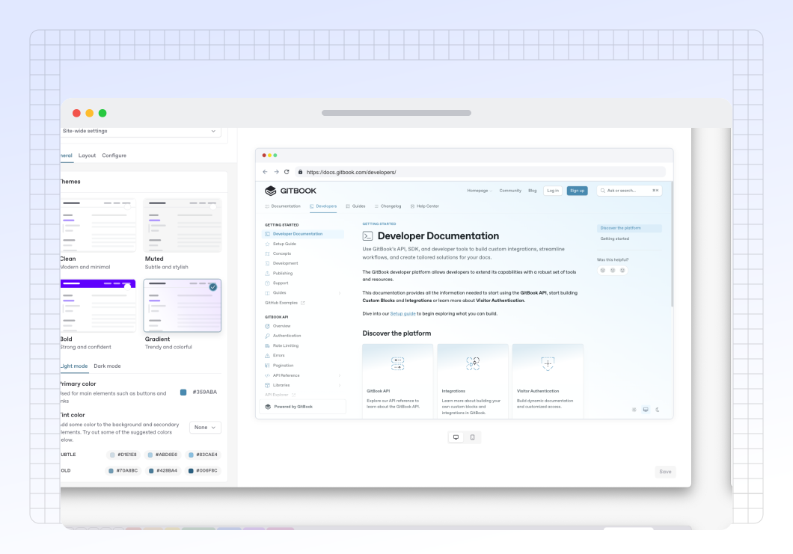

# Site customization


Certain customization features are available on [Premium and Ultimate site plans](https://www.gitbook.com/pricing).


You can customize the appearance of your published documentation, match the user interface to the language of your content, and more.

You can apply customizations to your entire docs site as a site-wide theme, or to individual variants and site sections.

<figure><figcaption>
GitBook's own documentation is an example of a customized docs site.
</figcaption></figure>

### General

Control how your content looks in the Customization tab of your site’s dashboard. The available options are:

Title, icon and logo

**Title**\
You can set any title you choose for your space. Note: this setting will only affect the title that displays _in the published documentation_. If you want to edit the title in the GitBook app, close the customize menu and edit it at the top of the space.

**Icon**\
You can set an emoji, or upload an icon of your own. The icon you set in the **Customization** menu will be used as the favicon for your docs site.


**Note**: this setting will only affect the icon that displays _in the published documentation_. If you want to edit the icon used within the GitBook app, you can do so when editing content in the space itself.


**Custom logo** <mark style="background-color:purple;">Premium & Ultimate</mark>\
You can replace _both_ the published space’s title and icon with a custom logo so that your documentation better reflects your own branding — and, you can upload two versions: one for light mode, and one for dark mode.

_What’s the difference between the icon and logo options?_\
The icon setting lets you upload a small, 132x132px image, which will appear _alongside_ your space title. The custom logo option lets you upload a larger image (we recommend at least 600px wide), which will completely replace any icon and title you’ve set.

Themes (for light &#x26; dark modes)

Themes let you customize the color scheme of your published content for both light and dark mode. There are four themes for you to choose from.

The colors of your site will be directly impacted by the **primary color** and **tint** that you choose. These two color selections will affect various parts of the interface, and can completely change the look and feel of your site. Scroll down to find out more about them.

The four themes available are:

#### **Clean**

A modern theme featuring translucency and minimally-styled elements. Your primary color (or tint) affects links and other highlighted interface elements

Clean is available for all sites, and is the default theme.

#### **Muted**

A sophisticated theme with decreased contrast between elements. The site background is more pronounced and blends in with the foreground, and some elements feature an inverted look — all based on your primary color (or tint).

Muted is available for all sites.

#### **Bold** <mark style="background-color:purple;">Premium & Ultimate</mark>

A high-impact theme with prominent colors and strong contrasts. Your primary color (or tint) will be used for the header of the site, and other highlighted elements like icons are colored along with it.

Bold is only available for Premium or Ultimate sites.

#### **Gradient** <mark style="background-color:purple;">Premium & Ultimate</mark>

A trendsetting theme featuring a gradient background and splashes of color. The gradient and highlighted elements will be colored by your primary color (or tint).

Gradient is only available for Premium or Ultimate sites.

***

#### **Primary color**

Your site’s primary color will affect the styling of highlighted interface items and navigational elements like links, the current page and page section, breadcrumbs, and primary header buttons.&#x20;

To make sure these elements are readable by all audiences, GitBook automatically adjusts the color on individual elements for readability if the contrast with the background is too low, or when a visitor’s system specifically requests a higher contrast level.

#### **Tint color**

Your site’s tint color will subtly change the color of all text and icons across your entire site — including text, header links, icon color, and UI elements like the **Ask or search** bar. The tint color will _not_ affect navigational elements like links and buttons, which always use the primary color.

In the **Tint color** section you’ll see some suggested colors based on your primary color selection, and you can select one with a click to preview it. You can also simply select your primary color as your tint, or a completely custom color using the color picker — the choice is yours.

#### Semantic colors

Semantic colors are applied to [hint blocks](../creating-content/blocks/hint.md) within your published content. You can change the background color of the blocks by selecting a color for each hint style.

The colors you select here will only be reflected in the docs site you’re currently customizing. Hint blocks in the GitBook editor will always remain in their assigned colors for consistency.

Modes

**Show mode toggle**\
Enable this if you would like visitors to your published content to be able to manually toggle between light and dark mode. Readers can find the toggle at the bottom of any published page, both on larger screens and mobile devices.

**Default mode**\
Choose whether visitors to your published content will see it in light or dark mode initially. If **Show mode toggle** is enabled, they’ll be able to switch to the other option if they prefer. If **Show mode toggle** is disabled, they’ll only be able to see your content in the mode you choose here.

_Note: if you just want to change the theme within the GitBook app, you can do that from your **Settings**_ <picture><source srcset="../.gitbook/assets/settings_icon_dark.svg" media="(prefers-color-scheme: dark)"></picture> _menu, which can be found at the bottom of the_ [_sidebar_](../resources/gitbook-ui.md#sidebar)_._

Site styles

**Font family** <mark style="background-color:purple;">Premium & Ultimate</mark>\
Choose a font family for your published content from a curated list of popular options, or upload your own custom fonts for a more personalized look.

**Custom fonts** <mark style="background-color:purple;">Ultimate</mark>\
Enhance your brand by using your own fonts in published content. We currently support `.woff` and `.woff2` file formats. For other formats, including variable fonts, please contact customer support for assistance.

**Icons** <mark style="background-color:purple;">Premium & Ultimate</mark>\
When using page icons, you can set the weight and style of the displayed icons here.

**Corner style**\
Choose either a rounded or straight corner style, to help align your published GitBook content with your own brand’s styling preferences.

**Link style**

Choose between two link design styles for your published content. Default highlights the entire link in your primary or tint color. Accent will simply add a colored underline to the link, with the text itself remaining the same color as the rest of your content.

Sidebar styles

**Background style**\
Choose the background style for the sidebar container. The color is created from the color set in **Theme**.

**List style**\
Choose the sidebar list and selected items style.

### Layout

Header

**Search bar**

Change the position and look of the search bar between prominent (centered in the header) and subtle (located in the upper right corner). Turning off the header entirely will place the search bar in the sidebar instead.

**Navigation**\
Add header links to your site. You could use header links to point to important parts of your documentation, or perhaps to link back to your main website.

You can choose what type of appearance you would like your link to have, and can choose between a normal link, primary button, and secondary button.

When enabled, simply add a title and a URL for each link. We support two levels of header navigation, meaning that you can have sub-links that appear in a dropdown menu.

Announcement <mark style="background-color:purple;">Premium &#x26; Ultimate</mark>

Add an announcement banner to the top of your published site. Customize the announcement style, add a message and call to action.

Pagination

Control the display of the previous and next buttons that appear at the bottom of each page in your space. You can additionally set this feature for [specific pages](../creating-content/content-structure/page.md).

<strong>Footer</strong> <mark style="background-color:purple;">Premium &#x26; Ultimate</mark>

Enable or disable a footer section for your space.

**Logo**\
Add your logo or another image in the footer.

**Copyright text**\
Add copyright information to your footer.

**Navigation**\
Add links in your footer, in multiple sections. Similar to the header, you can add a title and URL for each link. Make sure to also include a section title for each section you create.

### Configure

Localize user interface

You can select from a list of languages to localize the user interface of your published content. This will apply translations to the **non-custom** areas of the interface.

This setting will _not_ auto-translate your actual content, but can help with matching the user interface to the language that you are writing in.

Is there a language we don’t yet offer that you would like to see included in this list? [Let us know](https://github.com/GitbookIO/gitbook/issues), or [contribute your own translation](https://www.gitbook.com/solutions/open-source)!

Edit on GitHub/GitLab

If your space is connected to a Git repository, you can optionally show a link for your users to contribute to your documentation from your linked repository.

Privacy Policy

You can link to your own privacy policy to help visitors understand how your GitBook content uses cookies, and how you protect their privacy. If you choose not to set one, your site will default to [GitBook’s own privacy policy](https://policies.gitbook.com/privacy-and-security/statement/cookies).

### Customizing sites with multiple sections

<figure><figcaption>
The customization panel in GitBook.
</figcaption></figure>

If you have a docs site with with multiple sections, you can control the customization of each one individually.

Select the whole site or a specific site section using the drop-down menu at the top of the **Customization** panel.

* **Site-wide settings** – These automatically apply to all linked spaces.
* **Section specific settings** – If you’re using site sections, you’re can set section specific customization that will override the default site-wise setting.


Changes you make to specific site sections will override the site-wide customization settings, even if you change the site-wide setting again later.&#x20;

You can reset customization overrides back to the site-wide default by clicking the **Reset** button <picture><source srcset="../.gitbook/assets/reset_icon_dark.svg" media="(prefers-color-scheme: dark)"></picture> next to the space selector.


### What counts as ‘Advanced customization’?

Every GitBook user can take advantage of basic customization options on their docs site. Premium or Ultimate site plan users can also use advanced customization features to further tweak their docs to match their brand.

Advanced customization options include:

* **Custom logo** – Add a logo that replaces the emoji and title at the top of your docs site.
* **Icons** - Change the weight and style of page icons in your docs site.
* **Custom font** – Change the font of your docs to one of the built-in options.
* **Footer** – Add a custom logo, copyright text and navigation to a footer at the bottom of your documentation.
* **Bold and Gradient themes** – Change the background color for your header, or add a gradient background to your entire site with these new themes.

### What cannot be customized?

The options above provide lots of ways for you to customize your space, but there are a few things that you won’t be able to customize, regardless of [your chosen plan](../account-management/plans/).

1. It’s not possible to customize the layout of the elements on the page (However, it _is_ possible to [hide certain elements on specific pages](../creating-content/content-structure/page.md)).
2. It’s not possible to insert custom code (such as CSS, HTML or JS) directly into your GitBook site. We already integrate with a number of popular tools, and offer [rich embeds](../creating-content/blocks/embed-a-url.md) for many more.
3. It’s not possible to remove the small “Powered by GitBook” link that appears in published documentation.
