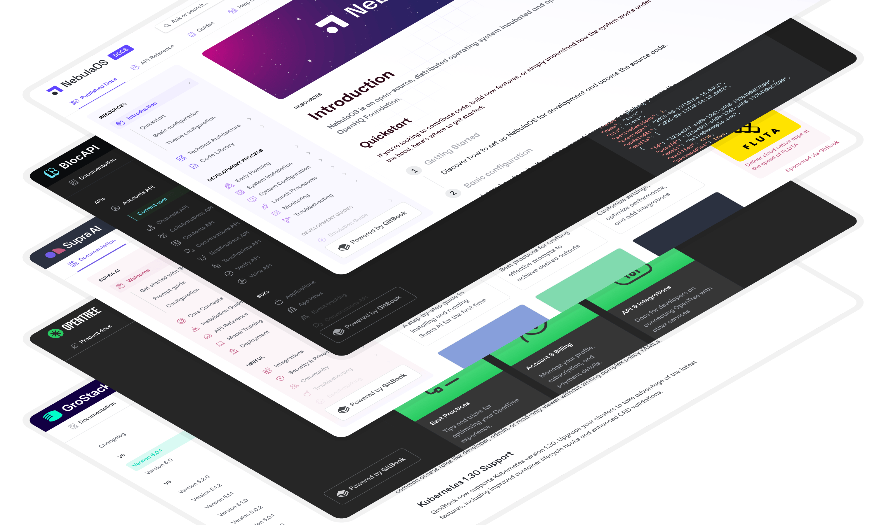
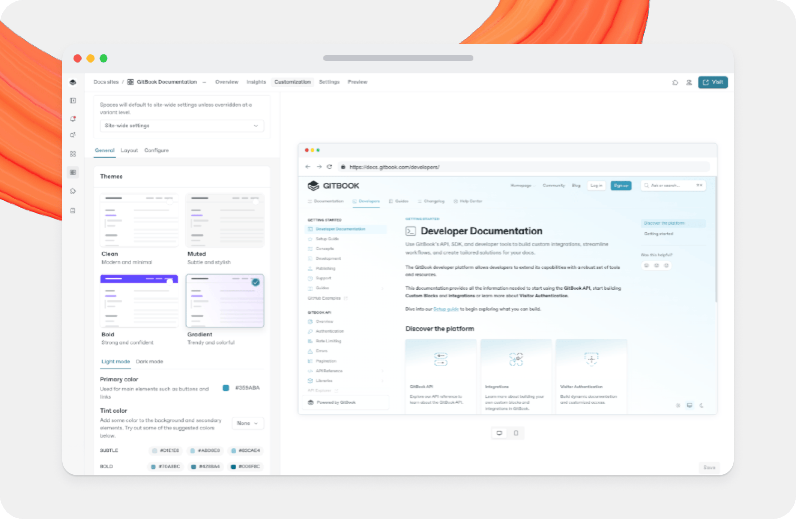

# Site customization



You can customize the appearance of your published documentation, match the user interface to the language of your content, and more.

You can apply customizations to your entire docs site as a site-wide theme, or to individual variants and site sections.

<figure><figcaption>
You can create all kinds of site designs using GitBook’s built-in customization options.
</figcaption></figure>

### Customizing sites with multiple sections or variants

If you have a docs site with with multiple sections or variants, you can control the customization of each one individually.

Select the whole site or a specific site section using the drop-down menu at the top of the **Customization** panel.

* **Site-wide settings** – These automatically apply to all linked spaces.
* **Section or variant specific settings** – If you’re using site sections or variants, you’re can set specific customization that will override the default site-wise setting.

<figure><figcaption>
The customization panel in GitBook.
</figcaption></figure>


Changes you make to specific site sections will override the site-wide customization settings, even if you change the site-wide setting again later.

You can reset customization overrides back to the site-wide default by clicking the **Reset** button <picture><source srcset="../../.gitbook/assets/25_02_19_reset_icon_dark.svg" media="(prefers-color-scheme: dark)"></picture> next to the space selector.


### What counts as ‘Advanced customization’?

Every GitBook user can take advantage of basic customization options on their docs site. Premium or Ultimate site plan users can also use advanced customization features to further tweak their docs to match their brand.

Advanced customization options include:

* **Custom logo** – Add a logo that replaces the emoji and title at the top of your docs site.
* **Icons** - Change the weight and style of page icons in your docs site.
* **Custom font** – Change the font of your docs to one of the built-in options.
* **Footer** – Add a custom logo, copyright text and navigation to a footer at the bottom of your documentation.
* **Bold and Gradient themes** – Change the background color for your header, or add a gradient background to your entire site with these new themes.

### What cannot be customized?

The options above provide lots of ways for you to customize your space, but there are a few things that you won’t be able to customize, regardless of [your chosen plan](../../account-management/plans/).

1. It’s not possible to customize the layout of the elements on the page (However, it _is_ possible to [hide certain elements on specific pages](../../creating-content/content-structure/page.md)).
2. It’s not possible to insert custom code (such as CSS, HTML or JS) directly into your GitBook site. We already integrate with a number of popular tools, and offer [rich embeds](../../creating-content/blocks/embed-a-url.md) for many more.
3. It’s not possible to remove the small “Powered by GitBook” link that appears in published documentation.
