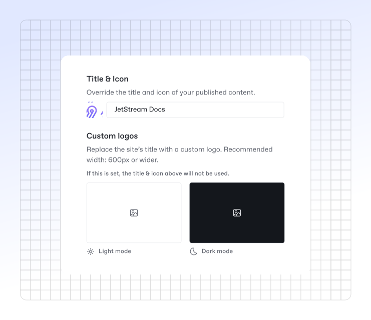
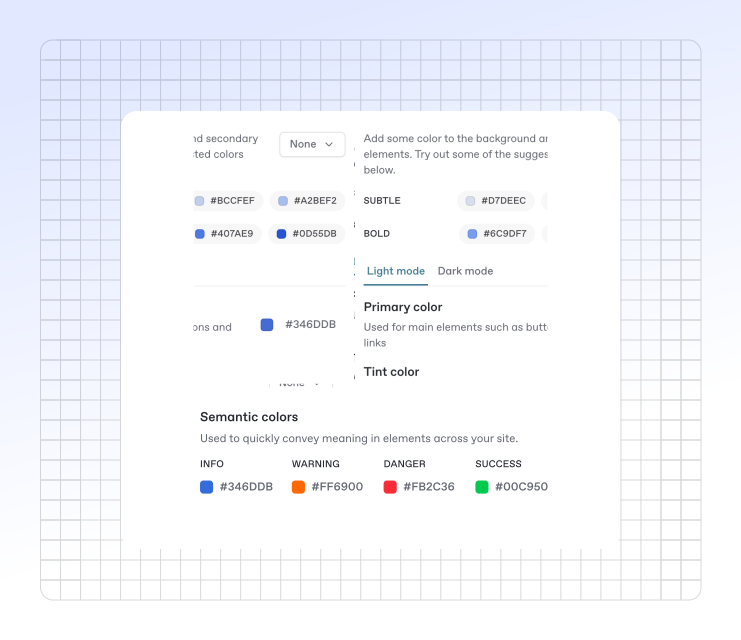
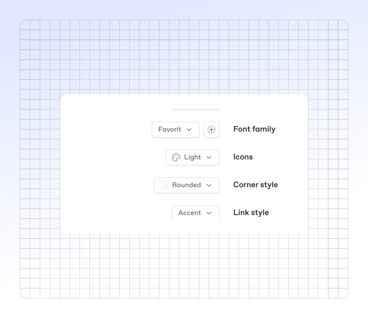

# Icons, colors, and themes

### Title, icon and logo

<figure><figcaption></figcaption></figure>

**Title**

You can set any title you choose for your space. Note: this setting will only affect the title that displays _in the published documentation_. If you want to edit the title in the GitBook app, close the customize menu and edit it at the top of the space.

**Icon**

You can set an emoji, or upload an icon of your own. The icon you set in the **Customization** menu will be used as the favicon for your docs site.


This setting will only affect the icon that displays _in the published documentation_. If you want to edit the icon used within the GitBook app, you can do so when editing content in the space itself.


**Custom logo** <mark style="background-color:purple;">**(Premium & Ultimate)**</mark>

You can replace _both_ the published space’s title and icon with a custom logo so that your documentation better reflects your own branding — and you can upload two versions: one for light mode, and one for dark mode.


#### What’s the difference between the icon and logo options?

The icon setting lets you upload a small, 132×132 px image, which will appear _alongside_ your space title and function as your site’s favicon. The custom logo option lets you upload a larger image (we recommend at least 600 px wide), which will completely replace any icon and title you’ve set.


### Themes

Themes let you customize the color scheme of your published content for both light and dark mode. There are four themes to choose from. The colors of your site will be directly impacted by the **primary color** and **tint** that you choose. These two selections affect various parts of the interface and can completely change the look and feel of your site.

<figure><figcaption></figcaption></figure>

#### Clean

A modern theme featuring translucency and minimally styled elements. Your primary color (or tint) affects links and other highlighted interface elements.\
&#xNAN;_&#x43;lean is available for all sites and is the default theme._

#### Muted

A sophisticated theme with decreased contrast between elements. The site background is more pronounced and blends in with the foreground, and some elements feature an inverted look — all based on your primary color (or tint).\
&#xNAN;_&#x4D;uted is available for all sites._

#### Bold <mark style="background-color:purple;">**(Premium & Ultimate)**</mark>

A high‑impact theme with prominent colors and strong contrasts. Your primary color (or tint) will be used for the header of the site, and other highlighted elements like icons are colored along with it.\
&#xNAN;_&#x42;old is only available for Premium or Ultimate sites._

#### Gradient <mark style="background-color:purple;">**(Premium & Ultimate)**</mark>

A trendsetting theme featuring a gradient background and splashes of color. The gradient and highlighted elements will be colored by your primary color (or tint).\
&#xNAN;_&#x47;radient is only available for Premium or Ultimate sites._

### Colors

<figure><figcaption></figcaption></figure>

#### Primary color

Your site’s primary color will affect the styling of highlighted interface items and navigational elements like links, the current page and section, breadcrumbs, and primary header buttons. GitBook automatically adjusts colors on individual elements for readability if the contrast with the background is too low or when a visitor’s system requests higher contrast.

#### Tint color

Your site’s tint color will subtly change the color of all text and icons across your entire site — including header links, icon color, and UI elements like the **Ask or search** bar. The tint color will _not_ affect navigational elements like links and buttons, which always use the primary color. In the **Tint color** section you’ll see suggested colors based on your primary color selection; you can select one to preview it, choose your primary color as your tint, or pick a completely custom color with the color picker.

#### Semantic colors

Semantic colors are applied to hint blocks within your published content. You can change the background color of each hint style; these changes will only be reflected on the published site you’re customizing. Hint blocks in the GitBook editor will always remain in their assigned colors.

### Modes

**Show mode toggle**

Enable this if you want visitors to manually toggle between light and dark mode. Readers can find the toggle at the bottom of any published page, on both desktop and mobile.

**Default mode**

Choose whether visitors see your content in light or dark mode by default. If **Show mode toggle** is enabled, they can switch modes; if disabled, they’ll only see the mode you choose here.

_Note: to change the theme within the GitBook app, go to your Settings menu at the bottom of the sidebar._

### Site styles

<figure><figcaption></figcaption></figure>

**Font family** <mark style="background-color:purple;">**(Premium & Ultimate)**</mark>

Choose a font family for your published content from a curated list of popular options.

**Custom fonts** <mark style="background-color:purple;">**(Ultimate)**</mark>

Upload your own fonts to align your published content with your brand’s style guide. To upload a font, click **Add custom font** and follow the instructions. You must upload a font file for both regular and bold weights.

GitBook currently supports `.woff` and `.woff2`. For other formats, please contact [support@gitbook.com](mailto:support@gitbook.com).

**Icons** <mark style="background-color:purple;">**(Premium & Ultimate)**</mark>

When using page icons, set the weight and style of the displayed icons here.

**Corner style**

Choose either rounded or straight corners to match your brand’s style preferences.

**Link style**

Choose between two link designs:

* **Default:** highlights the entire link in your primary or tint color.
* **Accent:** adds a colored underline to the link, leaving the text color unchanged.

### Sidebar styles

<figure><figcaption></figcaption></figure>

**Background style**

Choose the background style for the sidebar container. The color is derived from your selected theme.

**List style**

Choose the style for the sidebar list and its selected items.
