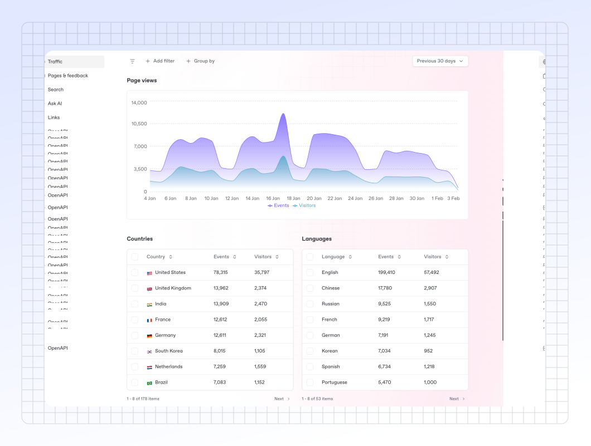

# Site insights


This feature is available on [Premium and Ultimate site plans](https://www.gitbook.com/pricing).


Insights give you information on the content you've published and how it performs. It's split up between different sections — **Traffic**, **Pages & feedback**, **Search**, **Ask AI**, **Links**, and **OpenAPI**.

You can see a top-level overview of your insights on the **Overview** tab of your site’s dashboard, with a globe that shows views in the last hour by location.

Click the **Insights** tab in the site header to find more detailed insights for your site.&#x20;

<figure><figcaption>
The site insights dashboard.
</figcaption></figure>

### Filters & groups

You can add filters or group your data to view it in specific ways. For example, you could look at search data within a specific site section, or filter your traffic data by country, device, browser and more.&#x20;

By combining filters and groups, you can drill down in to precise analytics data to track the events that you are important to you.&#x20;

### Types of data

The Insights tab is split into six sections, each focused on a specific data type.

#### Traffic

GitBook tracks page views to help you understand the popularity and reach of your content. Each time a user visits a page on your docs site, it is counted as a page view.&#x20;

Page views are critical for assessing the effectiveness of your content strategy and optimizing your documentation based on user interest. It’s split up between different views and profiles, including countries, languages, browsers, and more.

#### Pages & Feedback

Pages & feedback allow you to see a high-level representation of how your users rate your content. You’ll see an overview of all of your site’s sections and variants, and after enabling [page rating](site-settings.md#page-ratings-pro-and-enterprise-plans) in the **Customize** menu for a site, you can see each page’s average feedback rating.

If you want to use or analyze this data further outside of GitBook, click **Download CSV** to download a `.csv` file to your device.

You can also see a list of comments left from visitors who rate your pages, to get actionable insights on how your docs can be improved.


**Why can’t I see any feedback data for my site?**\
We only display data for published sites with page ratings enabled. If your site is not published or does not have page ratings enabled, you won’t see any insights.


#### Search

You can measure and improve your documentation by checking which keywords are used the most by users searching your documentation. This view allows you to see what keywords are performing the best, and which ones you could improve on.&#x20;

The information here can be helpful for informing your content architecture, making certain parts of your documentation easier to find without search, or adding additional content to existing pages based on what your visitors are searching for.

#### Ask AI

The [Ask AI](../creating-content/searching-your-content/gitbook-ai.md) section allows you to see what your users are asking for when using GitBook AI. This insight helps you identify common questions, uncover gaps in your documentation, and improve content to better meet user needs.&#x20;

By looking at these queries, you can refine your documentation structure, enhance discoverability, and provide more relevant information to your audience.

#### Links

GitBook tracks links to help you understand how users interact with external resources in your documentation. This feature provides insights into external links, their domains, and their placement within your docs, such as in the header, footer, or sidebar. Analyzing link usage can help you optimize navigation, improve content accessibility, and refine your documentation strategy based on user engagement.

#### OpenAPI

The [OpenAPI](../creating-content/openapi/) analytics view in GitBook provides insights into how users engage with your API documentation.&#x20;

It tracks interactions such as endpoint views, parameter searches, and request explorations, helping you understand which parts of your API are most accessed and where users may need more clarity. These insights enable you to refine your documentation, improve developer experience, and ensure your API content is effectively meeting user needs.
