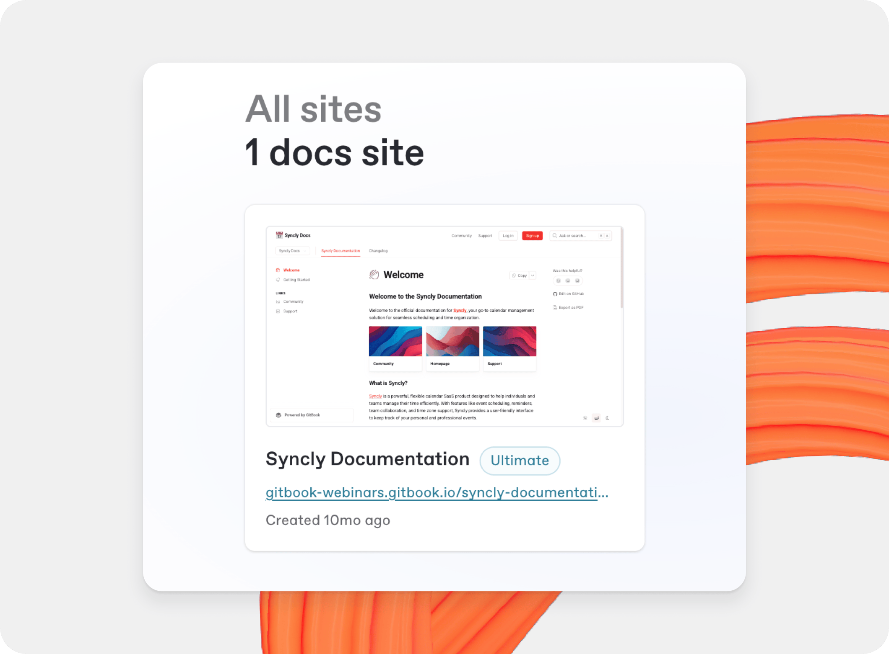

# Publish a docs site

Once you’ve finished writing, editing, or importing your content, you can publish your work to the web as a docs site. Your docs will be published on the web and available to your selected audience.

The content on your site comes from [spaces](../../creating-content/content-structure/space.md) in your organization. When you create a new docs site, you can create a new space, or link an existing one.

<figure><figcaption>
GitBook's docs sites homepage.
</figcaption></figure>

### Create a docs site

To create a docs site, click the plus **+** icon next to Docs site in the sidebar to launch the docs site wizard.

Give your site a name, choose a starting point for your content, and select whether you want to publish your site now or later.

If you already have content in a space that you would like to use, you can create a docs site directly from that space by opening the space and clicking **Share** in the top-right corner of the window. Then choosing **Publish as a docs site** from the share modal.

### Publish a docs site

By default, your site will be published publicly. You can change your site’s visibility in your [site’s settings](../site-settings.md).

There are three primary options to choose from when publishing your site:

<table data-view="cards"><thead><tr><th></th><th></th><th></th><th data-hidden data-card-cover data-type="image">Cover image</th><th data-hidden data-card-target data-type="content-ref"></th><th data-hidden data-type="image">Cover image (dark)</th><th data-hidden data-type="image">Cover image (dark)</th><th data-hidden data-card-cover-dark data-type="image">Cover image (dark)</th></tr></thead><tbody><tr><td><strong>Public</strong></td><td>Publish your docs publicly to the web.</td><td></td><td><a href="../../.gitbook/assets/Public (1).png">Public (1).png</a></td><td><a href="public-publishing.md">public-publishing.md</a></td><td><a href="../../.gitbook/assets/Public (1) (1).png">Public (1) (1).png</a></td><td></td><td><a href="../../.gitbook/assets/Public.png">Public.png</a></td></tr><tr><td><strong>Privately with share links</strong></td><td>Publish your docs with private share links.</td><td></td><td><a href="../../.gitbook/assets/Share links (1) (1).png">Share links (1) (1).png</a></td><td><a href="share-links.md">share-links.md</a></td><td></td><td><a href="../../.gitbook/assets/Share links (1).png">Share links (1).png</a></td><td><a href="../../.gitbook/assets/Share links.png">Share links.png</a></td></tr><tr><td><strong>Authenticated Access</strong></td><td>Protect your published docs behind an OAuth sign in.</td><td></td><td><a href="../../.gitbook/assets/Auth access.png">Auth access.png</a></td><td><a href="../authenticated-access/">authenticated-access</a></td><td></td><td></td><td><a href="../../.gitbook/assets/Auth access (1).png">Auth access (1).png</a></td></tr></tbody></table>

### Delete or unpublish a docs site

To delete a docs site, you’ll need to open your site’s dashboard, then open [**Site settings**](../site-settings.md#delete-site) from the top-right corner.

### Site editing permissions

Docs sites inherit the editing permissions from the [spaces](../../creating-content/content-structure/space.md) linked to them.

You can view all the permissions set for users with access to the docs site from the permissions modal from the docs site’s **Overview** page. You’ll also see which space the user’s permission was inherited from. If you’d like to change the permission settings, open the space, then click **Share**. Here you can edit the permissions from a modal.

Users with **Administrator** or **Creator** permissions on _any_ space linked to a specific docs site will have full access permissions for the site. This means that they’ll be able to control any of the publishing and customization settings.

Users with **Reviewer**, **Editor**, **Commenter**, or **Reader** permissions on any space linked to a specific site will get read-only permissions. This means they will see the docs site in your organization, but won’t be able to access any of its settings.
