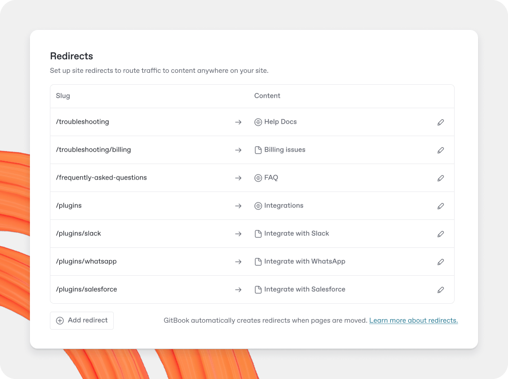

# Site redirects



<figure><figcaption>
Site redirects are useful when migrating documentation or restructuring content to avoid broken links, which can impact SEO.
</figcaption></figure>

Redirects are commonly used when you are migrating your documentation from one provider to another — like when you just moved docs to GitBook. Broken links can impact SEO so we recommend setting up redirects where needed.

In addition to [automatic redirects created by GitBook](site-redirects.md#about-automatic-redirects), you can create a redirect from any path in your site’s domain.

## Managing redirects on your site

To get started, view your site’s dashboard in GitBook and open the **Settings** tab, then click **Domain & redirects**.

### Creating redirects

Click **Add redirect** and select the **Manual** option.&#x20;

Fill in the source path — i.e. the URL slug that you wish to redirect somewhere else — and the destination content you wish to link to. You can pick any [section](site-structure/site-sections.md), [variant](site-structure/variants.md), or [page](../creating-content/content-structure/page.md) on to your site. Click **Add** to create the redirect.

You can also create **wildcard redirects** by adding \* at the end of the source path, for example:

* /docs/\* to match everything under /docs/
* /changelog\* to match paths that start with /changelog

When your source path includes a wildcard (\*), you can enable **Replace wildcard with matched text**.

* **On:** the part matched by \* is appended to the destination path.
  * Example: source /docs/\* → destination /help\
    /docs/install redirects to /help/install
* **Off:** all matched URLs redirect to the same fixed destination.
  * Example: source /docs/\* → destination /help\
    /docs/install redirects to /help

If you want to add another redirect to the same page, you can toggle the **Add another redirect** option on before you hit **Add**. When you add your redirect, the modal will remain open with the destination content set to the previous selection so you can add another URL slug immediately.

### Editing redirects

To edit a redirect, press the **Edit** <picture><source srcset="../.gitbook/assets/25_01_10_edit_icon_dark.svg" media="(prefers-color-scheme: dark)"></picture> icon next to it in the list. Update the redirect and hit **Save**.

To delete a redirect, press the **Delete redirect** button and confirm.

### Import redirects from a CSV

Click **Add redirect** and choose **Upload CSV**.

Upload a CSV with exactly two columns named: **source** and **destination:**

* The source is the path you want to redirect (for example, /docs/site-redirects)
* The destination is the GitBook admin URL of a **target page**, as shown in the screenshot below

<figure><figcaption>
You can find the GitBook admin URL for a page in this menu
</figcaption></figure>

A maximum of 500 rows is supported per import.

If your CSV includes duplicate source values, only the first row is processed. The import runs as an upsert: existing redirects with the same source are updated, and new redirects are created for sources that don’t exist yet.

If any rows fail, an error CSV is available from the bottom-right toast. It includes source, destination, and a short explanation of each error so you can fix, delete the errors column and re-import.

## About automatic redirects

Whenever pages are moved or renamed, their canonical URL changes with them. In order to keep your content accessible, GitBook automatically creates a [HTTP 307](https://developer.mozilla.org/en-US/docs/Web/HTTP/Reference/Status/307) redirect from the old URL to the new one.

Every time a URL is loaded, GitBook resolves it through the following steps:

1. Site content is resolved to its canonical URL by following any of the automatically created redirects.
2. If the URL cannot be resolved, the URL is checked against [space-level redirects](../getting-started/git-sync/content-configuration.md#redirects), defined in your repository's `.gitbook.yaml` file.
3. Finally, the URL is checked against site-level redirects, created via [the process above](site-redirects.md#creating-redirects).
