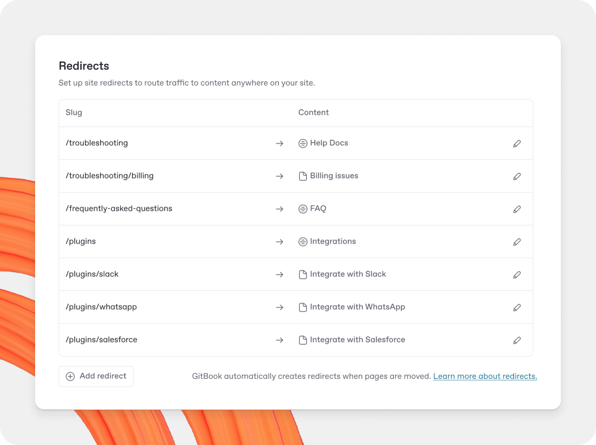

# Site redirects



<figure><figcaption>
Site redirects are useful when migrating documentation or restructuring content to avoid broken links, which can impact SEO.
</figcaption></figure>

Redirects are commonly used when you are migrating your documentation from one provider to another — like when you just moved docs to GitBook. Broken links can impact SEO so we recommend setting up redirects where needed.

In addition to [automatic redirects created by GitBook](site-redirects.md#about-automatic-redirects), you can create a redirect from any path in your site’s domain.

Redirects can be created as either **Live** or **Draft**. Draft redirects allow you to prepare and review redirect rules before publishing them. Drafts do not affect your live site until they are enabled.

## Managing redirects on your site

To get started, view your site’s dashboard in GitBook and open the **Settings** tab, then click **Domain & redirects**.

### Creating redirects

Click **Add redirect** and select the **Manual** option.

Fill in the **source path** — the URL slug you want to redirect — and the **destination** content you want visitors to be sent to. You can select any section, variant, or page on your site.

Click **Enable redirect** to immediately enable the redirect.

If you want to create the redirect without making it live yet, click **Save as draft** instead. Draft redirects appear in the **Draft** tab and can be enabled later.

You can also create **wildcard redirects** by adding \* at the end of the source path, for example:

* /docs/\* to match everything under /docs/
* /changelog\* to match paths that start with /changelog

When your source path includes a wildcard (\*), you can enable **Replace wildcard with matched text**.

* **On:** the part matched by \* is appended to the destination path.
  * Example: source /docs/\* → destination /help\
    /docs/install redirects to /help/install
* **Off:** all matched URLs redirect to the same fixed destination.
  * Example: source /docs/\* → destination /help\
    /docs/install redirects to /help

If you want to add another redirect to the same page, toggle **Add another redirect** before clicking **Enable redirect** or **Save as draft**.

When you add the redirect, the modal will remain open with the destination content set to your previous selection so you can quickly add another source path.


**Note:** GitBook resolves published URLs case-insensitively, so two redirects that differ only in capitalization are treated as the same path. If you're migrating from a platform that uses case-sensitive URLs, you may need to consolidate redirects before importing.


### Editing redirects

To edit a redirect, click the **Edit** icon next to it in the list. Update the redirect and click **Enable redirect** to publish your changes.

If the redirect is currently a **draft**, you can also publish it directly from the edit modal by clicking **Enable redirect**.

### Enabling draft redirects

Draft redirects appear in the **Draft** tab of the redirects table.

You can publish a draft redirect in two ways:

• Open the redirect and click **Enable redirect** in the edit modal.\
• Use the **toggle in the table** to enable the redirect directly.

Once enabled, the redirect moves to the **Live** tab and immediately starts routing visitors.

### Import redirects from a CSV

Click **Add redirect** and choose **Upload CSV**.

Upload a CSV with the columns `source`, `destination`, and optional `intent`.

* `source` is the path you want to redirect, for example /docs/site-redirects
* `destination` can be:
  * a specific page, using the page’s admin URL as shown in the screenshot below
  * an external URL
  * empty, depending on the intent
* `intent` can be:
  * live, left blank, or omitted entirely, to create, update, or remove a live redirect
  * draft to create, update, or remove a draft redirect
  * publish to publish an existing draft redirect to live, `destination` must be empty.

<figure><figcaption>
You can find the GitBook admin URL for a page in this menu
</figcaption></figure>

A maximum of 500 rows is supported per import.

If your CSV includes duplicate source values, only the first row is processed. The import runs as an upsert: existing redirects with the same source are updated, and new redirects are created for sources that don’t exist yet.

If any rows fail, an error CSV is available from the bottom-right toast. It includes source, destination, and a short explanation of each error so you can fix, delete the errors column and re-import.

#### CSV Examples

| source               | destination              | intent  | Result                                      |
| -------------------- | ------------------------ | ------- | ------------------------------------------- |
| /docs/site-redirects | https://example.com/page | blank   | Create or update a live redirect            |
| /docs/site-redirects | https://example.com/page | live    | Create or update a live redirect            |
| /docs/site-redirects | https://example.com/page | draft   | Create or update a draft redirect           |
| /docs/site-redirects | empty                    | blank   | Remove the live redirect                    |
| /docs/site-redirects | empty                    | live    | Remove the live redirect                    |
| /docs/site-redirects | empty                    | draft   | Remove the draft redirect                   |
| /docs/site-redirects | empty                    | publish | Publish the existing draft redirect to live |

## About automatic redirects

Whenever pages are moved or renamed, their canonical URL changes with them. In order to keep your content accessible, GitBook automatically creates a [HTTP 307](https://developer.mozilla.org/en-US/docs/Web/HTTP/Reference/Status/307) redirect from the old URL to the new one.

Every time a URL is loaded, GitBook resolves it through the following steps:

1. Site content is resolved to its canonical URL by following any of the automatically created redirects.
2. If the URL cannot be resolved, the URL is checked against [space-level redirects](../getting-started/git-sync/content-configuration.md#redirects), defined in your repository's `.gitbook.yaml` file.
3. Finally, the URL is checked against site-level redirects, created via [the process above](site-redirects.md#creating-redirects).
