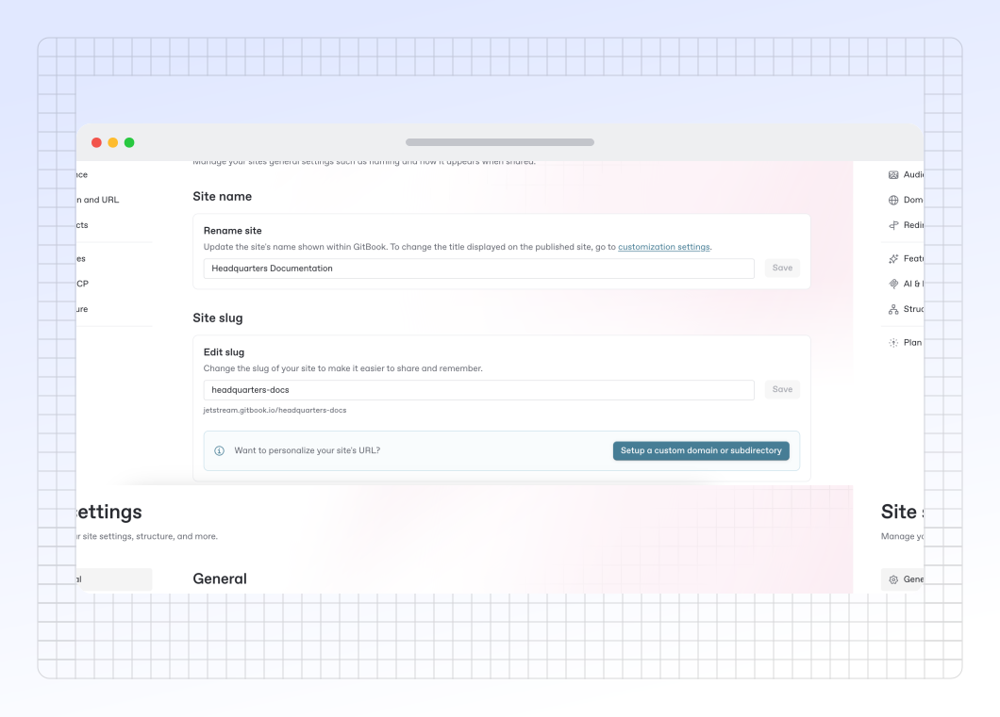

# Site settings



<figure><figcaption>
Update the settings for your published documentation.
</figcaption></figure>

### General

Site title

Change the name of your site, if you don't have a custom logo this is the name that your site visitors will see.

Social preview

Here, you can upload a custom social preview image for your site. This will set the site’s `og:image` to your uploaded image, and it’ll show when the site’s link is shared to any platform or product that supports OpenGraph images, such as Slack or X.

If you don’t add a social preview, GitBook will automatically generate one using your theme color, page title and description.

If your site has multiple [site sections](site-structure/site-sections.md), you can use the drop-down menu in this modal to add a custom social preview image for each one, or for your entire site.

Unpublish site

Unpublish your site, but keep its settings and customizations. You can publish your site again at any time.

Delete site

Unpublish and remove your site from the **Docs site** section in the GitBook app.

**Note:** Deleting a site is a permanent action and cannot be undone. Any settings and customizations will be lost, but your content will remain in its [space](../creating-content/content-structure/space.md).

### Audience

Audience

Choose who sees your published content. See [publish-a-docs-site](publish-a-docs-site/ "mention") for more info.

Adaptive content <mark style="background-color:purple;">Ultimate</mark>

Turn on adaptive content for your site pages, variants, and sections. [Adaptive content](adaptive-content/) lets you hide or show content for different visitors, depending on their permissions.

Your visitor token signing key will also be displayed here.

### Domain and URL

Custom domain

Configure a custom domain to unify your site with your own branding. See [custom-domain.md](custom-domain.md "mention") for more info.

GitBook Subdirectory

Publish your content on a subdirectory (e.g. `yourcompany.com/docs`). See [#gitbook-subdirectory](site-settings.md#gitbook-subdirectory "mention") for more info

### Redirects


[site-redirects.md](site-redirects.md)


### Features

PDF export <mark style="background-color:purple;">Premium &#x26; Ultimate</mark> 

Let your visitors to export your GitBook as PDF. See [pdf-export.md](../collaboration/pdf-export.md "mention") for more info.

Page ratings <mark style="background-color:purple;">Premium &#x26; Ultimate</mark> 

Choose whether or not visitors to your published content can leave a rating on each page to let you know how they feel about it. They’ll be able to choose a sad, neutral, or happy face.

You can review the results of these ratings by opening the [**Insights**](insights.md) section of your docs site dashboard and selecting the [**Content scores**](insights.md#content-scores) tab.

### AI & MCP

Choose the AI experience <mark style="background-color:purple;">Premium &#x26; Ultimate</mark> 

Let your site visitors ask GitBook anything with AI search or the GitBook assistant. See [search-and-gitbook-assistant.md](search-and-gitbook-assistant.md "mention") for more info.

Extend it with MCP connectors <mark style="background-color:purple;">Ultimate</mark> 

Configure MCP servers that the AI assistant can use when answering user questions inside your docs. See [#how-do-i-use-gitbook-ai](search-and-gitbook-assistant.md#how-do-i-use-gitbook-ai "mention") for more info.

### Structure


[site-structure](site-structure/)


### Plan


[plans](../account-management/plans/)

