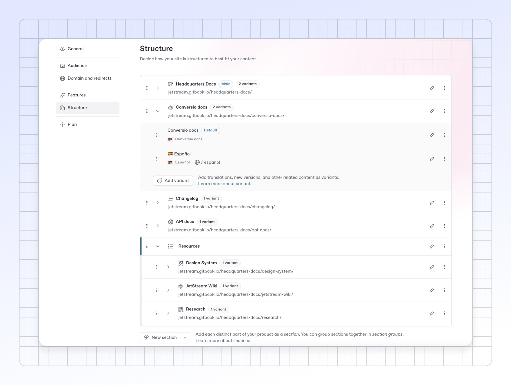
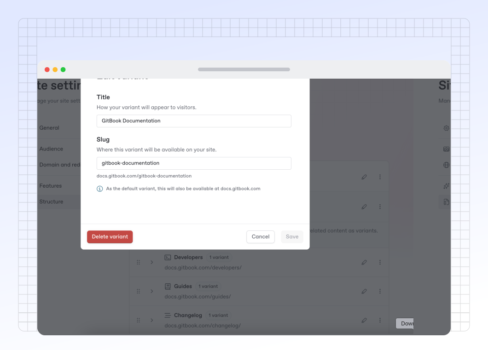

# Site structure

The content on your site comes from [spaces](../../creating-content/content-structure/space.md) in your organization. You can link one or multiple spaces. GitBook will publish each one and handle the navigation between spaces.

## Content types

Linked spaces can serve as one of two different content types, which determine how GitBook treats them in relation to each other and shows them to visitors.

<table data-card-size="large" data-view="cards"><thead><tr><th></th><th></th><th data-hidden data-card-cover data-type="files"></th><th data-hidden data-card-target data-type="content-ref"></th><th data-hidden><select></select></th></tr></thead><tbody><tr><td><strong>Content variants</strong></td><td>Publish multiple versions of the same content — ideal for localization, versioning, and more.</td><td><a href="../../.gitbook/assets/card_variants.svg">card_variants.svg</a></td><td><a href="variants.md">variants.md</a></td><td></td></tr><tr><td><strong>Site sections</strong></td><td>Split your site into distinct parts — ideal for multiple products or parts of your organization.</td><td><a href="../../.gitbook/assets/card_site_sections.svg">card_site_sections.svg</a></td><td><a href="site-sections.md">site-sections.md</a></td><td></td></tr></tbody></table>

## Managing your site structure

From your docs site’s dashboard, open the **Settings** tab in the site header, then click **Structure**. Here you can see all the content of your site, divided into sections and variants.

Your site starts out with a single section with your site's name and a single variant with the space you linked during your site's set-up.

<figure><figcaption>
The structure of a published docs site.
</figcaption></figure>

### Linking a space to your docs site

To add a [site section](site-sections.md), click the **Add section** button underneath the table and choose a space to link as a section. The new section is then added to the table and will be available to visitors as a tab at the top of your site.

To add a [variant](variants.md), click the **Add variant** button in the section you’d like to add to, then choose a space to link. The new variant is then added to the list of variants within the chosen section and will be available to visitors in the variant dropdown on your site.

When you add a space — as a variant or a section — a name and slug will be generated based on the space’s title.

### Changing sections or variants

<figure><figcaption>
Update a site section or variant.
</figcaption></figure>

You can change the name and slug of each of sections and variants by clicking the **Edit** <picture><source srcset="../../.gitbook/assets/edit_icon_dark.svg" media="(prefers-color-scheme: dark)"></picture> button in the table row of the item you’d like to edit. This will open a modal. Edit the field(s) you’d like to change, then click the **Save** button to save.


Changing a linked space's slug will change the space's canonical URL. GitBook will create an automatic redirect from the old URL to the new one. You can also [manually create redirects](../site-redirects.md).


To replace a section or variant, first delete it by clicking its **Edit** <picture><source srcset="../../.gitbook/assets/edit_icon_dark.svg" media="(prefers-color-scheme: dark)"></picture> button, then click the **Delete** button in the lower left of the modal. Once the item is deleted, click the **Add section** or **Add variant** button to add it again.

### Reordering sections or variants

Your site displays sections and variants in the order that they appear in your **Site structure** table. They can be reordered by grabbing the **Drag handle** <picture><source srcset="../../.gitbook/assets/options_menu_icon_dark.svg" media="(prefers-color-scheme: dark)"></picture> and moving it up or down. The changed order will be reflected on your site immediately.

You can also use the keyboard to select and move content. Select a section or variant with the space bar, then use the arrow keys to move it up or down. Hit the space bar again to confirm the new position.

### Setting default content

If you have multiple sections in your site, one section will be marked as **Default**. This section is shown when visitors arrive on your site, and is served from your site’s root URL. Other sections each have a slug that is appended to the root URL.

If you have multiple variants within a section, one variant will be marked as the default. Like sections, the default variant is shown when visitors arrive on your site, or when they visit a section. Other variants each have a slug that’s appended to the section’s URL.

To set a space as default, click on the **Actions menu** <picture><source srcset="../../.gitbook/assets/actions_icon_dark.svg" media="(prefers-color-scheme: dark)"></picture> in the space’s table row and then click **Set as default**.


Setting a space as default removes its slug field, as it will be served from the section root instead. GitBooks redirects the space’s slug to the appropriate path, to ensure visitors keep seeing your content.


### Remove content from a site

To remove the content of a space from a site, open the **Settings** tab from your docs site dashboard, then click **Structure** to find the content you want to remove.&#x20;

Open the **Actions menu** <picture><source srcset="../../.gitbook/assets/actions_icon_dark.svg" media="(prefers-color-scheme: dark)"></picture> for the space you want to remove and choose **Remove**.


Removing a space from your site will remove it from the published site, but **will not delete the space or the content within it**.

