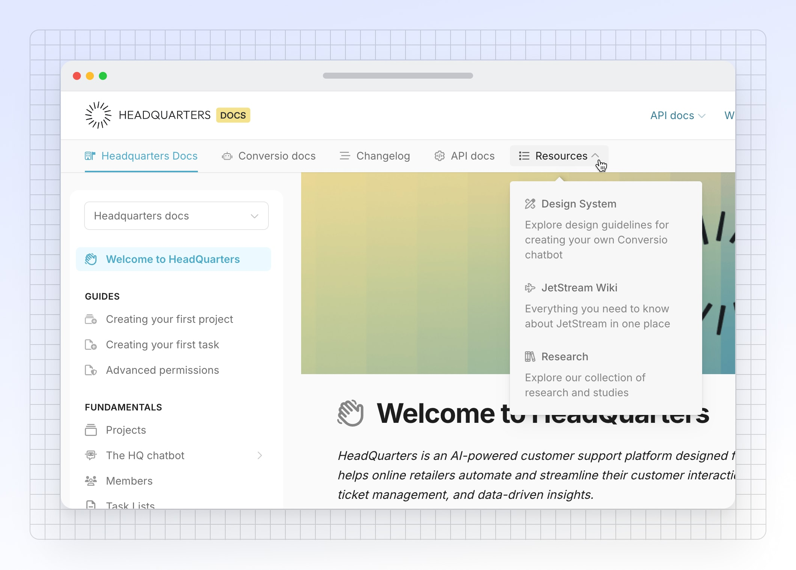

# Site sections



<figure><figcaption>
Example of a GitBook site with site sections
</figcaption></figure>

With site sections, you can centralize all your documentation and create a seamless experience for your users.

Site sections are perfect for organizing your documentation — whether you’re managing separate products, or catering to both end-users and developers with content tailored to each.

You can also [group site sections together](site-sections.md#create-a-site-section-group). Doing so will create a drop-down menu in your navigation bar — ideal for adding hierarchy to your site sections.


### Sections or variants?

Each site section is a space in GitBook. You can create site sections from any space you like, but we recommend you use sections as semantically different parts of your docs.

If you want to add variations of the same content — such as localizations or historical versions of the same product — consider using [content variants](variants.md) instead.


### Adding a section to your docs site

From your docs site’s dashboard, open the **Settings** tab in the site header, then click **Structure**. Here you can see all the content of your site.

To add a site section, click the **New section** button underneath the table and choose a space to link as a section. The new section is then added to the table and will be available to visitors as a tab at the top of your site.

<figure><figcaption>
Add structure to your docs with site sections.
</figcaption></figure>

### Create a site section group

You can group site sections together under a single heading. Site section groups will appear as a drop-down in your site’s nav. Site sections in a group can also include an optional description, which appears below the section title in the drop-down menu.

To create a group, click the arrow next to the **New section** button and choose **New section group**. Give your new group a name, then click **Add section** in the modal to add sections to your group. You can add existing sections of your site to the new group, or select another space you want to add using the menu.

### Editing a section

You can change the name, icon and slug of each of your sections by tapping the <picture><source srcset="../../.gitbook/assets/edit_icon_dark.svg" media="(prefers-color-scheme: dark)"></picture> **Edit** button in the table row of the section you’d like to edit. This will open a modal. Edit the field(s) you’d like to change, then click the **Save** button. You can also delete the variant by clicking the **Delete variant** button in the lower left.


Changing a section’s slug will change its canonical URL. GitBook will create an automatic redirect from the old URL to the new one. You can also [manually create redirects](../site-redirects.md).


Site sections within a group can also optionally display a description, which will appear in the drop-down menu of your site’s nav bar when the section group is hovered. See the image at the top of this page to see an example of how this can look in your published documentation.

### Reordering sections

Your site displays sections in the order that they appear in your Site structure table. Sections can be reordered by grabbing the **Drag handle** <picture><source srcset="../../.gitbook/assets/options_menu_icon_dark.svg" media="(prefers-color-scheme: dark)"></picture> and moving it up or down. All the spaces within that section will be moved with it. The changed order will be reflected on your site immediately.

You can also use the keyboard to select and move content: select a section with the space bar, then use the arrow keys to move it up or down. Hit the space bar again to confirm the new position.

### Setting a default section

If you have multiple sections in your site, one section will be marked as the default. This section is shown when visitors arrive on your site, and is served from your site’s root URL. Other sections each have a slug that is appended to the root URL.

To set a section as default, click on the **Actions menu** <picture><source srcset="../../.gitbook/assets/actions_icon_dark.svg" media="(prefers-color-scheme: dark)"></picture> in the section's table row and then click **Set as default**.

### Remove a section

To remove a section from a site, click the **Settings** <picture><source srcset="../../.gitbook/assets/settings_icon_dark.svg" media="(prefers-color-scheme: dark)"></picture> button from your docs site dashboard, then click **Structure** to find the content you want to remove. Click the **Edit** <picture><source srcset="../../.gitbook/assets/edit_icon_dark.svg" media="(prefers-color-scheme: dark)"></picture> button next to the section you want to remove, then click the **Delete** button in the lower left of the modal. This will remove the section, along with all the variants within it, from the published site. It will not delete the spaces itself, or the content within them.

To remove a section from a site, open the **Settings** tab from your docs site dashboard, then click **Structure** to find the content you want to remove.

Open the **Actions menu** <picture><source srcset="../../.gitbook/assets/actions_icon_dark.svg" media="(prefers-color-scheme: dark)"></picture> for the space you want to remove and choose **Remove**.


Removing a section from your site will remove it — and all variants within it — from the published site, but **will not delete any of the spaces or the content within them**.

