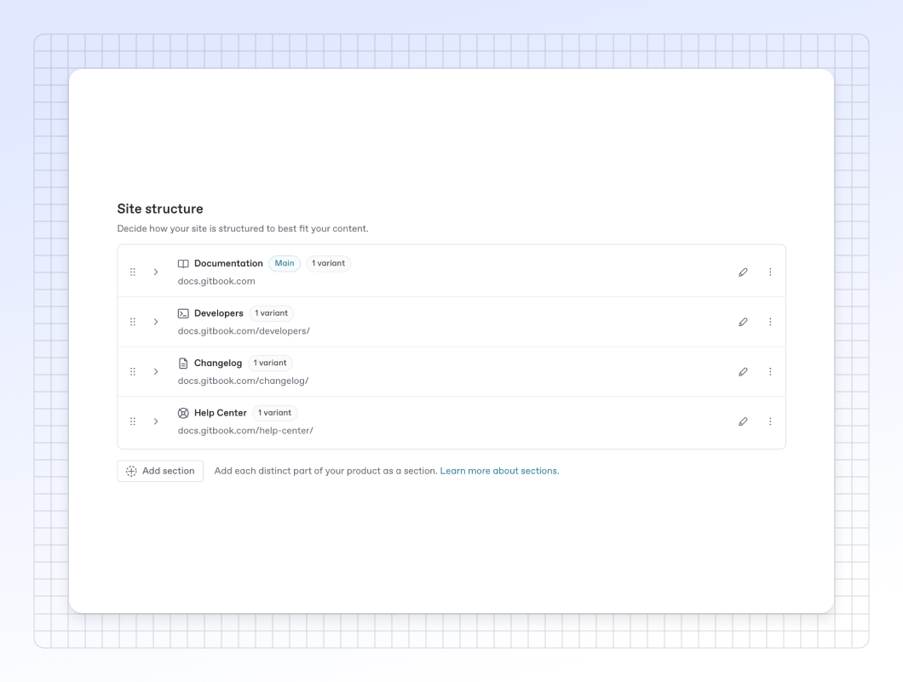

# Site sections


This feature is available on the [Ultimate site plan](https://www.gitbook.com/pricing).


A site with multiple sections is useful if you need to separate distinct parts of your documentation, each with its own navigation tree — such as if you’re documenting different products with separate versions, or if you want to offer end-user and developer documentation separate from each other.

The spaces you link as sections can contain any content, but it is recommended to use sections as _semantically different_ parts of your docs. If the spaces you'd like to link are variations of the same content, consider adding them as [content variants](variants.md) instead.

<figure><figcaption></figcaption></figure>

### Adding a section to your docs site

From your docs site’s dashboard, click the **Settings** <picture><source srcset="../../.gitbook/assets/settings - dark.svg" media="(prefers-color-scheme: dark)"></picture> button, then click **Structure**. Here you can see all the content of your site.

To add a site section, click the **Add section** button underneath the table and choose a space to link as a section. The new section is then added to the table and will be available to visitors as a tab at the top of your site.

### Editing a section

You can change the name and slug of each of your sections by tapping the <picture><source srcset="../../.gitbook/assets/edit - dark.svg" media="(prefers-color-scheme: dark)"></picture> **Edit** button in the table row of the section you’d like to edit. This will open a modal. Edit the field(s) you'd like to change, then click the **Save** button to save. You can also delete the variant by clicking the **Delete variant** button in the lower left.&#x20;


Changing a section’s slug will change its canonical URL. GitBook will create an automatic redirect from the old URL to the new one. You can also [manually create redirects](../site-redirects.md).


### Reordering sections

Your site displays sections in the order that they appear in your Site structure table. Sections can be reordered by grabbing the **Drag handle** <picture><source srcset="../../.gitbook/assets/options-menu-dark.svg" media="(prefers-color-scheme: dark)"></picture> and moving it up or down. All the spaces within that section will be moved with it. The changed order will be reflected on your site immediately.

You can also use the keyboard to select and move content: select a section with the space bar, then use the arrow keys to move it up or down. Hit the space bar again to confirm the new position.&#x20;

### Setting a default section

If you have multiple sections in your site, one section will be marked as the default. This section is shown when visitors arrive on your site, and is served from your site’s root URL. Other sections each have a slug that is appended to the root URL.

To set a section as default, click on the **Actions menu** <picture><source srcset="../../.gitbook/assets/actions - dark.svg" media="(prefers-color-scheme: dark)"></picture> in the section's table row and then click **Set as default**.

### Remove a section

To remove a section from a site, click the **Settings** <picture><source srcset="../../.gitbook/assets/settings - dark.svg" media="(prefers-color-scheme: dark)"></picture> button from your docs site dashboard, then click **Structure** to find the content you want to remove. Click the **Edit** <picture><source srcset="../../.gitbook/assets/edit - dark.svg" media="(prefers-color-scheme: dark)"></picture> button next to the section you want to remove, then click the **Delete** button in the lower left of the modal. This will remove the section, along with all the variants within it, from the published site. It will not delete the spaces itself, or the content within them.
