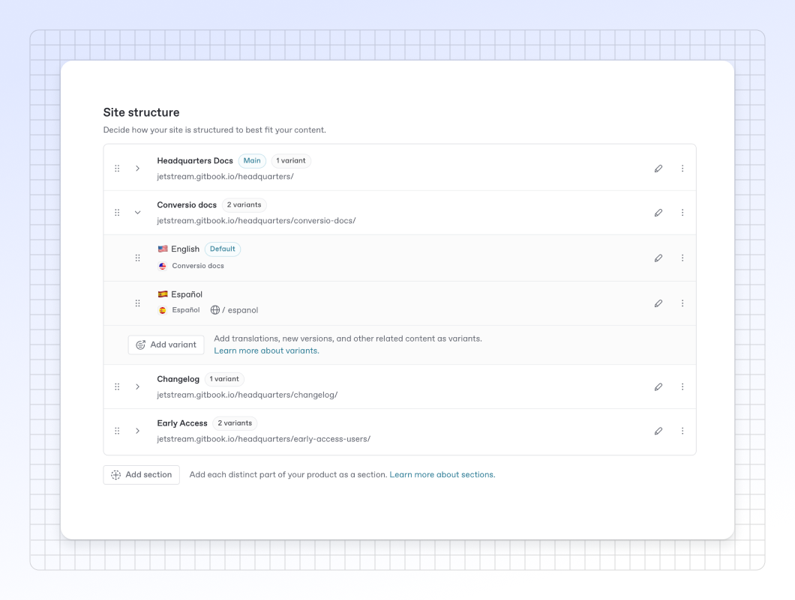

# Content variants

You can publish multiple versions of the same documentation as part of a single docs site. These variants will be available to the end users via the space switcher in the top-left corner of the published site.

<figure><figcaption></figcaption></figure>

### Add multiple languages or versions

A site with multiple variants is useful if you need to group together the content of your spaces — such as if you’re documenting multiple versions of an API (v1, v2, v3, etc.), or documenting your content in different languages.


The spaces you link can contain any content, but it’s recommended to use variants as _variations of the same content_. If the spaces you link are semantically different from each other, consider adding them as [site sections](site-sections.md) instead.


### Adding a variant to your docs site

From your docs site’s dashboard, click the **Settings** <picture><source srcset="../../.gitbook/assets/settings_icon_dark.svg" media="(prefers-color-scheme: dark)"></picture> button, then click **Structure**. Here you can see all the content of your site.

To add a variant, click the **Add variant** button in the section you'd like to add to, then choose a space to link. The new variant is then added to the list of variants within the chosen section and will be available to visitors in the variant dropdown on your site.

### Changing a variant

You can change the name and slug of each of your variants by tapping the <picture><source srcset="../../.gitbook/assets/edit_icon_dark.svg" media="(prefers-color-scheme: dark)"></picture> **Edit** button in the table row of the variant you’d like to edit. This will open a modal. Edit the field(s) you'd like to change, then click the **Save** button to save. You can also delete the variant by clicking the **Delete variant** button in the lower left.&#x20;


Changing a linked space's slug will change the space's canonical URL. GitBook will create an automatic redirect from the old URL to the new one. You can also [manually create redirects](../site-redirects.md).


To replace a variant’s linked space with a different space, first delete it by clicking its **Edit** <picture><source srcset="../../.gitbook/assets/edit_icon_dark.svg" media="(prefers-color-scheme: dark)"></picture> button, then click the **Delete** button in the lower left of the modal. Once the variant is deleted, click the **Add variant** button to add the new space.

### Reordering variants

Your site displays variants in the order that they appear in your **Site structure** table. Variants can be reordered by grabbing the **Drag handle** <picture><source srcset="../../.gitbook/assets/options_menu_icon_dark.svg" media="(prefers-color-scheme: dark)"></picture> and moving it up or down. The changed order will be reflected on your site immediately.

You can also use the keyboard to select and move content: select a section or variant with the space bar, then use the arrow keys to move it up or down. Hit the space bar again to confirm the new position.

### Setting a default variant

If you have multiple variants within a section, one variant will be marked as the default. This variant is shown when visitors arrive on your site (or when they visit a section). Other variants each have a slug that is appended to the site's URL.

To set a variant as default, click on the **Actions menu** <picture><source srcset="../../.gitbook/assets/actions_icon_dark.svg" media="(prefers-color-scheme: dark)"></picture> in the variant’s table row and then click **Set as default**.


Setting a variant as default removes its slug field, as it will be served from the section root instead. GitBook will redirect the variant's slug to the appropriate path, to ensure visitors keep seeing your content.


### Remove a variant from a site

To remove a variant from a site, click the **Settings** <picture><source srcset="../../.gitbook/assets/settings_icon_dark.svg" media="(prefers-color-scheme: dark)"></picture> button from your docs site dashboard, then click **Structure** to find the content you want to remove. Click the **Edit** <picture><source srcset="../../.gitbook/assets/edit_icon_dark.svg" media="(prefers-color-scheme: dark)"></picture> button next to the variant you want to remove, then click the **Delete variant** button in the lower left of the modal. This will remove it from the published site, but will not delete the variant or the content within.

