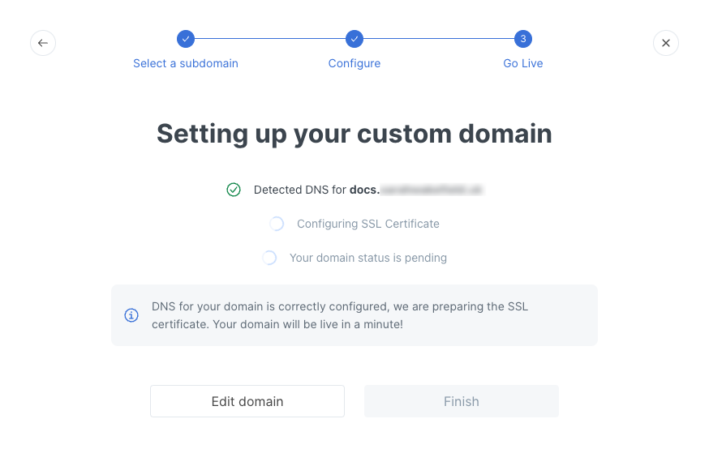
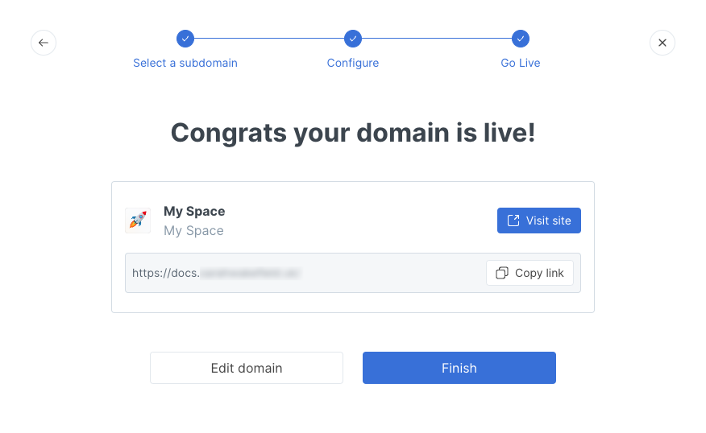

# Confirming the custom domain setup


Please follow the steps to set a custom domain in this order:

1. [Choosing a subdomain](choose.md)
2. [Deciding where to set the custom domain](location.md)
3. [Initiating the custom domain setup](initiate/) (at the [organization](initiate/organization-level-custom-domain.md), [collection](initiate/collection-level-custom-domain.md), or [space](initiate/space-level-custom-domain.md) level)
4. [Configuring DNS](configure-dns.md)
5. [**Confirming the custom domain setup**](finalize.md) **(you are here)**


Once your CNAME record has taken effect, or has _propagated_, you're ready to confirm the setup in GitBook. As a reminder, this could take anywhere from a few minutes to 48 hours.

If you're setting an organization-level custom domain, go back into the organization settings page, and click the **Edit domain** button in the Publishing section.

If you're setting a collection- or space-level custom domain, go back into the Share modal for that collection or space. From either the **Publish to the web** or **Share to an audience** tab (depending on how it has been published) click the **Edit domain** button.

If our setup process is still in progress, you'll see the same options as you saw before. Click on the **Next: Configure DNS** button and then the **Ready: Go Live** button to get to the final screen.

The first thing we'll do is check to see if the correct DNS record has taken effect. Once we've been able to detect this, you'll see an update on the screen:

<figure><figcaption></figcaption></figure>

Next, we'll configure an SSL certificate for the custom domain automatically. This part of the process might take a few minutes. Once it has been completed successfully, you'll see a success message:

<figure><figcaption></figcaption></figure>

Visitors to your documentation can now use your custom domain to access it. 🎉

If you ever change your mind, you can always go back to the organization settings page or to the Share modal for a collection or space to edit or remove the custom domain.

If you follow the steps on this page and you don't see the success message, some more time might still be needed for the CNAME record to propagate. Try allowing about another hour before coming back to try it again, or review our [troubleshooting](troubleshooting.md) information if you still have trouble. Remember that it _can_ in some cases take up to 48 hours for the change to fully take effect.
