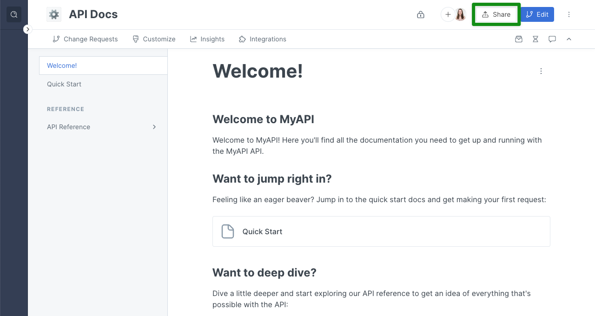
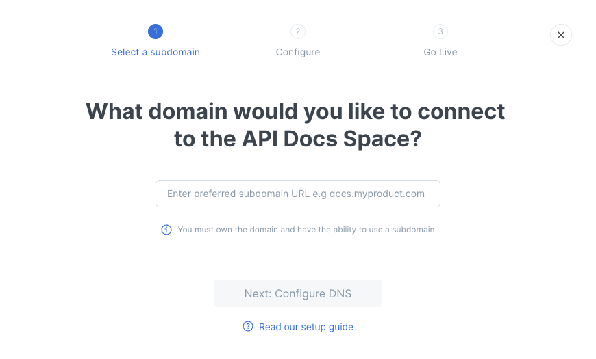

# Space-level custom domain


Please follow the steps to set a custom domain in this order:

1. [Choosing a subdomain](../choose.md)
2. [Deciding where to set the custom domain](../location.md)
3. [**Initiating the custom domain setup**](./) **(at the** [**organization**](organization-level-custom-domain.md)**,** [**collection**](collection-level-custom-domain.md)**, or** [**space**](space-level-custom-domain.md) **level) (you are here)**
4. [Configuring DNS](../configure-dns.md)
5. [Confirming the custom domain setup](../finalize.md)


You'll find the options for setting a custom domain for a space within the space's Share modal. To get there, click on the name of the space in the sidebar, and then click on the **Share** button near the top-right corner. It will look something like this:

<figure><figcaption>
Click the button to open the share modal
</figcaption></figure>

First, your space needs to be published. Any setting other than unpublished will work — **public**, **unlisted**, **share link**, or **visitor authentication**. (Depending on the plan you have chosen, it might be that only _some_ of these publishing options are available to you.)

Once you have published your space on either the **Publish to the web** or the **Share to an audience tab**, you'll see a section titled **Customize URL**. Click on the **Connect a domain** button:

<figure><figcaption>
The share modal
</figcaption></figure>

Now, enter the custom domain you'd like to set, and then click the **Next: Configure DNS** button:

<figure><figcaption>
Connect a domain
</figcaption></figure>

We'll then provide the name and value to use in the next step when you create your CNAME DNS record. You can copy the name or value to your clipboard by clicking on the icon on the right-hand side of each field.

<figure><figcaption>
The CNAME value for your custom domain
</figcaption></figure>

The value for the CNAME record will be in the format `[something]-hosting.gitbook.io`, where that `[something]` will be **unique to you**. Make sure to use the value displayed to you in the GitBook app, and _not_ the value in the screenshot above! 🙂

Now, you're ready to move onto the next step: [configuring DNS](../configure-dns.md).
