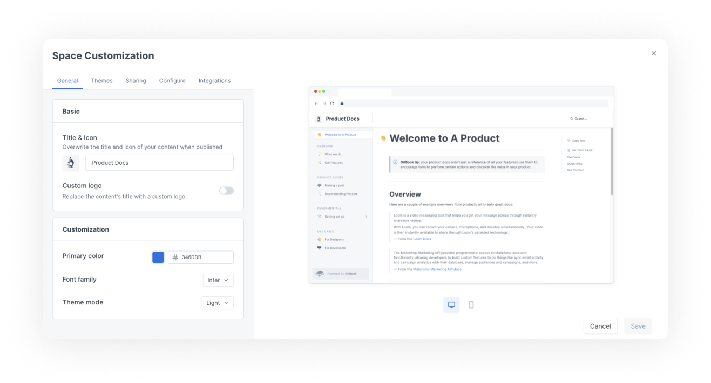
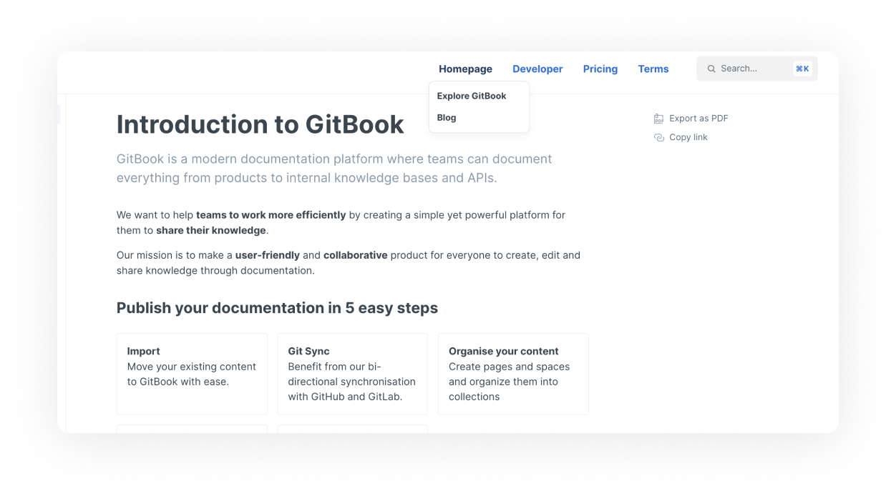
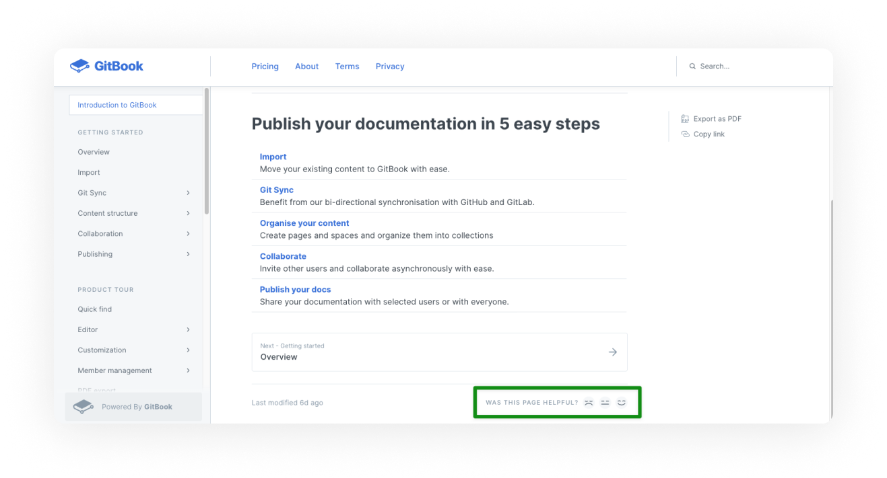

# Space customization

<figure><figcaption>
Space customization settings
</figcaption></figure>

Customizing your space lets you control the branding, presentation and extra features of your space's public content.


Most customization settings apply to your **published content**. This keeps your writing experience and in-app GitBook content consistent, while allowing you to control the output to a degree.


## General

Inherit customizations

If the space you are customizing is within a collection, you'll see this option:

When this setting is enabled, the space will automatically inherit any changes made to the customization settings for the parent collection. This is useful if you want to control multiple spaces' customizations in one place, and removes the need to make the same change multiple times across spaces.

Title and icon

The _**internal**_ icon and title, which you'll see when logged into the GitBook app, are set in the [space header](https://docs.gitbook.com/getting-started/overview#space-header). In this customization setting you can override those and choose different _**external**_ settings, which your visitors will see when they access your published content.

It's not uncommon to use a longer or more specific title in published content and to use a shorter title or internal wording that might not make complete sense to your visitors when logged into the GitBook app.

For the icon, you can choose from a long list of emojis, or you can upload your own square image.

Custom logo

You can replace _both_ the space's title and icon with a custom logo, so that your documentation better reflects your own branding.

**The custom logo setting is only available to spaces owned by an organization subscribed to a Pro or Enterprise plan.**

Primary color

The chosen primary color will be applied to things like links, hover states, and buttons. While you can use any color you'd like, it's important to keep accessibility in mind and choose something that will have good contrast when used as a text link.

Font family

You can customize the font family from a list of predefined options.

GitBook doesn't support the uploading or linking of custom fonts. If you think we're missing a typeface that works wonderfully for headers, body copy, and captions, [let us know](../../faq/support.md)!

**The font family setting is only available to spaces owned by an organization subscribed to a Pro or Enterprise plan.**

Theme mode

Choose between a light and a dark theme.

**This setting only affects the published content. If you're looking to use a different theme when logged into the GitBook app, you can do so from your settings menu, found at the bottom of the** [**sidebar**](https://docs.gitbook.com/getting-started/overview#sidebar)**.**

## Header

#### Theme

We offer a number of header options for our theme:

1. **None**\
   This gives a more minimal look and feel. No [header links](space-customization.md#undefined) will be visible, whether they have been configured or not, and the search option will be moved next to the space title or logo.
2. **Matching**\
   In light [theme mode](space-customization.md#theme-mode), the header will have a light background. In dark [theme mode](space-customization.md#theme-mode), the header will have a dark background.
3. **Bold**\
   The selected [primary color](space-customization.md#primary-color) will be used for the header background.
4. **Contrast**\
   In light [theme mode](space-customization.md#theme-mode), the header will have a dark background. In dark [theme mode](space-customization.md#theme-mode), the header will have a light background.


The bold and contrast theme header options are only available to spaces owned by an organization subscribed to a **Pro** or **Enterprise** plan.


#### Navigation

You can add links to the header section of your documentation. For each link, you will need to set a URL and a text label. You could use header links to link to important parts of your documentation, or perhaps to link back to your main website.

You can also create a navigation menu by adding links and sub-links which will shows as drop downs for each item.

<figure><figcaption></figcaption></figure>


If your [theme header option](space-customization.md#theme-header-options) is set to **none**, any header links you have configured will not be displayed. Make sure to choose one of the other theme header options so that your configured links are visible!


## Sharing

#### Social preview

You can upload a custom social preview image for your space. This will set the space's `og:image` to be your uploaded image, and it'll show when the space's link is shared to any platform or product that supports OpenGraph images.

## Configure

Localize user interface

You can select from a list of languages to localize the user interface of your published content. This will apply translations to the **non-custom** areas of the interface.

This setting will not auto-translate your actual content, but can help with matching the user interface to the language that you are writing in.

Is there a language we don't yet offer that you would like to see included in this list? [Let us know](../../faq/support.md)!

PDF Export

You can choose whether or not you'd like visitors to your published content to be able to download the content as a PDF file.

You can [find out more about the PDF export feature](../share/pdf-export.md).

**PDF export is only available to spaces owned by an organization on a Pro or Enterprise plan.**

Page rating

Choose whether or not visitors to your published content can leave a rating on each page to let you know how they feel about it.

You can review the results of this survey if you click on [insights](../insights.md) in the [space sub-navigation](https://docs.gitbook.com/getting-started/overview#space-sub-navigation).

