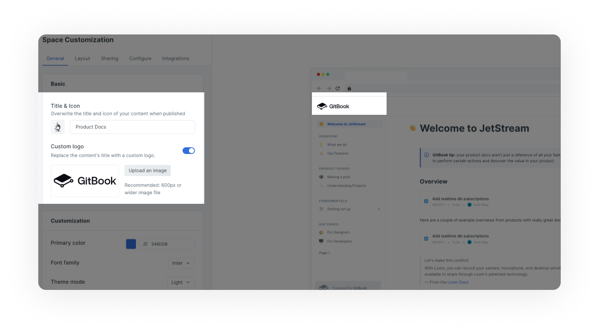

# Space customization

<figure><figcaption>
Space customization settings
</figcaption></figure>

Customizing your space lets you control the branding, presentation and extra features of your space's public content.


Most customization settings apply to your **published content**. This keeps your writing experience and in-app GitBook content consistent while allowing you to control the output to a degree.


## General: control how your content looks

Inherit customizations

If the space you are customizing is within a collection, you'll see this option:

When this setting is enabled, the space will automatically inherit any changes made to the customization settings for the parent collection. This is useful if you want to control multiple spaces' customizations in one place, and removes the need to make the same change multiple times across spaces.

### Change the space title and icon&#x20;

You will see an _**internal**_ icon and title when logged into the GitBook app. Those are usually set when you first create a space and include a random emoji. By navigating to the title & icon you can override those settings and choose the different _**external**_ appearance, that your visitors will see when they access your published content.


**Space titles:** It's not uncommon to use a longer or more specific title in published content and to use a shorter title or internal wording that might not make complete sense to your visitors when logged into the GitBook app.&#x20;


You can upload your own square image as your space icon or use a long list of emojis provided.&#x20;

### Upload a custom logo

You can replace _**both**_ the space's title and icon with a custom logo so that your documentation better reflects your own branding.


The custom logo setting is only available to spaces owned by an organization subscribed to a Pro or Enterprise plan.


#### What is the difference between an icon and a custom logo?&#x20;

The icon allows you to upload a small 132px square image and which will be displayed alongside your space title while the custom logo allows you to upload a larger image and gives you full control over the image and space title.&#x20;

<figure><figcaption>
Preview of a space with custom logo
</figcaption></figure>

Primary colour

The chosen primary color will be applied to things like links, hover states, and buttons. While you can use any color you'd like, it's important to keep accessibility in mind and choose something that will have good contrast when used as a text link.

Font family

You can customize the font family from a list of predefined options.

GitBook doesn't support the uploading or linking of custom fonts. If you think we're missing a typeface that works wonderfully for headers, body copy, and captions, [let us know](../../faq/support.md)!

**The font family setting is only available to spaces owned by an organization subscribed to a Pro or Enterprise plan.**

Select dark or light theme for published content

Choose between a light and a dark theme.

**This setting only affects the published content. If you're looking to use a different theme when logged into the GitBook app, you can do so from your settings menu, found at the bottom of the** [**sidebar**](https://docs.gitbook.com/getting-started/overview#sidebar)**.**

## Layout: manage how users navigate your content

### Change the header theme

We offer a number of header options for our theme:

* **Matching**\
  In light [theme mode](space-customization.md#theme-mode), the header will have a light background. In dark [theme mode](space-customization.md#theme-mode), the header will have a dark background.
* **Bold**\
  The selected [primary color](space-customization.md#primary-color) will be used for the header background.
* **Contrast**\
  In light [theme mode](space-customization.md#theme-mode), the header will have a dark background. In dark [theme mode](space-customization.md#theme-mode), the header will have a light background.


The bold and contrast theme header options are only available to spaces owned by an organization subscribed to a **Pro** or **Enterprise** plan.


### Create a navigation menu

You can add links to the header section of your documentation. For each link, you will need to set a URL and a text label. You could use header links to link to important parts of your documentation, or perhaps to link back to your main website.

You can also create a navigation menu by adding links and sub-links which will show as drop-downs for each item.

<figure><figcaption></figcaption></figure>

### Previous and next buttons

Pagination allows you to control whether the buttons _**Previous**_ or _**Next**_ appear at the bottom of your page

### Footer

Footer allows you to upload an image, copyright text and add column titles with links.&#x20;

## Sharing: upload social preview

You can upload a custom social preview image for your space. This will set the space's `og:image` to be your uploaded image, and it'll show when the space's link is shared to any platform or product that supports OpenGraph images.

## Configure: manage the interface&#x20;

### Match the user interface to the language of your content

You can select from a list of languages to localize the user interface of your published content. This will apply translations to the **non-custom** areas of the interface.

This setting will not auto-translate your actual content, but can help with matching the user interface to the language that you are writing in.

Is there a language we don't yet offer that you would like to see included in this list? [Let us know](../../faq/support.md)!

### PDF Export

You can choose whether or not you'd like visitors to your published content to be able to download the content as a PDF file.

You can [find out more about the PDF export feature](../share/pdf-export.md).


**PDF export is only available to spaces owned by an organization on a Pro or Enterprise plan.**


### Page rating&#x20;

Choose whether or not visitors to your published content can leave a rating on each page to let you know how they feel about it.

You can review the results of this survey if you click on [insights](../insights.md) in the [space sub-navigation](https://docs.gitbook.com/getting-started/overview#space-sub-navigation).

<figure><figcaption>
Page rating displayed on published documentation 
</figcaption></figure>

### Upload a privacy policy

Provide a privacy policy to help visitors understand cookie tracking. Otherwise, the GitBook [privacy policy](https://policies.gitbook.com/privacy/cookies) will be used.

## Integrations

Enable Intercom or Google Analytics integrations on your published content.&#x20;

Looking for more integrations? [Read about our integrations](space-customization.md#integrations) including [Segment](../../product-tour/integrations/segment/), [Plausible](../../product-tour/integrations/plausible/) or [Fathom.](../../product-tour/integrations/fathom/)&#x20;
