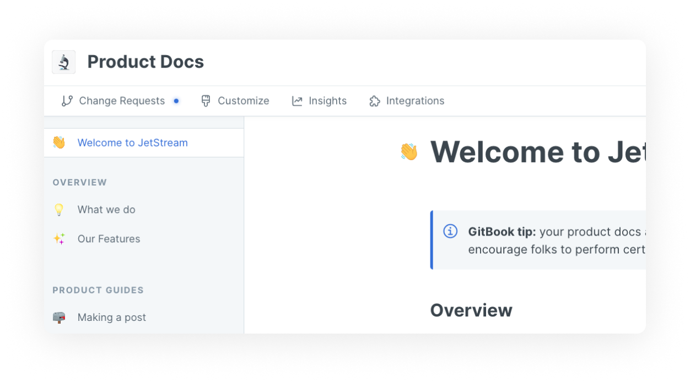

# Gather insights on your content

You can measure and improve your documentation by checking how your pages are performing and which keywords are used when searching through your documentation.


**Permissions**

Administrators and creators can view the insights panel.


## The insights panel

When inside a space, click on **insights** in the [space sub-navigation](https://docs.gitbook.com/getting-started/overview#space-sub-navigation) to open the insights panel. You'll see two tabs: pages and searches.

<figure><figcaption>
Preview of the sub-navigation panel with insights visible. This view is available to admins and creators 
</figcaption></figure>

#### Pages tab

Traffic

This shows a summary of visits to your space across all pages. You can view daily, weekly, or monthly traffic — monthly is the default. A bar chart plots that traffic over time.

Pages

For each page in the space, you can see a count of all views. This is the **total number of views since the page was published**. If [page rating](https://docs.gitbook.com/tour/customization/space-customization#page-rating) is enabled, you can also see how many people have left feedback on each page and the average feedback rating. Hover over the average rating to see further details.

Click **download CSV** if you'd like to use or analyse this data further outside of GitBook, and a `.csv` file will be downloaded to your device.

#### Search tab

Searches

Switch to the search tab to take a look at which terms visitors are searching for within the space. You can view these search terms for the past week, month, or year — and again, the month is the default setting.

The information here can be helpful for informing your content architecture, making certain parts of your documentation easier to find without search, or adding additional content to existing pages based on what your visitors are searching for.

Click **download CSV** if you'd like to use or analyse this data further outside of GitBook, and a `.csv` file will be downloaded to your device.


**Why can't I see any data for my space?** We display data only for **published** spaces. That means that if your space is shared internally with the members of your organization, you will not see any insights into this space.&#x20;


## FAQ: Feedback, analytics and insights&#x20;

### Can I integrate GitBook with other analytics tools?&#x20;

GitBook default insights offer a quick overview of page views. To take a deeper look into your readers' behaviour, you should take a look at our [Google Analytics](customization/space-customization.md#google-analytics), [Plausible](broken-reference) or [Fathom](broken-reference) integrations.

### Can I get more detailed information besides page ratings?

Page ratings can be set in the customization settings, allowing users to provide a basic rating on the content. The summary of those votes can be accessed through insights in the [page tab](insights.md#pages).&#x20;

At the moment we don't offer any options to integrate or gather feedback from users. If you would like to see us implement more options please submit them as a feature request in [our community.](https://github.com/GitbookIO/community/discussions)&#x20;
