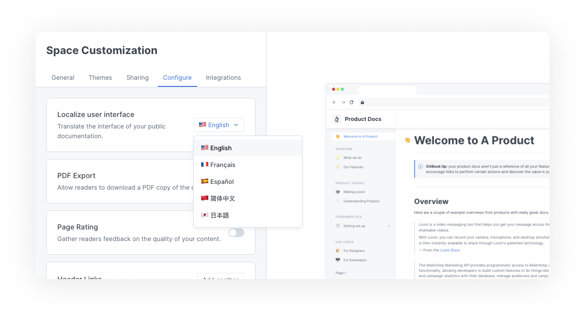
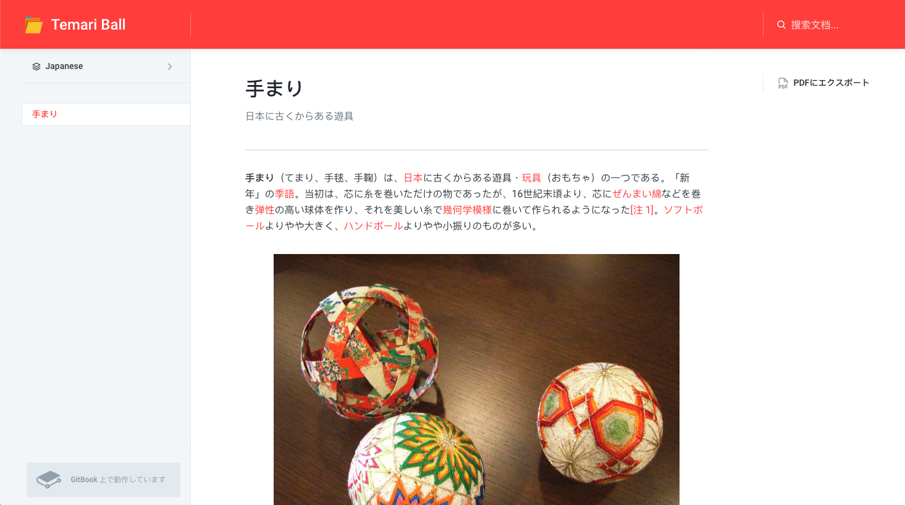

# Internationalization

GitBook supports the internationalization of a space or a collection, enabling public documentation user interface elements to be translated.


**Permissions**

Administrators and creators can change the language of the user interface for public documentation.


## Choosing a language for your content

Currently, the supported languages are: English, French, Spanish, Chinese (simplified), and Japanese.

By default your content will have the **English** language selected. To change this, click **customize** in the [space sub-navigation](https://docs.gitbook.com/getting-started/overview#space-sub-navigation), go to the **configure** tab, and use the dropdown menu in the **localize user interface** setting.

<figure><figcaption>
Choose your preferred language for the user interface elements of your published documentation
</figcaption></figure>

### Inheriting language settings

If a space is inside a collection, you can set the localization language for that space to inherit. This will keep the space's localization language in sync with the setting at the collection level. Choosing a different language for one space inside a collection would override the collection-level setting.

## Publishing your content in different languages

If you need to publish your documentation in multiple languages, you can use variants. [Publishing a collection as a variant](share/collection-publishing.md) enables you create a space per-language and publish the collection as unified UI, allowing readers to switch seamlessly between different language spaces.

<figure><figcaption>
An example of a translated documentation in Japanese
</figcaption></figure>
