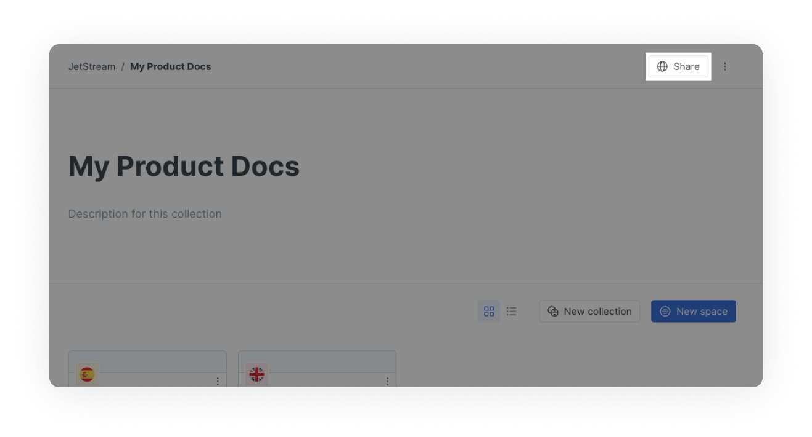
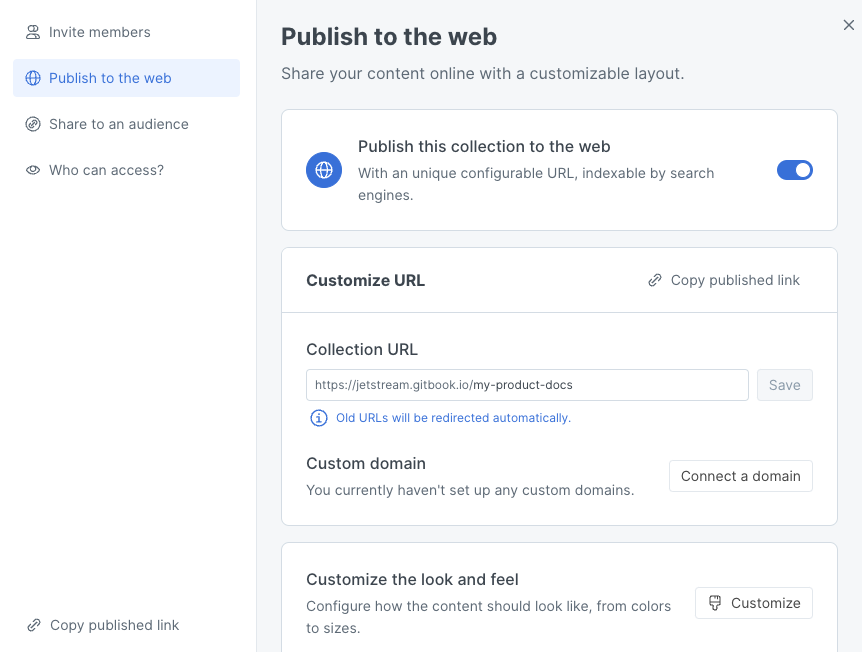
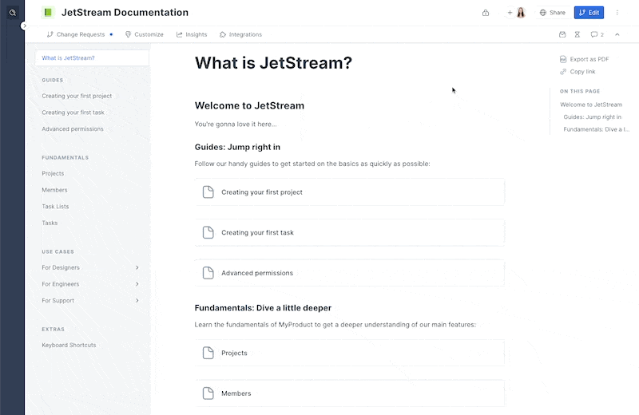

# Collection publishing

If you want to publish multiple versions of your documentation in one place, such as different languages or different versions of your product, you can use collection publishing. Keep reading to learn about how this works.


**Permissions**

Only creators and administrators can publish content.


## Why publish spaces (variants) in a collection?

When you set the [space visibility](space-publishing.md) of a space to **in collection** and publish the collection, you can wrap a number of spaces in a single published interface. We call this **publishing variants**.

When you publish a collection of variants, any child space that is published inside the collection will be quickly accessible through a dropdown in the sidebar of the published content, allowing readers to switch between variants at any time.

Variants are useful if you need to offer a grouped experience for spaces, such as documenting multiple versions of an API (v1, v2, v3, etc.) or documenting your content in multiple languages.

<figure><figcaption>
Switching between variants in published documentation
</figcaption></figure>

Here's some examples of how GitBook users have published variants in collections:

* [Pancake Swap](https://docs.pancakeswap.finance/) use variants to publish their documentation in different languages
* [Forest Admin](https://docs.forestadmin.com/documentation/) use variants to publish different versions of their documentation in one place

## Spaces inside a published collection

When you publish a collection, you still need to decide which spaces nested within the collection should be published as part of that collection. This might be a little confusing at first, but it lets you maintain private spaces inside a published collection.&#x20;

As an example, maybe you've got a collection full of useful spaces, but you're working on a completely new space to live alongside them. Rather than creating and editing that space somewhere else, you can keep it where it's supposed to live, and only publish it as part of the collection when it's ready.

## How to publish a collection and variants

We will use the example of publishing product documentation in multiple languages. The same logic applies to publishing other types of variants such as multiple versions of an API (v1, v2, v3, etc.).

You should create a collection to hold your spaces/variants. You can see in the screenshot below that we have a collection called My Product Docs. Inside the collection are 2 spaces: English and Spanish. As the names suggest, the English space contains our product documentation written in English, and the Spanish space contains the Spanish translation.

<figure><figcaption>
A collection with two variants
</figcaption></figure>

### Publish the collection

First we will publish the collection. Note that this **does not publish the spaces inside the collection**. You need to publish each space individually.

Collection publishing works almost exactly the same as [space publishing](space-publishing.md#publish-to-the-web). Navigate to the the **share** button near the top-right corner, which will open the share modal.

<figure><figcaption>
Sharing a collection
</figcaption></figure>

Inside the share modal, you'll see some or all of the following tabs on the left-hand side to choose from. (The tabs available to you will depend on your permissions.)

#### **Invite members**

If you have administrator permissions for the collection, you'll see the option to invite members here. Inviting a member will make them a member of the organization that owns the space, and the cost for this will depend on the [plan](../../account-management/plans/) that the organization is subscribed to.

It is also possible to invite members to the organization from within the organization settings area.


[invite-members-to-your-organization](../../collaboration/invite-members-to-your-organization/)


If you want your content to remain private, shared only with a specific person or group, inviting that person or people to be a member of your organization could be a great choice. They will be able to access the content when they are logged into their GitBook account.

#### Publish to the web

On the other hand, your content might be suited for a much wider audience! If that's the case, you might like to publish it to the web. Collections that are published to the web can be [indexed by search engines](../seo.md) and will be available to **anyone** on the Internet.

<figure><figcaption>
Publishing a collection to the web
</figcaption></figure>

You'll still retain control over who can _edit_ your content, and only the primary content branch for each published space within the collection will be published, so any [change requests](../../collaboration/collaboration/change-requests.md) will remain private until merged.

#### **Share to an audience**

In some cases, you might want to publish your content, but only permit certain people to access it. We offer a number of options for this:

1. **Publish with** [**visitor authentication**](../visitor-authentication.md)\
   With visitor authentication, GitBook lets _your_ server-side code handle who has access to the content. You can [find out more about visitor authentication](../visitor-authentication.md).
2. **Publish with** [**share links**](share-links.md)\
   Share links include a private token, making it extremely difficult for anyone outside of those you share the link with to find the content. This can be a great way to share private content with those who are not members of your organization. You can [find out more about share links](share-links.md).
3. **Publish as unlisted**\
   Unlisted collections are publicly available, but they _won't_ be indexed by search engines such as Google. They will still be accessible to anyone on the Internet who knows (or can guess) the link to your documentation.

#### **Who can access?**

This tab confirms the current visibility of the space, along with who has access to it within the GitBook app. No settings can be changed here; all changes are made from within the other tabs.

### Publish spaces as variants inside a collection

For each space that you want to publish in the collection, click on the **share** button near the top-right corner to open the share modal.

<figure><figcaption>
Publishing a space as a variant in a collection
</figcaption></figure>

Ensure you're on the publish to the web tab, and then toggle the publish in collection setting to the **on** position.

### How to set the default space in a collection

The default space in a collection is the space that readers see first when they visit your published collection. To change the default space in a collection, navigate to the collection customization page by clicking the triple dot menu button in the top-right corner of the collection in the editor. Under General > Collection, choose the default space from the dropdown.

<figure><figcaption>
Change the default space in a published collection
</figcaption></figure>
