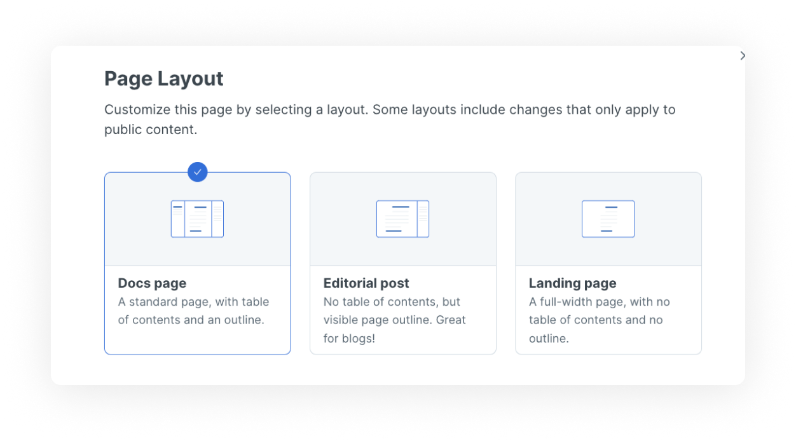

# Page layouts

When publishing your documentation you can select a type of layout you would like each page to be displayed in. This feature allows you to have a greater control over the pages and how they are displayed to your readers.


This feature affects only pages in published spaces.


## Types of page layouts

GitBook offers 3 types of page layouts:

#### Docs page

The default page layout type with table of contents and outline

#### Editorial post

A page layout without table of contents but with an outline

#### Landing page

A full-width page with no table of contents and no outline

## Selecting your page layout

To select a layout for your page navigate to the [page actions](../../product-tour/navigation.md#page-actions) menu and select page layout. You will be presented with the 3 options mentioned above.

Please bear in mind that those changes apply only to public content, they will not be visible in the editor.

<figure><figcaption>
The page layout selection menu
</figcaption></figure>
