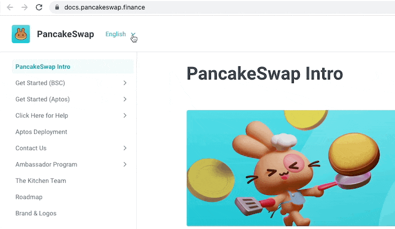
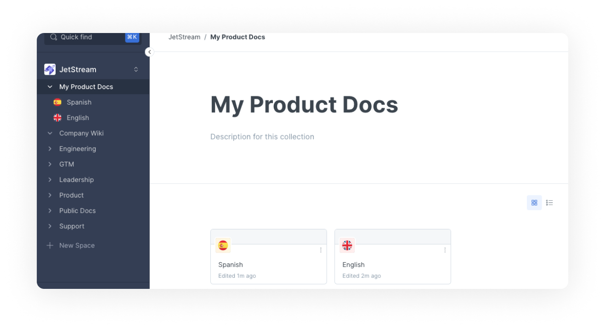

# Share different language or product versions in one place

If you want to publish multiple versions of your documentation in one place, such as in different languages or different versions of your product, you can use **collection publishing**.&#x20;


**Permissions**

Only creators and administrators can publish content.


## Why publish spaces in a collection?

When you set the [space visibility](space-publishing.md) of a space to **in collection** and publish the collection, you can wrap a number of spaces in a single published interface. We call this **publishing variants**.

When you publish a collection of variants, any child space that is published inside the collection will be quickly accessible through a dropdown in the sidebar of the published content, allowing readers to switch between variants at any time.

Variants are useful if you need to offer a grouped experience for spaces, such as documenting multiple versions of an API (v1, v2, v3, etc.) or documenting your content in multiple languages.

<figure><figcaption>
Switching between variants in published documentation
</figcaption></figure>

Here are some examples of how GitBook users have published variants in collections:

* [Pancake Swap](https://docs.pancakeswap.finance/) use variants to publish its documentation in different languages
* [Forest Admin](https://docs.forestadmin.com/documentation/) use variants to publish different versions of their documentation in one place

## Spaces inside a published collection

When you publish a collection, you still need to decide which spaces nested within the collection should be published as part of that collection. This might be a little confusing at first, but it lets you maintain private spaces inside a published collection.

As an example, maybe you've got a collection full of useful spaces, but you're working on a completely new space to live alongside them. Rather than creating and editing that space somewhere else, you can keep it where it's supposed to live, and only publish it as part of the collection when it's ready.

## How to publish collection with variants

We will use the example of publishing product documentation in multiple languages. The same logic applies to publishing other types of variants such as multiple versions of an API (v1, v2, v3, etc.).

You should create a collection to hold your spaces/variants. You can see in the screenshot below that we have a collection called My Product Docs. Inside the collection are 2 spaces: English and Spanish. As the names suggest, the English space contains our product documentation written in English, and the Spanish space contains the Spanish translation.

<figure><figcaption>
A collection with two variants
</figcaption></figure>

Step 1: Publish the collection

First we will publish the collection. Note that this **does not publish the spaces inside the collection**. You need to publish each space individually.

Collection publishing works almost exactly the same as [space publishing](space-publishing.md#publish-to-the-web). Navigate to the the **share** button near the top-right corner, which will open the share modal.

Inside the share modal, you'll see some or all of the following tabs on the left-hand side to choose from. (The tabs available to you will depend on your permissions.)

Step 2: Publish spaces in collection 

For each space that you want to publish in the collection, click on the **share** button near the top-right corner to open the share modal.

This action will create variants that will be displayed inside your collection.&#x20;

Ensure you're on the publish to the web tab, and then toggle the publish in collection setting to the **on** position.

<figure><figcaption>
Publish variants of spaces in one collection
</figcaption></figure>

### How to set the main space in a collection

The default space in a collection is the space that readers will land on when they visit your published collection.&#x20;

To change the default space in a collection, navigate to the collection customization page by clicking the triple dot menu button in the top-right corner of the collection in the editor. Under General > Collection, choose the default space from the dropdown.

<figure><figcaption>
Change the default space in a published collection
</figcaption></figure>


Did you know you can extend GitBook through integrations? GitBook's Integration Platform allows you to enhance the way you work—Including helping you with translations of the things you write. \
\
Head to our guide on [translating GitBook pages](https://developer.gitbook.com/getting-started/guides/use-github-actions-to-translate-gitbook-pages) to learn more.

