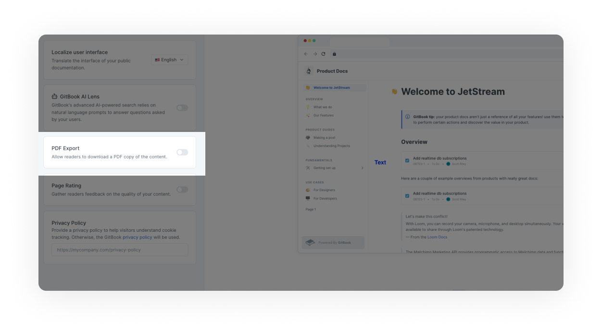
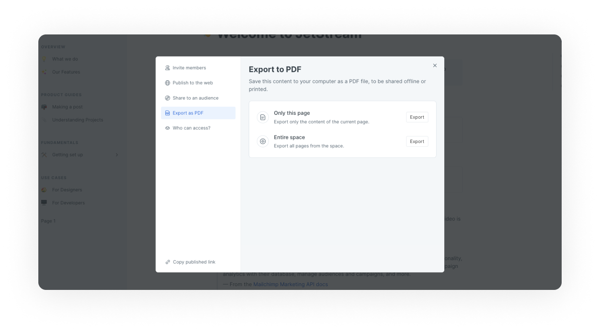

# PDF export

The PDF export is available with a **Pro** or **Enterprise** plan. It allows:

1. Visitors to your published content to download the space as a PDF file.
2. You and other logged-in users to export a single page, a page with its subpages, or an entire space as a PDF file.


**Permissions**

Admins and creators can enable and disable PDF export for a space.


## Allow readers to export a PDF version of your content

To enable or disable PDF export for your readers, head to the customization settings for a space or collection. On the configure tab, you can enable or disable the PDF export setting. This setting determines whether or not **readers of your published content can download it in PDF format**.

<figure><figcaption>
Enable or disable PDF export for your published content
</figcaption></figure>

## Export your own content as PDF

Regardless of the configured customization setting shown above, members of an organization (on the Pro or Enterprise plan) who are logged in to the app can export a page, or an entire space as a PDF file.

### How to export an individual page

1. You can access the export menu through [page actions](https://docs.gitbook.com/getting-started/overview#page-actions) which are displayed on the right-hand side of the editor. Alternatively, navigate to the **share** button in the top right-hand corner and click on 'Export as PDF' in the share modal.
2. Go to the page that you would like to export, and click **export as PDF** in page actions.
3. Select **only this page**.
4. Click the **export** button.
5. Wait for the PDF file to be created, then click the **download** button.

<figure><figcaption>
Export "Only this page" as a PDF
</figcaption></figure>

### How to export an entire space

1. Navigate to the [page actions](https://docs.gitbook.com/getting-started/overview#page-actions) menu on the right-hand side of the editor. Alternatively, navigate to the **share** button in the top right-hand corner and click on 'Export as PDF' in the share modal.
2. Go to any page within the space you'd like to export and click **export as PDF** in page actions.
3. Select the **entire space**.
4. Click the **export** button.
5. Wait for the PDF file to be created, then click the **download** button.

<figure><figcaption>
Export "Entire Space" as a PDF
</figcaption></figure>
