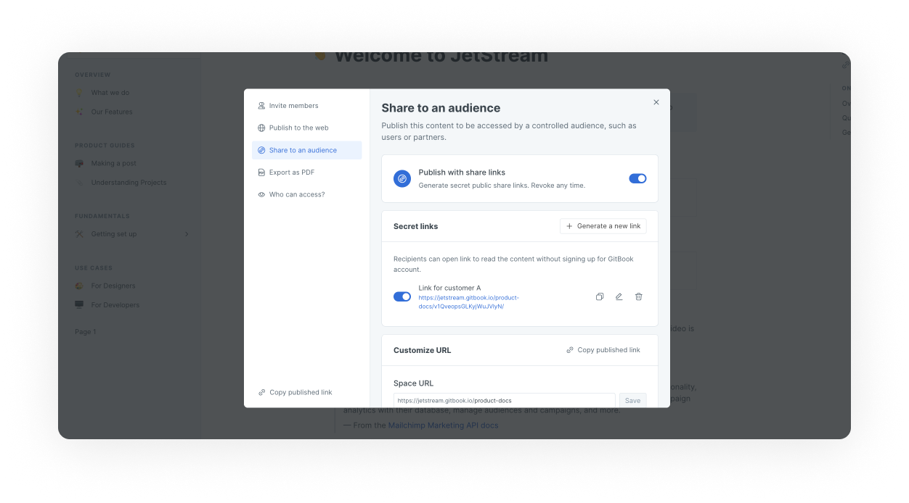
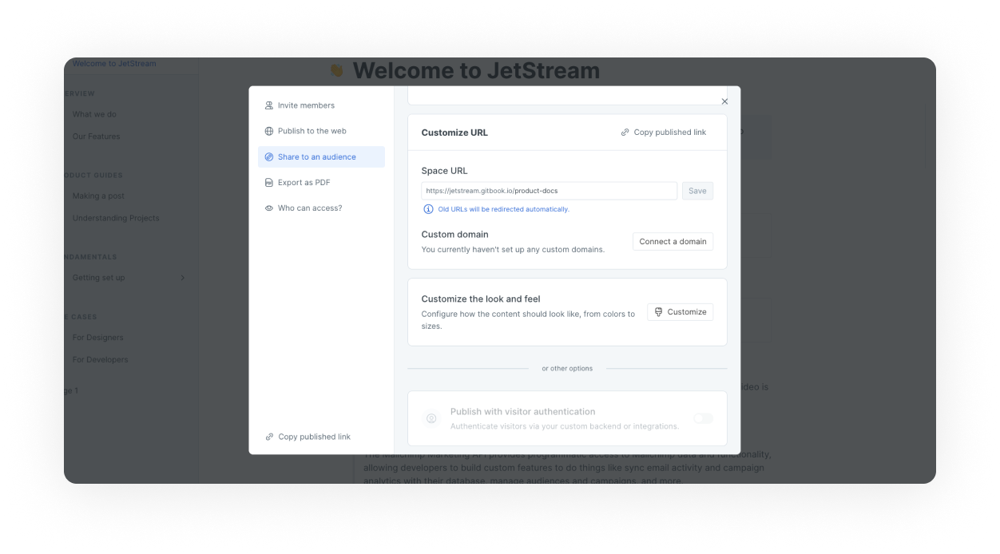

# Share privately with a secure link


This feature is available on our **Pro** and **Enterprise** plans.


Share your private content with customers and partners without inviting them to your organization by using a secret shareable link or links!

## Publish via share link

<figure><figcaption>
A GitBook space published via share link
</figcaption></figure>

To publish via share link(s), open the space or collection you want to share in GitBook. Open the share menu and select **share to an audience**.

Next, click on **publish with share links** to access your share links. In this area will be able to review and name your share links, customize the UR and copy the links.&#x20;

<figure><figcaption>
Link and domain settings for a GitBook space published via share link
</figcaption></figure>

Once the link is active, a private token is generated within your URL, which is unique to your space. Sharing this link will give non-GitBook users access to your private content in read mode only.


Share links can be [revoked](share-links.md#revoke-a-link) and regenerated at any time.


## Permissions

The content will be accessible to **anyone following the link**. Your team members will always be able to access your content from their dashboard.


Make sure you share the link only with people you want to share your private content. Don’t forget that you can [revoke](share-links.md#revoke-a-link) a link at any time.


## Revoke a link

The shareable link can be disabled or regenerated by revoking a link. You can see and revoke any previously generated link by opening the visibility menu and clicking through to link and domain settings.


**Heads up!** Anyone using a revoked link will no longer have access to your content.


## Other secure sharing options

### Privacy of my content is not critical

If you don’t have strong privacy and security requirements, a better solution may be to publish the space as [unlisted](https://docs.gitbook.com/getting-started/publishing/space-publishing#unlisted-space). Unlisted spaces are not indexed by search engines, and therefore will not be easily discoverable.

### I need a more secure alternative

#### Internal users

The most secure way to share your content with a private audience is to have them create a GitBook account and join your organization.

This process can be [automated using SSO/SAML](../publishing/broken-reference/), which can be used to create custom authentication for your documentation. This will require setup on your end to integrate with your chosen identity provider.&#x20;

**External users**

If you would like to share your **public** content with a large number of authenticated visitors, you might like to use our [visitor authentication](../visitor-authentication.md) feature. This would allow you to design your own flow allowing you to authenticate users via a token. This solution requires engineering resources from your side - you can preview an example repository for [Node.JS on GitHub.](https://github.com/GitbookIO/example-visitor-authentication)
