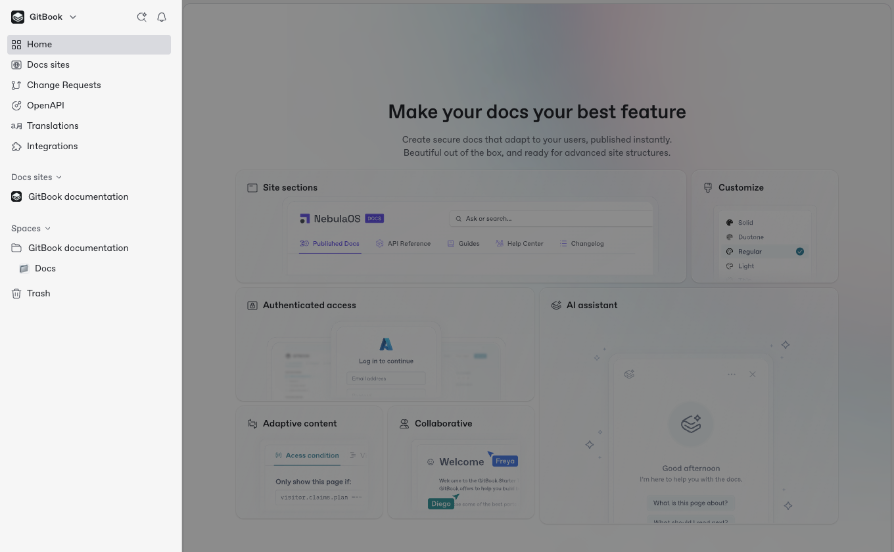
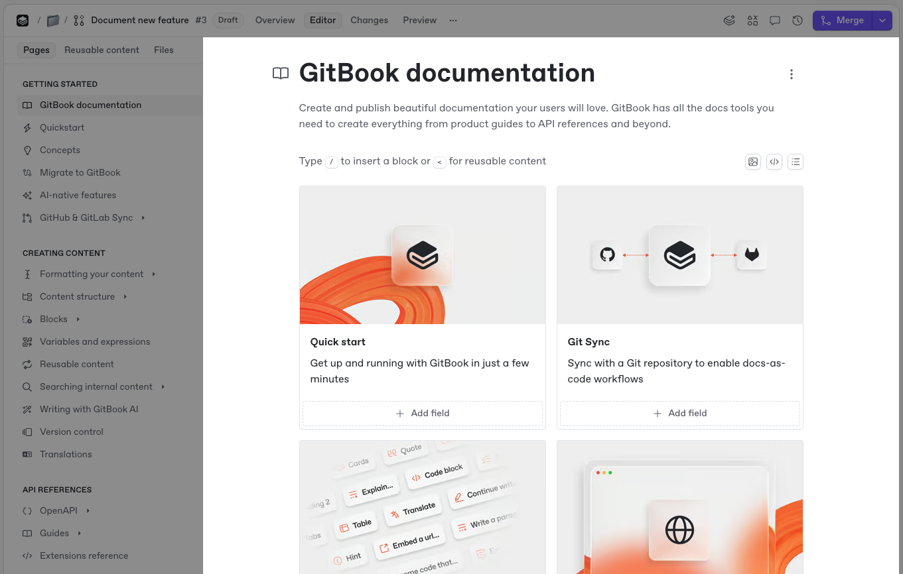

# GitBook UI

GitBook is split into different sections to make it easier to organize and manage the content you create.

### Sidebar

<figure><figcaption>
The GitBook sidebar holds all of your documentation, as well as notifications, the search bar, snippets and more.
</figcaption></figure>

The sidebar allows you to see and overview of your GitBook organization at a glance. The sidebar contains:

* **Organization switcher**\
  If you’re a part of multiple organizations, you can see and switch between them here. You can also create a new organization from this menu.
* **Notifications**\
  When you’re tagged in a comment or conversation, or when there is important activity in a space you’re working in, you’ll get a [notification](../../collaboration/notifications.md) to show you what’s new.
* **Ask or search**\
  Powered by [GitBook AI](../../creating-content/searching-your-content/gitbook-ai.md), you can ask questions in natural language, or search through the different spaces and content in your organization.
* **Home**\
  The Home page allows you to see everything your team is working on at a glance. View open change requests, discussions and comments, recent page edits and more.
* **Docs sites home**\
  Click this to visit the overview page for all the docs sites you have created in your organization.
* **Integrations**\
  GitBook [integrations](../../content-editor/editor/broken-reference/) supercharge your content, allowing you to embed more into your pages, or add information to your knowledge base from other apps.
* **Docs sites**\
  Toggle this section to view all the [docs sites](../../publishing-documentation/publish-a-docs-site/) in your organization right in the sidebar and jump to one with a click.
* **Spaces**\
  The spaces section is where you’ll find the [collections](../../creating-content/content-structure/collection.md) and [spaces](../../creating-content/content-structure/space.md) you create when adding more content. Head to our [content structure](../../creating-content/content-structure/) section to find out more.
* **Settings**\
  You’ll find [personal settings](../../account-management/account-settings.md) and [organization settings](../../account-management/organization-settings.md) at the bottom of the sidebar. Here, you can also toggle light/dark mode, or get help from our support team if needed.
* **Trash**\
  Deleted spaces appear in the trash. You can restore them for up to seven days — after that, they’re permanently deleted.

### Table of contents

<figure><figcaption>
The table of contents lists all the pages and links in your selected space.
</figcaption></figure>

By default, the table of contents shows a list of [pages, links, and groups](../../creating-content/content-structure/page.md#organizing-your-content) that make up a space. You’ll find it to the right of the sidebar. It’s specific to the space you’re currently viewing.

The table of contents is also where you can view and manage [resuable content](../../creating-content/reusable-content.md) and [files](../../creating-content/blocks/insert-files.md) for your space.

From the **Pages** tab in the table of contents you can:

* Create new [pages](./#pages) and subpages
* Create [page groups](./#groups)
* Add [external links](./#external-links)
*   Access [the Actions menu](./#the-actions-menu)&#x20;

    <picture><source srcset="../../.gitbook/assets/25_01_10_actions_icon_dark.svg" media="(prefers-color-scheme: dark)"></picture>

    &#x20;for individual pages.

In the **Reusable content** tab, you can:

* View and search through the reusable content in the space
* Create new reusable content
* Drag and drop reusable content onto the page
* Rename and delete reusable content

In the **Files** tab, you can:

* View, search and reorder the files in your space
* Drag and drop more files into your space
* Manage individual files

If you want to give more focus to the content of your page, you can temporarily hide the table of contents by hovering your cursor next to it and clicking the **Hide** button <picture><source srcset="../../.gitbook/assets/25_10_08_panel_left.svg" media="(prefers-color-scheme: dark)"></picture> that appears. To make it appear again, hover your cursor near the edge of the page and click the **Show** button <picture><source srcset="../../.gitbook/assets/25_10_08_panel_right.svg" media="(prefers-color-scheme: dark)"></picture>.

### Space header

<figure><figcaption>
The space header sits at the top of the editor, and offers options that apply to the whole space.
</figcaption></figure>

The space header contains information about the space you’re currently viewing. It lets you do things like publish and share your space, view the comments and history for the space, configure [GitHub or GitLab sync](../../getting-started/git-sync/), and more.


**The space header is adaptable**, and changes depending on the space and mode you’re currently in.

For example, if you’re editing a [change request](../../collaboration/change-requests/), you will see an overview of the change request, alongside options to open the editor, view changes and merge your change request.

If you’re viewing a read-only space, you will need to open a new change request to edit the content of the page as live edits are locked.


<figure><figcaption>
The space header inside a change request.
</figcaption></figure>

The space header includes:

* **The space emoji or icon**\
  You can choose an emoji or icon for your space, to help you easily identify it in the sidebar.
* **The space name**\
  The name of the space that will appear in the sidebar, and your documentation if and when you choose to publish it.
* **The space’s breadcrumbs**\
  A full, linear list of the collections or docs sites the space lives in.
*   **Actions menu**&#x20;

    <picture><source srcset="../../.gitbook/assets/25_02_04_actions_horizontal.svg" media="(prefers-color-scheme: dark)"></picture>

    \
    Offers a list of actions for your space. Similar to [page actions](./#the-actions-menu), the available actions for a space will differ depending on the mode you’re currently in.
* **Overview**\
  When viewing a change request, this tab shows the title and description of the change request, along with the participants and reviewers. It also shows all the changes and comments.
* **Editor view**\
  This view is where you can make edits to your content using GitBook’s block-based editor.
* **Changes view**\
  This view [highlights the changes](../../collaboration/change-requests/#diff-mode) made within a change request using the diff view. This is ideal for reviewing new content before merging your change request to push the changes live.
* **Preview**\
  This view allows you to quickly see a preview of your content before you merge a change request.
* **Collaborators**\
  The avatar of anyone else who’s currently viewing a page in your space, with colored circles to show their cursor color. Click an avatar to jump to the page they’re currently viewing.
* **Git Sync configuration**\
  The [GitHub and GitLab Sync](../../getting-started/git-sync/) configuration for your space.
* **The Share menu**\
  Allows you to publish and share your space. You can also invite others to [collaborate](../../content-editor/editor/broken-reference/) through this menu.
* **Variables**\
  [Create and add reusable variables](../../creating-content/variables-and-expressions.md) to use in a space.
* **GitBook Agent**\
  Collaborate on changes in a space with [GitBook Agent](/broken/pages/KHHFlE1MtpVIaZboN8b2).
* **Comments**\
  See the [comments and discussions](../../collaboration/comments.md) you and your team have had about the space content.
* **Change requests**\
  Create, update, and delete [change requests](../../collaboration/change-requests/) in your space.
* **Space history**\
  View [a version history](../../creating-content/version-control.md) that includes all the changes made in the space — or in your current change request — over time.
* **The Edit button**\
  If your space is published, or someone has locked[ live edits](../../collaboration/live-edits.md), the **Edit** button will appear in the space header. It will create a new [change request](../../collaboration/change-requests/) to edit content.

### Site header

The site header contains information about the site you’re currently viewing. It lets you do things like view site insights, customize your site, change its settings and preview the site in different modes and screen sizes. You can also configure integrations and manage members’ access.

The site header includes:

* **The site name**\
  The name of the space that will appear in the sidebar, and your documentation if and when you choose to publish it.
* **The site’s breadcrumbs**\
  A link back to the main Docs sites screen.
* **Overview**\
  The site overview shows you essential information about your site including it’s URL, publish status, audience and content, as well as top-level insights.
* **Insights**\
  The [insights panel](../../publishing-documentation/insights.md) gives you detailed analytics about your site and how it’s performing.
* **Customization**\
  Here you can [customize your site](../../publishing-documentation/customization/) with your own logo, colors, header links, and much more.
* **Settings**\
  Access your [site’s settings](../../publishing-documentation/site-settings.md) and control the name, audience, content structure and other options.
* **Preview**\
  The preview tab lets you quickly see how your published site will look in light and dark mode across desktop and mobile displays.
* **Integrations**\
  The button opens a modal that lets you install and configure [integrations](../../integrations/install-an-integration.md) for your site.
* **Member access**\
  View and manage who can access your site in the GitBook app, and what permissions they have.
* **Visit site**\
  Click this to instantly open your published docs site in a new tab. This button only appears when your site is live.

### Content editor

<figure><figcaption>
Write content and add blocks in the GitBook editor.
</figcaption></figure>

The editor is the main part of your space, where you can write or insert content in GitBook. It supports multiplayer, meaning you and your team can collaborate on changes in real-time.

You can insert [content blocks](../../creating-content/blocks/), type [Markdown](../../creating-content/formatting/markdown.md), [embed content](../../creating-content/blocks/embed-a-url.md), and collaborate on changes with [GitBook Agent](/broken/pages/KHHFlE1MtpVIaZboN8b2).

In addition to working on changes, you can also comment on blocks, tag teammates, and more.

### Page title and description 

At the top of each page you can set a **title**, add an optional **emoji**, and write a **description**. The title you use will appear in the table of contents, and forms your page’s URL slug when published.

Your page description can be a maximum of 200 characters long, and will act as the preview text for your page in search engines.


You can change the URL slug for a page by choosing **Page Actions** <picture><source srcset="../../.gitbook/assets/25_01_10_actions_icon_dark.svg" media="(prefers-color-scheme: dark)"></picture> > **Rename**. Find out more about [Page Actions](./#page-options) below.


### Page actions menu

The page’s **Actions menu** <picture><source srcset="../../.gitbook/assets/25_01_10_actions_icon_dark.svg" media="(prefers-color-scheme: dark)"></picture> allows you to do things like duplicate, rename or delete your page.

You can open the **Actions menu** using the <picture><source srcset="../../.gitbook/assets/25_01_10_actions_icon_dark.svg" media="(prefers-color-scheme: dark)"></picture> icon that appears when hovering over your page in the sidebar, or from the icon next to the page title.


The type of actions available will depend on whether you’re in [live editing](../../collaboration/live-edits.md) mode or a [change request](../../collaboration/change-requests/).


### Page options

<figure><figcaption>
The <strong>Page options</strong> side panel offers customization options for your documentation and navigation.
</figcaption></figure>

With page options, you cam customize your documentation layout and navigation. You can only access page options if you’re in an editing mode.

You can open the **Page options** side panel by opening the page’s **Action menu** <picture><source srcset="../../.gitbook/assets/25_01_10_actions_icon_dark.svg" media="(prefers-color-scheme: dark)"></picture> and choosing **Options**, or by hovering over the main title of the page and clicking **Page options** when it appears.


Certain changes, such as disabling the table of content, only apply to published documentation and may not be visible in the editor.


### Page outline

<figure><figcaption>
The page outline shows H1 and H2 headings, allowing you to quickly jump to a specific section on an individual page.
</figcaption></figure>

The **page outline** sits on the right-hand side of the editor, and makes it easy to jump directly to the section of the page you’re looking for.

Any [headings](../../creating-content/blocks/heading.md) you add to the page will appear in the page outline listed here.

The page outline will appear in your published site, too. You can toggle it on or off in the [**Page options**](./#page-options) side panel.


If you can’t see the right-hand column of the app, it may be because your browser window is less than 1430 pixels wide. Your browser window needs to be at least 1430 pixels wide to see and use the page outline.

