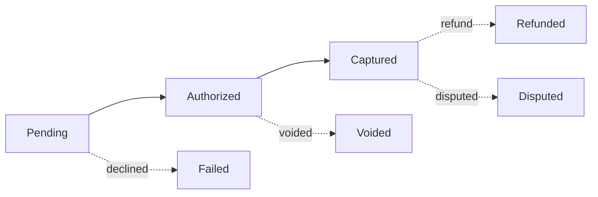

# Block ecosystem — choosing the right one

GitBook has a rich block ecosystem. A docs site that uses it well feels like a real product; one that doesn't feels like a `man` page. The skill's instinct when generating content should be to **reach for the specialized block**, not the markdown-y plain-text fallback. This reference catalogues the high-leverage blocks and the patterns they belong to.

`write-gitbook` is the authority on the syntax of each block. This file is about *which block to use when*, with example invocations to anchor each pattern.

## Mirror the source before inventing

When you're rebuilding from existing docs (a competitor's site, the user's previous platform, an internal wiki), **fetch the source and mirror its landing pages and information architecture before reaching for novel templates.** The user's existing IA is the spec — they almost always have reasons for it that aren't visible in a pile of markdown files. Inventing new card grids, hero blocks, and layouts when the source already had a working answer is how you produce something that *looks* GitBook-y but doesn't actually serve the readers.

The right default order:

1. **Look at the rendered source** — fetch the live site, screenshot the landing page, count the cards, note what's at the top of each space.
2. **Decide what carries over verbatim** vs. what genuinely needs updating. A "What's new" section that listed three product launches still wants to list those three launches.
3. **Then apply GitBook idioms** — convert the source's hand-rolled HTML cards to a `<table data-view="cards">`, swap inline icons for Font Awesome equivalents, replace ASCII diagrams with Mermaid. The block ecosystem upgrade should be additive to the IA, not a replacement for it.

Reaching for templates from this file's decision table without first mirroring the source produces pages that show off GitBook but don't serve the original's readers. Mirror first, upgrade second.

## The decision table

| Content shape | Right block | Wrong-default to avoid |
|---|---|---|
| Release notes / changelog / "what's new" | `` with `` entries (RSS auto-generated, supports tags) | Bare `## YYYY-MM-DD` headings followed by bullet lists |
| API endpoint reference | OpenAPI auto-generation via `type: builtin:openapi` in SUMMARY.md | Hand-authored endpoint pages duplicating the spec |
| State machines, flows, sequences, simple architecture | ` ```mermaid ` fenced block | ASCII art with `-->` and box-drawing characters |
| Tabular comparison or reference | Markdown table | Repetitive prose with parallel structure |
| Sequential walkthrough (3+ ordered steps with substantial content per step) | `` with `` entries | Numbered list with all steps in one paragraph each |
| Equivalent code in different languages or environments | `` with `` per language | Stacked fenced code blocks with `### Node`/`### Python` headings |
| "Heads up" / "danger" / "tip" callouts | `` | Bold-italic prose like "**Note:** ..." |
| Side-by-side content layout | `` with `` entries | Two paragraphs and hoping for the best |
| Pickable card grid (e.g. "choose your path") | Card-table — `<table data-view="cards">` | Plain bullet list with sub-bullets describing each option |
| Cross-cutting boilerplate that shouldn't be copy-pasted | `` | Duplicated paragraphs across pages |
| Values that appear on many pages (env URLs, support emails, version pins) | Variables in `.gitbook/vars.yaml` + `<code class="expression">space.vars.<name></code>` | Hard-coded literals in every page |
| Long detail that's optional reading | `` (collapsible details) | A whole separate page just for the digression |
| Video / external preview embeds | `` | Plain link to YouTube |
| Conditional content for different visitor personas | `` ... `` | Static content that ignores audience |
| Marketing-style landing page or hero | `layout: width: wide` + `cover:` + `coverY:` in frontmatter | Always-wide on every homepage — the default width is right for normal docs landings |

The skill should treat the right column as a smell — when generating content, if it falls into one of the wrong-default patterns, that's a signal to switch to the specialized block on the left.

## Block-by-block guidance

### Updates block — for any changelog or release-notes content

The Updates block produces a timeline view with auto-generated RSS, optional tags for filtering, and a richer card-style layout than plain headings:

```markdown


## AI topic auto-classification (beta)

Lyra now assigns incoming Feedback to existing Topics based on content. Enable
per-Topic from **Settings → AI** in the dashboard. The classifier runs on every
new Feedback within a few seconds of arrival.



## SAML SSO for Pro and Enterprise

Configure under **Settings → Authentication**. Supports Okta, Azure AD, and any
SAML 2.0 IdP. SCIM provisioning is available on Enterprise.


```

The `format` can be `full` (cards), `short` (compact), or `numeric` (numbered). Tags are defined in `.gitbook/tags.yaml`:

```yaml
- tag: api
  label: API
  icon: code
- tag: auth
  label: Authentication
  icon: lock
- tag: beta
  label: Beta
  icon: flask
```

**Always use Updates for changelog spaces.** The auto-generated RSS feed alone is worth the small extra syntax cost.

### Mermaid — for any flow, sequence, state machine, or simple architecture

Standard markdown fenced block with `mermaid` as the language:

````markdown

````

GitBook renders it inline. Mermaid supports `flowchart`, `sequenceDiagram`, `stateDiagram-v2`, `erDiagram`, `gantt`, `classDiagram`, and `pie`. For docs sites, `flowchart` and `sequenceDiagram` cover ~90% of cases.

**Reach for Mermaid whenever you'd otherwise draw boxes-and-arrows in ASCII.** The ASCII version is uglier, harder to maintain, and not screen-reader friendly.

### OpenAPI — for API reference spaces

When building an API reference space, **don't hand-author endpoint pages**. Generate or upload an OpenAPI spec and let GitBook auto-generate the operation pages. Hand-authored endpoint pages drift from the actual API and triple your maintenance burden.

The flow has three pieces:

**1. Get an OpenAPI spec into GitBook.** Two options:

- **Upload via the GitBook API**: `POST /v1/orgs/{orgId}/openapi` with the spec. The skill can do this — see `api-cheatsheet.md`.
- **Host on GitHub Pages or any URL**: GitBook fetches it on a schedule. Lower-friction for teams who already host their spec publicly.

Either way the spec gets a slug (e.g. `lyra-v1`) that you reference from the SUMMARY.md.

**2. Reference the spec from SUMMARY.md** to auto-generate the operation pages. The pattern from the example site:

````markdown
## Feedback API

* [Overview](feedback-api/README.md)
* ```yaml
  type: builtin:openapi
  props:
    models: false
    downloadLink: true
  dependencies:
    spec:
      ref:
        kind: openapi
        spec: lyra-v1
  ```
````

The fenced YAML inside the SUMMARY bullet expands at render time into one nav entry per operation in the spec, grouped by tag. Set `models: true` to include schemas as their own pages; `downloadLink: true` adds a "Download spec" button.

**3. Write a brief overview README.md** for each API resource — prose context that doesn't belong in the spec: base URL, version policy, what the resource is for, migration notes from earlier versions. The auto-generated operation pages live alongside this README in the nav.

When the user is creating an API reference space, **the skill should ask whether they have an OpenAPI spec already**. If yes, route through the upload flow. If no, offer to generate a starter spec from whatever endpoint information the user has — even a minimal spec is much better than hand-authored pages that immediately drift.

### Layout in frontmatter — especially for homepages

Every space's homepage `README.md` should set layout flags. The default page width is narrow (optimised for prose); landing pages and overviews want wider layout, fewer chrome elements, often a cover image:

```yaml
---
description: Build with Lyra. Customer feedback, structured.
icon: house
cover: .gitbook/assets/home-cover.png
coverY: 0
layout:
  width: wide
  cover:
    visible: true
    size: hero
  title:
    visible: true
  description:
    visible: true
  tableOfContents:
    visible: false
  outline:
    visible: false
  pagination:
    visible: false
---
```

**`width: wide` is for marketing-style or hero pages, not the default for documentation landings.** Use it when the page has a hero image, a large card grid that needs the room, or a multi-column dashboard layout. For a normal docs landing — even one with card-tables for navigation — the GitBook default width with TOC visible reads better and matches user expectations for a docs site. When in doubt, **mirror the source.** If you're rebuilding from another platform's docs site, look at how the original landing renders before deciding to widen it.

Use `width: wide` deliberately on:

- Marketing-style landing pages with hero imagery
- Changelog pages where the Updates timeline benefits from horizontal space
- Dashboard-style pages with side-by-side panels
- Pages with genuinely wide tables that don't fit at default width

For interior content pages, `width: default` (or omitting the layout block entirely) is the right call — long-form prose reads better at narrower widths.

### Reusable content (`.gitbook/includes/`)

For boilerplate that appears in 3+ places (test/live mode warnings, persona switchers, footer disclaimers, version banners), extract it into `.gitbook/includes/<name>.md` and pull it in:

```markdown

```

The path is relative to the file doing the include. The included file is plain markdown — no special wrapper needed.

### Variables (`.gitbook/vars.yaml`)

For values that appear on many pages — support emails, current API version date, environment URLs, version pins — define them once:

```yaml
support_email: support@lyra.app
api_version: "2026-04-01"
sandbox_host: api.sandbox.lyra.app
production_host: api.lyra.app
```

And reference them inline:

```markdown
The current pinned version is <code class="expression">space.vars.api_version</code>.
For help, contact <code class="expression">space.vars.support_email</code>.
```

When the value changes, you update one file, not 40.

### Card-tables for "choose your path" content

The home page of a multi-space site, the top of a how-to category, the API reference overview — anywhere the reader is making a choice between several options — uses card-tables instead of a bullet list:

```markdown
<table data-view="cards"><thead><tr><th></th><th></th><th></th><th data-hidden data-card-target data-type="content-ref"></th></tr></thead><tbody>
<tr>
  <td><h3><i class="fa-bolt" style="color:$primary;">:bolt:</i></h3></td>
  <td><strong>Quickstart</strong></td>
  <td>Send your first feedback event in five minutes.</td>
  <td><a href="getting-started/quickstart.md">quickstart</a></td>
</tr>
<tr>
  <td><h3><i class="fa-diagram-project" style="color:$primary;">:diagram-project:</i></h3></td>
  <td><strong>Data model</strong></td>
  <td>The four core resources and how they relate.</td>
  <td><a href="concepts/data-model.md">data-model</a></td>
</tr>
</tbody></table>
```

Yes the HTML is verbose. The visual result — icon + title + blurb + clickable card — is significantly better than any markdown alternative. Use them for the homepage's primary navigation cards.

### Columns for side-by-side layout

Two-up content (intro + callout, before/after, comparison) reads better in columns than stacked:

```markdown

{% column width="50%" %}
The new dashboard is generally available across all plans. Existing customers
will see it on their next sign-in. The classic dashboard is reachable from the
account menu under "Settings → Use classic dashboard" until 2026-12-01.


{% column width="50%" %}

**Migrating?** The classic API endpoints are unchanged — only the UI is new.



```

Don't overuse columns — three-column layouts almost always look cramped, and on mobile both columns just stack vertically anyway. Two columns at 50/50 or 60/40 is the sweet spot.

### Conditional content for personas

When a docs site serves multiple personas (prospects, new customers, enterprise admins, partners), use `` to swap content rather than maintaining separate pages:

```markdown



**Want to see this in action?** [Get a demo](https://lyra.app/demo) — we'll
walk you through with live data from a similar product.



```

The conditions reference visitor claims that GitBook resolves at render time. Keep the conditional content additive (extra hints, links, callouts) — building entire alternate page bodies behind conditionals is hard to maintain and worse to read.

## Putting it together

A well-built docs site, in terms of block usage, looks like:

- **Space homepages** — default GitBook layout (TOC visible, default width) for normal docs; reach for `width: wide` + cover image only when the page is genuinely marketing/hero-style. Card-table for primary navigation; columns for intro pairs if useful.
- **Getting-started pages** — stepper for the walkthrough, tabs for multi-language code, hint blocks for warnings.
- **Concept pages** — Mermaid for state machines and flows, tables for comparisons, hints for caveats.
- **How-to pages** — stepper if there's a real walkthrough, prose otherwise; tabs only when you have genuinely parallel multi-language code.
- **Reference pages** — tables, OpenAPI auto-generation for endpoints, expandables for optional detail.
- **Changelog** — `` with tags and RSS, on a `width: wide` page with a brief intro paragraph.
- **API reference space** — overview README per resource, OpenAPI auto-gen for the operations themselves.
- **Cross-cutting** — `vars.yaml` for repeated literals, `.gitbook/includes/` for repeated paragraphs.

When the skill is generating a fresh docs site, walk through this list explicitly — for each piece of content being created, ask "is there a specialized block for this?" If yes, use it. If no, plain markdown.
