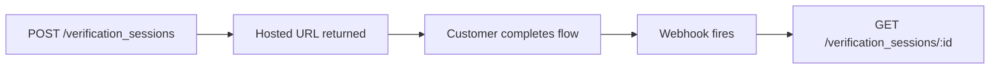

# Identity API

The Identity API runs the full verification stack — document review, selfie liveness, bank account verification, and business KYB. The operation reference is auto-generated and listed below this page in the sidebar.

## Resources

* **Verification sessions** — top-level resource, one per identity, bank, or business verification.
* **Documents** — captured documents and their per-check results.
* **Bank verifications** — Plaid-instant or micro-deposits flow records.

## How a verification flows



1. **Your server creates a session** — pass `type` (identity/bank/business) and `customer`. Get back a session record with a `url` to send the customer to.
2. **Customer completes the hosted flow** — Evolve handles all the capture and review.
3. **Webhook fires when complete** — `verification_session.verified`, `.failed`, or `.manual_review`. See [Event catalog](../webhooks/event-catalog.md).
4. **You retrieve the result** — the full check breakdown is on the session.

You can also drive the flow programmatically — submit documents, run individual checks, override decisions. Those operations are in the auto-generated reference.

## A minimal example



```js
const session = await evolve.identity.verificationSessions.create({
  type: "identity",
  customer: "cus_4n2P3qR5sT6uV",
  return_url: "https://yourapp.com/verified",
});

// Send `session.url` to the customer.
console.log(session.url);
```



```python
session = evolve.VerificationSession.create(
    type="identity",
    customer="cus_4n2P3qR5sT6uV",
    return_url="https://yourapp.com/verified",
)
print(session.url)
```



```bash
curl https://api.evolve.com/v2/verification_sessions \
  -H "Authorization: Bearer $EVOLVE_SECRET_KEY" \
  -d type=identity \
  -d customer=cus_4n2P3qR5sT6uV \
  -d return_url=https://yourapp.com/verified
```



## Conceptual background

For the product-side concepts — when to verify, which method to pick, what the customer sees — see the [Identity product space](https://app.gitbook.com/s/w7NRnYZuokE4h1mm2pJB/).
